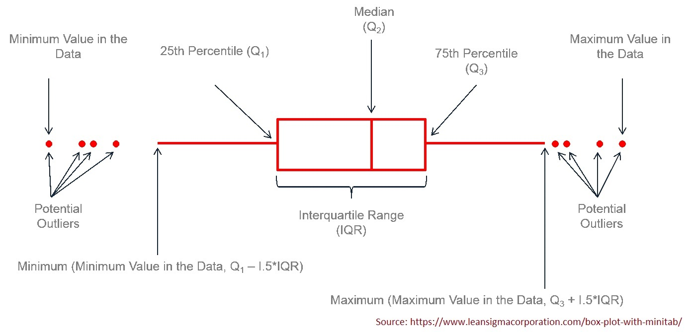

<style type="text/css">
h1.title {
  font-size: 20px;
  color: DarkRed;
  text-align: center;
}
h4.author { /* Header 4 - and the author and data headers use this too  */
    font-size: 18px;
  font-family: "Times New Roman", Times, serif;
  color: DarkRed;
  text-align: center;
}
h4.date { /* Header 4 - and the author and data headers use this too  */
  font-size: 18px;
  font-family: "Times New Roman", Times, serif;
  color: DarkBlue;
  text-align: center;
}
h1 { /* Header 3 - and the author and data headers use this too  */
    font-size: 22px;
    font-family: "Times New Roman", Times, serif;
    color: darkred;
    text-align: center;
}
h2 { /* Header 3 - and the author and data headers use this too  */
    font-size: 18px;
    font-family: "Times New Roman", Times, serif;
    color: navy;
    text-align: left;
}

h3 { /* Header 3 - and the author and data headers use this too  */
    font-size: 15px;
    font-family: "Times New Roman", Times, serif;
    color: navy;
    text-align: left;
}

h4 { /* Header 4 - and the author and data headers use this too  */
    font-size: 18px;
    font-family: "Times New Roman", Times, serif;
    color: darkred;
    text-align: left;
}
</style>


```{r setup, include=FALSE}
# code chunk specifies whether the R code, warnings, and output 
# will be included in the output files.
library(knitr)
library(lessR) 
knitr::opts_chunk$set(echo = TRUE,           # include code chunk in the output file
                      warnings = FALSE,       # sometimes, you code may produce warning messages,
                                              # you can choose to include the warning messages in
                                              # the output file. 
                      results = TRUE          # you can also decide whether to include the output
                                              # in the output file.
                      )   
```


# Introduction

The note outlines the basic descriptive statistics.

* Data Types
* Tabular and graphic summary of data
* numerical summary of data

# Data Types

There are different classifications of data types. We use the following simple one

* **Categorical Variables** - the values of these types of variables do not have numerical meaning in the sense that one can not perform arithmetic operations with the values of these types of variables.

  + *Ordinal categorical variables* - the values have a natural order. For example, course letter grades: A, B, C, D, and F.
  
  + *Nominal categorical variables* - the values do not have a natural order. For example, majors in a college: Mathematics, finance, music, biology, etc.


* **Numerical Variables** - as indicated in the name, the values of numerical variables are numbers.

  + *Discrete variables* - one can find two values of such variables such there are no meaningful values fall between the two. For example, the number of children in a household: 1, 2, 3, 4, ....  There is no such household that has 2.5 children.
  
  + *Continuous variables* - for any two distinct values of such variables, any value between the two is meaningful. For example, consider two arbitrarily selected human body temperatures (in Fahrenheit) 97.4 and 97.5, any number between 97.4 and 97.5 could be the temperature of someone in the population (although the person may not be part of the sample).

# Tabular and Graphic Summary

Both tabular and graphic summaries are powerful and effective tools to **visualize** the (shape of the) distribution of the data.

## Categorical Data

**Example 1**: [Status of Endangered Species]: The data was extracted from U.S. Fish & Wildlife Service ECOS Environmental Conservation Online System. The data can be found at the following 
<https://whitlockschluter3e.zoology.ubc.ca/Data/chapter02/chap02q06EndangeredSpecies2018.csv>

We want to summarize the status of endangered species (one of the columns in the data set). 

### Frequency Table

Since the values of categorical data sets are labels, constructing frequency tables of categorical data is straightforward.

```{r}
Species = read.csv("https://whitlockschluter3e.zoology.ubc.ca/Data/chapter02/chap02q06EndangeredSpecies2018.csv", header = TRUE)   # read the csv data from the URL 
kable(head(Species))     # list first 6 rows of the data
```

Next, we create a frequency table to include all four types of frequencies.

```{r}
speciesGroup = Species$speciesGroup   # extract the column of status of endangered species
freq = table(speciesGroup)            # frequency count
rel.freq = freq/sum(freq)             # relative frequency
cum.freq = cumsum(freq)               # cumulative frequency
cum.rel.freq = cum.freq/sum(freq)     # cumulative relative frequency
freq.table = cbind(freq =freq, 
                   rel.freq = rel.freq,
                   cum.freq = cum.freq,
                   cum.rel.freq = cum.rel.freq)    
kable(freq.table)     # kable() makes a nice-looking table
```

### Bar Chart and Pie Chart

We use R to create both charts based on the frequency table created in the previous sub-section in the following.

We first draw a simple pie chart. You can add different colors and additional information to the chart. You can visit <https://www.statmethods.net/graphs/pie.html> for more examples. 

```{r fig.align='center'}
freq = table(speciesGroup)
group = names(freq)
pie(freq, labels = group, main="Pie Chart of Species Group")
```

Since there are too many slices in the pie chart, it is not easy to add frequencies to the chart. This is not a good visualization. Next, we create a bar chart to represent the distribution of the same data set.

```{r fig.align='center'}
freq = table(speciesGroup)
group = names(freq)         # categories
barplot(freq,               # frequency table
        names.arg=group,    # tick marks
        las=3,              # 
        main="Distribution of Species Group" )
```

The above bar plot was created using the function in the Base R. We can also use relevant functions in different R packages to make bar chart that may contain additional information. For example, the R function **BarChart()** in library **{lessR}** generates bar charts with more information based on the original data values. This is different from **barplot()** which uses the frequency tables.

```{r results = FALSE, fig.align='center'}
# library(lessR)        # placed at the beginning of the document
BarChart(speciesGroup,  rotate_x=45)
```

There are more examples to use **BarChart()** in a nice blog <https://cran.r-project.org/web/packages/lessR/vignettes/BarChart.html>.


## Numerical Data

To summarize numerical data sets, we use frequency tables and histograms to visualize the underlying distributions. 

We will use the following data set to illustrate the steps to construct frequency tables and histogram using R. The data set  <https://www.sheffield.ac.uk/polopoly_fs/1.937195!/file/Diet_R.csv> was used to study the effect of three different diets on weight loss. The description of the data is also available at <https://www.sheffield.ac.uk/polopoly_fs/1.937194!/file/Diet_data_description.docx>


### Frequency Tables

Unlike the categorical data of which the data values are category labels, in numerical data, we need to group data values to create data groups and then construct the corresponding frequency table.

Think about creating a **data window** by the maximum and minimum data values in the data set then cut the data window into several small data windows with equal width. The data values in each small data window form a data group. In the figure, we assume there is data set with a minimum value of 21 and a maximum value of 74. We plan to split the data window [21, 74] into five small data windows **with equal width**. The cut-off points are [21.0, 31.6, 42.2, 52.8, 63.4, 74.0] (including minimum and maximum values). We can use R command to find these cut-offs if we provide minimum, maximum, and the number of small windows to be used for creating the frequency tables and histogram.

```{r echo=FALSE, fig.align='center', fig.height=3}
cutoff=seq(21, 74, length=6)
midpt = (cutoff[-1] + cutoff[-6])/2
plot(NULL, xlim=c(21, 74), ylim=c(-3,2), axes=FALSE, xlab=" ", ylab=" ")
title("Cutting Data Window into Small Data Windows")
segments(21,0,74,0, lwd=2, col="darkred")
segments(cutoff, rep(-1,6), cutoff, rep(1,6), lwd=2, col="darkred")
text(cutoff, rep(-2,6), as.character(cutoff), col="blue")
text(midpt, rep(0.75,5), paste("group-",1:5, sep=""), cex=0.8, col="navy")
#arrows(midpt, rep(2.5, 5), midpt, rep(0.5, 5), lwd=2, angle=0.35, col="navy")
```
We can use R function **seq(min, max, length = number-of-windows + 1)** to find cut-off points. For example, in the above figure, the following code yields the cut-off.

```{r a}
cutoff = round(seq(21, 74, length =5+1),1)   # round off the cut-offs to 1 decimal point
kable(data.frame(cutoff), align = 'l')    # kable() produces a nice looking table in PDF                      
```


**Example 2**: [**Effectiveness of Diets Data**] we are interested in creating a histogram of the weights of all participants in the study before starting the three diets. We want to create a frequency table with 6 rows. That is,
we will create 6 small data windows to define 6 groups. R function **cut(x = data-set, breaks=cutoff-points)** .

```{r}
diet = read.csv("https://www.sheffield.ac.uk/polopoly_fs/1.937195!/file/Diet_R.csv", header=TRUE)
pre.weight=diet$pre.weight   # extract pre.weight from the data set.
### calculate the cut-offs that yield 6 small data windows with equal widths
cutoff.pt = seq(min(pre.weight), max(pre.weight), length = 6+1) 
cutoff.pt = round(cutoff.pt, 1)       # rounding off to keep 1 decimal place
### we use R function **cut()** to split the original data window into 6 small data windows
data.group = cut(x = pre.weight, breaks=cutoff.pt, include.lowest = TRUE)
## use R function **table** to get the frequency table
freq.count=table(data.group)    # regular frequency counts
kable(freq.count, align = 'l')
```

We can also use the same steps to find relative and cumulative frequencies.

```{r}
freq = table(data.group)              # frequency count
rel.freq = freq/sum(freq)             # relative frequency
cum.freq = cumsum(freq)               # cumulative frequency
cum.rel.freq = cum.freq/sum(freq)     # cumulative relative frequency
freq.table = cbind(freq =freq, 
                   rel.freq = round(rel.freq,3),           # keep 3 decimal places
                   cum.freq = cum.freq,
                   cum.rel.freq = round(cum.rel.freq ,3))   # keep 3 decimal places
kable(freq.table, align = 'l')
```

### Graphic Summary - Histogram

As mentioned earlier, we use a histogram to visualize the distribution of the numerical data set. R function **hist(x=data-set, breaks = cutoff)**. We still use the same **pre.weight** and the same cut-off obtained in the previous subsections to construct the histogram.

```{r fig.align='center'}
hist(pre.weight, breaks = cutoff.pt,
     main = "Histogram of Pre-Weight")
```


We can see that the distribution of pre-weights is **skewed to the right** since the above histogram has a long right tail.


# Numerical Summary of Numerical Data 

Three family measures are outlined in this section: central tendency, variation, and location. We will still use **pre-weight** as an example to show how to basic R functions to calculate these numerical measures.

## Central Tendency

We will not list all relevant measures of centers. Three three R functions **mean()** and **median()** are used to calculate the mean and median of a given data set.

**Mean** - the average of the values in the data set.

```{r}
avg.pre.weight = mean(pre.weight)
kable(data.frame(avg.pre.weight), align = 'l')
```

**Median** - a cut-off value that split the data values into two parts (the cut-off in both parts) such that at least 50% data values are **greater than or equal to** and at least 50% data values are **less than or equal to the** cut-off value. 

```{r}
middle.numer = median(pre.weight)
kable(data.frame(middle.numer), align = 'l')
```
The more general quantile function **quantile()** can also be used to find the median. In fact, **quantile()** can be any percentile. The 50th percentile is the median.

```{r}
quantile.mid.num = quantile(pre.weight, # data set name
                            0.5,        # percentile, 0.5 = 50%
                            type=2      # there are different interpolations. We use type 2.
                            )
fifty.percentile= data.frame(quantile.mid.num)
kable(fifty.percentile, align = 'l')
```


## Variations

We use R functions and variable **pre-weight** to calculate variance, standard deviation, and inter-quartile range (IQR).

* **Variance** - measure the spread of the data. R function **var()** calculates the sample variance.

```{r}
sample.var = var(pre.weight)
kable(data.frame(sample.var), align = 'l')
```

* **Standard Deviation** - measures the spread of the data and is equal to the square root of the variance.

```{r}
stdev = sd(pre.weight)
kable(data.frame(stdev), align = 'l')
```

* **Inter-quartile Range (IQR)** - the range of the middle 50% data values. That is, we throw out the bottom and upper 25% of data values and use the difference between the maximum and the minimum values to define IQR. The idea is illustrated in the following figure [I exclude the code in the output file. You can find the RMD document].

```{r fig.align='center', echo=FALSE}
dat.val = pre.weight[pre.weight < 90]
cutoff=seq(min(dat.val), max(dat.val), length=6)
hist(dat.val, breaks = cutoff, main="Histogram of Some Data", 
     xlab="", ylab="", ylim=c(-3,20), axes = FALSE)
lines(density(dat.val,na.rm=T),col="navy",lwd=2)
# frequency table
freq.tbl = table(cut(dat.val, breaks= cutoff))
##
#abline(v=(quantile(dat.val, c(0.25, 0.75))), lwd=4, col=rgb(0.9, 0.1, 0.2, 0.4))
arrows(c(quantile(dat.val, 0.25),quantile(dat.val, 0.75)),c(17,16),
       c(quantile(dat.val, 0.25),quantile(dat.val, 0.75)), c(0,0), 
       length = 0.25,angle=15, lwd=4, col=rgb(0.9, 0.1, 0.2, 0.4))
#
text(73, 10, "50%", col=rgb(red=0.9, blue=0.7, green=0.0, alpha=0.7), cex = 2)
text(63, 5, "25%", col=rgb(red=0.1, blue=0.7, green=0.0, alpha=0.4), cex = 2)
text(83, 5, "25%", col=rgb(red=0.1, blue=0.7, green=0.0, alpha=0.4), cex = 2)
text(quantile(dat.val, 0.25), -2, "Q1", col=rgb(red=0.9, blue=0.1, green=0.0, alpha=0.9), cex = 2)
text(quantile(dat.val, 0.75), -2, "Q3", col=rgb(red=0.9, blue=0.1, green=0.0, alpha=0.9), cex = 2)
```

where **Q1** and **Q3** are the first and third quartiles which can be found using **quantile()**. The inter-quartile range is defined to be **IQR = Q3 - Q3**. We still use the **pre.weight** to illustrate how to find the IQR with the following code.

```{r}
IQR = quantile(pre.weight, 0.75, type = 2) - quantile(pre.weight, 0.25, type = 2)
IQR = as.vector(IQR)
kable(data.frame(IQR), align = 'l')
```

## Location

### Z-score Transforamtion

The z-score transformation converts any given numerical data set to a new standardized data set such the new data set has zero mean and unit standard deviation. Let's denote the original data set to be $X= \{x_1, x_2, \cdots, x_n\}$. let $Z =\{z_1, z_2, \cdots, z_n \}$ be the standardized data set. The formula that transforms X to Z is given by

$$
z_i = \frac{x_i-\bar{x}}{s}
$$

where $\bar{x}$ is the sample mean and $s$ is the standard deviation of $X$.

I use the toy data $X = \{1,3,5,7,9 \}$ as an example to perform the z-score transformation.

```{r}
X= c(1, 3, 5, 7, 9)     # type in data values
xbar = mean(X)          # sample mean
s = sd(X)               # sample standard deviation
Z=(X-xbar)/s            # z-score transformation
kable(data.frame(Z), align = 'l', format = "pipe")   # make a nice looking
```

### Quantile

A k-th quantile **of a data set** (also called sample k-th quantile) is defined as a cut-off value that splits the data into two parts such that **at least** $100k\%$ of data values are **bigger than or equal to** the cut-off and **at least** $100(1-k)\%$ data values are **less than or equal to** the cut-off value, where $0 < k < 100$.  Special quantiles are the quartile (quarter) and percentiles (hundredth). 

Please keep in mind that the calculation of quantile is based on the sorted data and involved interpolations. Several interpolations were implemented in R. There is a minor difference between these different interpolations. The simple interpolation that is commonly used is the *so-called* type 2 interpolation. The type 1 interpolation is the default type in **quantile(dataset, k/100, type=2)**. 

**Example** [**Pre-weight data**] -  We want find 25% and 68% percentiles of pre-weights.

```{r}
q.25 = quantile(pre.weight, 0.25, type = 2)
kable(data.frame(q.25), align = 'l')
```

```{r}
q.68 = quantile(pre.weight, 0.68, type = 2)
kable(data.frame(q.68), align = 'l')
```

We can call **quantile()** to find the two quantiles simultaneously. 

```{r}
q.25.68 = quantile(pre.weight, c(0.25, 0.68), type = 2)
kable(data.frame(q.25.68), align = 'l')
```


### Five-number Summary and Box-plot

The five-number summary consists of 5 numbers: minimum (0%), 1st quartile (25%), 2nd quartile(50%, median), 3rd quartile (75%), maximum (100%). R function **fivenum()** is dedicated to finding the five number summary. 

```{r}
fivenum(pre.weight)
```

We can also use **quantile()** to find the five-number summary in the following.

```{r}
quantile(pre.weight, c(0, 0.25, 0.5, 0.75, 1), type = 2)
```

A box-plot is the graphic representation of the five-number summary. 

```{r echo=FALSE, fig.align ="center",  fig.height=3,fig.width=5, dev="jpeg"}

```


R function **boxplot()** will make the box-plot. We only present a simple box-plot in the following. 


```{r fig.align='center'}
boxplot(pre.weight, horizontal = TRUE)
```


