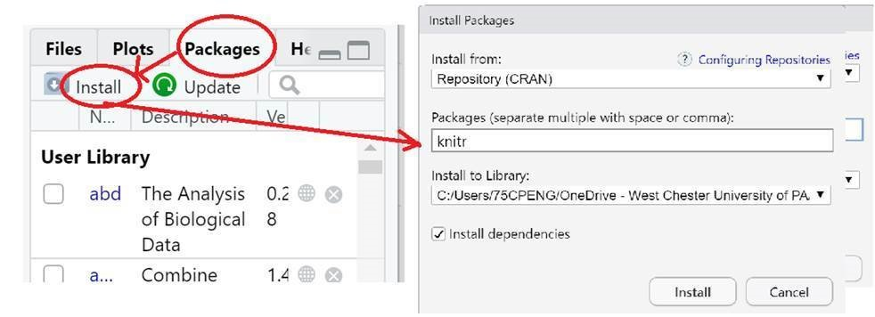

<style type="text/css">
h1.title {
  font-size: 20px;
  color: DarkRed;
  text-align: center;
}
h4.author { /* Header 4 - and the author and data headers use this too  */
    font-size: 18px;
  font-family: "Times New Roman", Times, serif;
  color: DarkRed;
  text-align: center;
}
h4.date { /* Header 4 - and the author and data headers use this too  */
  font-size: 18px;
  font-family: "Times New Roman", Times, serif;
  color: DarkBlue;
  text-align: center;
}
h1 { /* Header 3 - and the author and data headers use this too  */
    font-size: 22px;
    font-family: "Times New Roman", Times, serif;
    color: darkred;
    text-align: center;
}
h2 { /* Header 3 - and the author and data headers use this too  */
    font-size: 18px;
    font-family: "Times New Roman", Times, serif;
    color: navy;
    text-align: left;
}
h3 { /* Header 3 - and the author and data headers use this too  */
    font-size: 15px;
    font-family: "Times New Roman", Times, serif;
    color: navy;
    text-align: left;
}
h4 { /* Header 4 - and the author and data headers use this too  */
    font-size: 18px;
    font-family: "Times New Roman", Times, serif;
    color: darkred;
    text-align: left;
}
</style>


```{r setup, include=FALSE}
# code chunk specifies whether the R code, warnings, and output 
# will be included in the output files.
library(knitr)                           # load to R work-space to use functions in it.
knitr::opts_chunk$set(echo = TRUE,       # include code chunk in the output file.
                      warnings = FALSE,  # sometimes, you code may produce warning messages,
                                         # you can choose to include the warning messages in
                                         # the output file. 
                      results = TRUE     # you can also decide whether to include the output
                                         # in the output file.
                      )   
```


<center><font color = "blue" size =5><b>  Suggested Solutions </b></font> </center>


# Introduction 

We focus on the concepts of random variables and their corresponding distributions. Two basic types of questions are will face very often in this course are to find (1) left-tail probability (area under the density curve) and (2) quantile under given conditions for all continuous distributions. We present numerical examples on normal and t distributions in the last part of the class note. In this assignment, you will do problems similar to the last two examples. You can use the codes provided in the class note [HTML or PDF]. I also include RMD on the course web page but not required. In case some of you want to learn more advanced R coding, the source RMD is useful.

**kable()** function is in library **{knitr}**. If you have not installed this package on your computer, you will receive an error `could not find function "kable" calls:`. The following screenshot shows how to install a package on your computer.

```{r echo=FALSE, fig.align ="center", fig.cap="Install Packages on computer.", fig.height=4,fig.width=4, dev="jpeg"}

```


# Assignments for This Week: <font color = "red"><b>Due: 11:30 PM, Tuesday, 2/23/2021</b></font>

This assignment focuses on the two types of questions using normal distributions. Please prepare an R Markdown document to complete the assignment. <font color = "red">You are expected to submit the RMarkdown document and one of the three converted documents: HTML, PDF, and Word.</font>

## Problem 1

The size of fish is very important to commercial fishing. A study conducted in 2012 found the length of Atlantic cod caught in nets in Karlskrona to have a mean of 49.9 cm and a standard deviation of 3.74 cm (Ovegard, Berndt & Lunneryd, 2012). Assume the length of fish is normally distributed.

  1. State the random variable.
  2. Find the probability that an Atlantic cod has a length less than 52 cm.
  3. Find the probability that an Atlantic cod has a length of more than 74 cm.
  4. Find the probability that an Atlantic cod has a length between 40.5 and 57.5 cm.
  5. If you found an Atlantic cod to have a length of more than 74 cm, what could you conclude?
  6. What length are 15% of all Atlantic cod longer than?

<p style="font-family:verdana"><font color = "red">
**Solution:**  

1. The random variable is defined to be $Y$ = the length of Atlantic cod caught in nets in Karlskrona. This also defines the population of cod in the study.

2. The probability is 0.713 (given in the following code).

```{r}
pnorm(52, mean=49.9, sd = 3.74)
```

3. The probability that an Atlantic cod has a length of more than 74 cm is about 0.

```{r}
1-pnorm(74, mean=49.9, sd = 3.74)
```

4. The probability that an Atlantic cod has a length between 40.5 and 57.5 cm is 0.972.

```{r}
pnorm(57.5, mean=49.9, sd = 3.74) - pnorm(40.5, mean=49.9, sd = 3.74)
```

5. It is really rare to catch a Atlantic cod that has length more than 74 cm since the chance is almost 0 (see part 3. of this problem).

6. "length are 15% of all Atlantic cod longer than" is equivalently to 85-th quantile (<b>keep in mind that the quantile is defined using the left-tail area</b>).

```{r}
qnorm(0.85, mean=49.9, sd = 3.74)
```

That means that 15% Atlantic cod with length longer than 53.77.

</font></p>

## Problem 2

The mean yearly rainfall in Sydney, Australia, is about 137 mm and the standard deviation is about 69 mm ("Annual maximums of," 2013). Assume rainfall is normally distributed.

  1. State the random variable.
  2. Find the probability that the yearly rainfall is less than 100 mm.
  3. Find the probability that the yearly rainfall is more than 240 mm.
  4. Find the probability that the yearly rainfall is between 140 and 250 mm.
  5. If a year has a rainfall less than 100mm, does that mean it is an unusually dry year? Why or why not?
  6. What rainfall amount are 90% of all yearly rainfalls more than?

<p style="font-family:verdana"><font color = "red">
**Solution:** 

1. The random variable is $Y$ = The yearly rainfall in Sydney, Australia. (**Caution**: not the mean yearly rainfall!)

2. The probability that the yearly rainfall is less than 100 mm is 0.296.

```{r}
pnorm(100, mean = 137, sd = 69)
```

3. The probability that the yearly rainfall is more than 240 mm is 0.0678.

```{r}
1 - pnorm(240, mean = 137, sd = 69)
```

4. The probability that the yearly rainfall is between 140 and 250 mm is 0.432.

```{r}
pnorm(250, mean = 137, sd = 69) - pnorm(140, mean = 137, sd = 69)
```

5. No. It is not unusual to observe a yearly rainfall less than 100mm since the chance is 29.6%.


6. We are asked to find the cut-off the 90% of yearly rainfall are **higher than** that. This is actually the 10-th percentile which is 48.57.

```{r}
qnorm(0.1, mean = 137, sd = 69)
```
</font></p>


