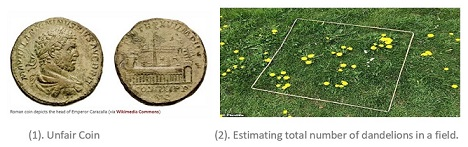
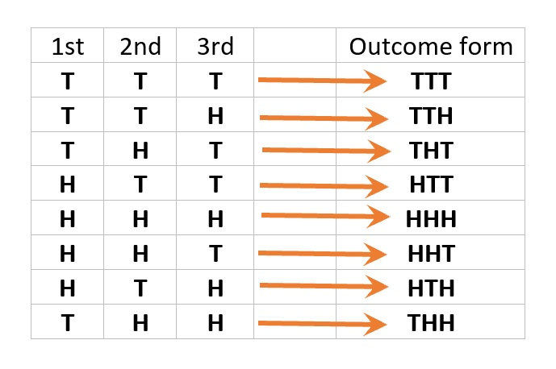
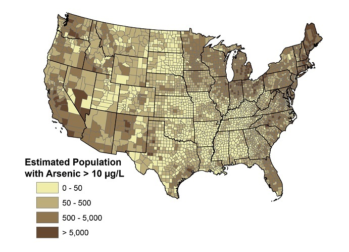

<style type="text/css">
h1.title {
  font-size: 20px;
  color: DarkRed;
  text-align: center;
}
h4.author { /* Header 4 - and the author and data headers use this too  */
    font-size: 18px;
  font-family: "Times New Roman", Times, serif;
  color: DarkRed;
  text-align: center;
}
h4.date { /* Header 4 - and the author and data headers use this too  */
  font-size: 18px;
  font-family: "Times New Roman", Times, serif;
  color: DarkBlue;
  text-align: center;
}
h1 { /* Header 3 - and the author and data headers use this too  */
    font-size: 22px;
    font-family: "Times New Roman", Times, serif;
    color: darkred;
    text-align: center;
}
h2 { /* Header 3 - and the author and data headers use this too  */
    font-size: 18px;
    font-family: "Times New Roman", Times, serif;
    color: navy;
    text-align: left;
}

h3 { /* Header 3 - and the author and data headers use this too  */
    font-size: 15px;
    font-family: "Times New Roman", Times, serif;
    color: navy;
    text-align: left;
}

h4 { /* Header 4 - and the author and data headers use this too  */
    font-size: 18px;
    font-family: "Times New Roman", Times, serif;
    color: darkred;
    text-align: left;
}
</style>


```{r setup, include=FALSE}
# code chunk specifies whether the R code, warnings, and output 
# will be included in the output files.
library(knitr)
library(lessR) 
knitr::opts_chunk$set(echo = TRUE,           # include code chunk in the output file
                      warnings = FALSE,       # sometimes, you code may produce warning messages,
                                              # you can choose to include the warning messages in
                                              # the output file. 
                      results = TRUE          # you can also decide whether to include the output
                                              # in the output file.
                      )   
```


# Concepts of Probability?

In this section, we provide a non-technical description of random variables and their corresponding probability distributions.

## Concepts of random variables

A random variable is a variable and its value is dependent on chance. What is the difference between a "regular" variable we learned from middle school and a **random variable**?

* **Example 1**: Let $x$ be a variable in the equation $3x +4 = 8$. $x$ is unknown before you solve for it from the equation. Most importantly, it is a **fixed** value although it is  unknown.

* **Example 2**: Let $Y$ be the height of the WCU student population. $Y$ is unknown before you measure the height of a student from this population. However, which student is selected to measure he/her height is dependent on **the chance**! 

We can see from examples 1 and 2 that $x$ and $Y$ are variables. $x$ is a **"regular" variable** and $Y$ is a **random variable**!


Because the value of a random variable is **dependent on the chance**, we need additional mathematical tools to characterize the **chance** - probability distribution. This will be described in a non-technical manner in the next section. 

## Types of random variables

There are basic types of random variables: discrete and continuous random variables.

* **Discrete random variables**: A random variable is said to be discrete if its value is obtained by <font color = "red">**counting**</font>. A discrete random variable may have either finite or infinite distinct values. 

  + **Example 3**: *Coin Flipping Experiment* - consider flipping an unfair coin (like the ones in the left panel of Figure 1) 10 times. Let $X=$ the number of **heads** observed.  clearly, $X$ is a discrete random variable since it can take finite values (11 distinct values): 0, 1, 2, ..., 10. Further, it can only take more than 11 distinct values since the unfair coin was flipped 10 times! Moreover, $X$ can never be 2.7! It is discrete!

  + **Example 4**: *Quadrat Sampling (right panel of Figure 1)* - consider estimating the total number of dandelions in a field. We know or we can measure the area of the field. The area of the quadrat is fixed. We can throw the quadrat randomly to the different regions in the field multiple times and count the number of dandelions in the squared plots sampled. Since the ratio of the sampled area and the total area of the field is equal to the ratio of the total number of dandelions in the sampled area and the total number of dandelions in the field. We then can solve the equation for the estimated total number of dandelions in the field. Now, let $Y$ be the number of dandelions inside the quadrat in each sampled region. Clearly, $Y$ is discrete. Is $Y$ finite? Technically speaking, the number of dandelions in the quadrat cannot be infinite no matter where it is placed. However, unlike $X$ in Example 3 that is naturally capped by 11, no cap can be placed on $Y$. Theoretically speaking, $Y$ is infinite! 
  
```{r echo=FALSE, fig.align ="center", fig.cap="Figure 1. Left: unfair coins. Right: quadrat for ecology sampling - estimating the number of dandelions in a field.", fig.height=3,fig.width=6, dev="jpeg"}

```


* **Continuous random variables** A random variable is continuous if its value is obtained by <font color = "red">**measuring**</font>.

  + **Example 5**: Let $Y$ be the pH of arterial plasma (i.e., the acidity of the blood) of people of a population. $Y$ is a typical continuous random variable. It has uncountably many values **between 0 and 14**. It is continuous since any value between any selected pHs could be the pH of a person in the population. 


## Concepts of probability distributions

We first briefly describe the concept of probability and then outline the probability distributions of random variables.

### Concepts of probability

Before introducing the definition of probability, we list the following concepts.

* **(Statistical) Experiment** - a process that produces well-defined outcomes. For example, consider an experiment of flipping a fair coin, the possible outcomes of this experiment are {heads, tails}. 

* **Sample Space** - the set of all possible outcomes is called sample space. The **sample space** of the above coin-toss example is **S = {heads, tails}**.

  + **Example 6**: Consider an experiment of flipping a fair coin *sequentially* three times. We use **T** to denote **tails** and **H** for **heads**. The sample space of this experiment is given by **S = {TTT, TTH, THT, HTT, HHH, HHT, HTH, THH}** that can be explained by the following figure.
  
```{r echo=FALSE, fig.align ="center", fig.cap="Figure 2. Sample space of the experiment of flipping a coin three times.", fig.height=2,fig.width=4, dev="jpeg"}

```

* **Event** - a subset of sample space. Two extreme events are impossible event (i.e., the subset is empty) and sure event (i.e., the subset is equal to the sample space).


  + **Example 7**: We will define a few events based on the experiment in **Example 6** in the following.
    - E1 = {observing at least 2 heads} = {HHH, HTH, THH, HHT}.
    - E2 = {observing exactly one heads} = {HTT, THT, TTH}.
    - E3 = {observing 5 heads} = {} = empty set = impossible event.
    - E4 = {observing at one heads **OR** one tails} = **S** = sure event.
    

  + **Example 8**: We still use the experiment in **Example 6** with sample space **S = {TTT, TTH, THT, HTT, HHH, HHT, HTH, THH}**. Define $Y =$ the number of **heads** observed in the experiment. We now define **Events** based on the value of random variable $Y$.
    - E.0 = {Y=0} = {TTT}.
    - E.1 = {Y=1} = {TTH, THT, HTT}.
    - E.2 = {Y=2} = {THH, HTH, HHT}.
    - E.3 = {Y=1} = {HHH}.

* **Definitions of probability** - There are two technical definitions of probability that measures the chance of occurrence of an event.

  + *Classical probability (based on equally likely outcome)*: P(E) = (# outcomes in E)/(# outcomes in S).
  
    - **Example 9**: The experiment in **Example 6** is an equally likely outcome experiment. Based on the above definition, we can calculate the probability of the event in **Example 7**:
      + P(E1) = #E1/#S = 4/8 = 1/2.
      + P(E2) = #E2/#S = 3/8.
      + P(E3) = #E3/#S = 0/8 = 0. That is, an impossible event has probability 0.
      + P(E4) = #E4/#S = #S/#S = 1. That is, a sure event has probability 1.

  + *Relative frequency approximation* - If an event is defined based on an unequally likely experiment, we need to repeat the experiment multiple times to observe the number of occurrences and then use the relative frequency to **approximate** the probability of the event. This definition is used in most practical applications. 

    - **Example 10**: Chronic arsenic toxicity, which is due to low-concentration exposure over a long period of time, impairs the same organs and tissues and is a threat to public health. The following map shows the distribution of people with arsenic levels > 10 $\mu g/L$ by US counties. As an example, Maine is one of the few states with a high level of arsenic. Let's consider a remote northern Maine community where no public water system is available, the drinking water is from private wells. What is the probability that a long-term resident of the community has an arsenic level of more than 10 $\mu g/L$? Apparently, that probability is NOT 0.5 (i.e., this is not an equally likely outcome experiment). We survey many residents to measure the arsenic level for each selected resident and record whether the arsenic level is higher than 10 $\mu g/L$. The desired probability is approximated by the relative frequency of residents with an arsenic level higher than 10 $\mu g/L$.   

```{r echo=FALSE, fig.align ="center", fig.cap="Figure 2. Distribution of people with arsenic level > 10 ug/L by US counties", fig.height=4,fig.width=4, dev="jpeg"}

```


# Probability distribution of random variables

The probability distribution of a population (or random variable) contains **all information** in the population (random variable). The primary questions we need to answer frequently about the distributions.

* **Finding probabilities**: For any given two values, say $x_1$ and $x_2$, (including one or both of the extreme values), we can find the probability $P(x_1 < X < x_2)$.

* **Finding quantiles (specific values of the random variable)**: For any value $x$ (including one of the extreme values) and a probability, say $p_0$, of well-defined event, we can find the specific value of $Y$, say $x_0$ that was used to define the valid event, from the equation $P(x < X <x_0) = p_0$ or  $P(x_0 < X <x) = p_0$.

There are types of random variables: discrete random variable and continuous random variable. The probability distribution of a random variable provides a way to find the probability of an event defined by a value or a set of values of the random variable.

## Discrete probability distribution

The probability distribution of a discrete random variable is a description of the relative frequencies of the corresponding district values. 

* **Example 11**: Refer to **Example 9**, Let $Y$ be the number of children. $Y$ has 4 possible values: 0, 1, 2, 3. Then the probability of each distinct value of $Y$ is summarized in the following table.

```{r echo = FALSE}
Y = 0:3
P = c(1/8, 3/8, 3/8, 1/8)
prob.table = data.frame( Y = Y, Prob = P)
kable(prob.table, caption = "Probability Distribution Table")
```

With the above table, we can find the probability of all events defined based on the values of random variable $Y$. The above table is called the **probability distribution table**. The following graphic representation of the probability distribution table is called the **probability distribution histogram**.


```{r echo = FALSE,fig.align='center', fig.height=3, fig.width=5} 
## You can ignore the code in this chunk! 
H <- c (1/8,3/8,3/8,1/8)
D <- c("0","1","2","3")
bar <- barplot(H,names.arg=as.character(D),
        axes = FALSE,
        ylim = c(0,0.5),
        xlab = "Number of Children",
        # ylab ="Probability",
        col = "skyblue",
        main = "Distribution of number of children") 
text(x = bar, y = H, label = H, pos = 3, cex = 0.8, col = "navy")
## Add x-axis labels 
axis(1, at =bar,  labels=D, tick=FALSE, cex.axis=1.2)
```

For example, with the above table, we can two types of questions.

* **Finding probabilities** 
  + $P(Y < 2) = P(0< X < 2) = P(Y=0) + P(Y = 1) = 0.125 + 0.375 = 0.5$. 
  + $P(Y > 2) = P(2 < X \le 3) = P(Y = 3) = 0.125$.

* **Finding quantiles**
  + $P(0< X < x_0) = 0.5 \to x_0 = 1.$
  + $P(1<X<x_0) = 0.375 \to x_0 = 0.375.$

**Caution**: The above two types of questions can be complicated in discrete distribution. This [blog post](https://valelab4.ucsf.edu/svn/3rdpartypublic/boost/libs/math/doc/sf_and_dist/html/math_toolkit/policy/pol_tutorial/understand_dis_quant.html) explains this complexity in some detail. we will NOT use the discrete distribution directly in this class, instead, we use will normal distribution (in the next section).

**Remark**: We can see from the above examples that the definition of an event associated with a discrete random variable is a value or set of values.


## Continuous probability distribution

A continuous random variable has uncountably many distinct values. That is, for any two distinct values of the continuous random variable, no matter how close they are, there are still uncountably many values in between. because this property, **an event associated with a continuous random variable is defined to be an interval or the union of some intervals of the values of the random variable**.

```{r echo=FALSE, fig.align='center', fig.height=3, fig.width=5}
x = seq(-12, 15, length=500)
y = 0.4*dnorm(x,-3, 3) + 0.6*dnorm(x,5,3)
par(oma=c(1,1,1,1)) # all sides have 3 lines of space
par(mar=c(2,1,1,1) + 0.1)
plot(x,y, type="l", lwd=2, col="navy",
    axes = FALSE,
    ylim = c(-0.007, 1.1*max(y)),
    xlab ="",
    ylab ="",
    main = "Continuous Distribution: Density Curve",
    col.main="navy")
abline(h=0, col="navy")
ab.seq=seq(-4, 3, length=200)
yab.seq = 0.4*dnorm(ab.seq,-3, 3) + 0.6*dnorm(ab.seq,5,3)
polygon(c(-4,ab.seq,3),c(0, yab.seq, 0), col = "skyblue")
#
y.mid = 0.4*dnorm(-0.5,-3, 3) + 0.6*dnorm(-0.5,5,3)
text(-0.5, 0.5*y.mid, "P(a < X < b) = area", cex = 0.7, col="navy")
##
points(c(-4,3), c(0,0), pch=19, col="yellow", cex = 1.2)
points(c(-4,3), c(0,0), pch=21, col="navy", cex = 1.3)
text(c(-4,3), c(-0.006,-0.006), c("a", "b"), col="navy")
##
y.right = 0.4*dnorm(1,-3, 3) + 0.6*dnorm(1,5,3)
y.1.5a = 1.4*( 0.4*dnorm(-2,-3, 3) + 0.6*dnorm(-2,5,3))
arrows(-2, y.1.5a, 1, y.right, angle=20, length = 0.2, col = "purple", lwd = 2)
text(-2, 1.1*y.1.5a, "density curve of some random variable", cex=0.7, col = "red")
```

Unlike in the case of the discrete random variable in which the height of the vertical bar in the probability histogram is defined to be the probability of observing that corresponding value, **for any continuous random variable**, we define the probability of an event that is defined based on an interval $[a, b]$ to be

* $P(a < X < b) = $ the area of the region defined by $a, b$ and the density curve (see the above figure).

* As a special case, $P(X = c) = 0$. Moreover, $P(X=c_1, c_2, c_3,\cdots )=0$. That is, **the probability of observing countably many values of a continuous random variable is ALWAYS ZERO!**.

* **Two Basic Types of Questions**: finding probabilities and quantiles.

  + *Finding probabilities*: for any given two values (including possibly one of or both $-\infty$ and $\infty$), say $a, b$, then $P(a<X<b)=$ area of the shaded region as shown in the above Figure. As a special case, if $a = b$, then $P(X = a) = 0$. 
  
  + *Finding quantiles*: for a given value, say $x$,  of $X$ (possibly including $\infty$ or $-\infty$) and a probability, say $p_0$, we can find the other value $x_0$ from $P(x < X < x_0) = p_0$ if ($x \le x_0$). As a special case, if the given value is $\infty$ and $-\infty$ (both are not valid values of $X$!), then $x_0$ that satisfies $P(X < x_0) = P(-\infty<X<x_0) = p_0$ is called the $100p_0^{th}$ quantile (see the following figure). 
  
```{r echo=FALSE, fig.align='center', fig.height=3, fig.width=5}
x = seq(-15, 15, length=500)
y = 0.4*dnorm(x,-3, 3) + 0.6*dnorm(x,5,3)
par(oma=c(1,1,1,1)) # all sides have 3 lines of space
par(mar=c(2,1,1,1))
plot(x,y, type="l", lwd=2, col="navy",
    axes = FALSE,
    ylim = c(-0.006, 1.1*max(y)),
    xlab ="",
    ylab ="",
    main = expression(paste("100p"[0],"th percentile of a continuous distribution")),
    col.main="navy")
abline(h=0, col="navy")
ab.seq=seq(-15, 3, length=200)
yab.seq = 0.4*dnorm(ab.seq,-3, 3) + 0.6*dnorm(ab.seq,5,3)
polygon(c(-15,ab.seq,3),c(0, yab.seq, 0), col = "skyblue")
#
points(3, 0, pch=19, col="yellow", cex = 1.2)
points(3, 0, pch=21, col="navy", cex = 1.3)
text(c(-14,3),c(-0.005, -0.005), c(expression(-infinity), expression(paste("x"[0]," = 100p"[0],"th  percentile"))), col="navy", adj =0)
##
y.mid = 0.4*dnorm(-0.5,-3, 3) + 0.6*dnorm(-0.5,5,3)
text(-0.5, 0.5*y.mid, expression(paste("P(X < x"[0],") = p"[0])), cex = 0.7, col="navy")
```

In the next section, we will introduce several distributions of special continuous random variables.

# Special continuous distributions

Four distributions will be used in this course. We introduce the first two of them: normal distribution and t-distribution.

## Normal distribution

The general normal distribution has a bell-shaped distribution as shown in the following figure. A normal distribution is uniquely determined by its mean and variance. We usually use notation $N(\mu, \sigma^2)$, where $\mu$ and $\sigma^2$ are the mean and variance of the normal distribution.  When $\mu=0$ and $\sigma^2 =1$, the normal distribution $N(0,1)$ is called the **standard normal distribution**. The 


```{r echo = FALSE, fig.align='center', fig.height=3, fig.width=7}
x1 = seq(-10, 20, length=500)
x2 = seq(-3.5, 3.5, length = 500)
##
y1 = dnorm(x1, 5, 5)
y2 = dnorm(x2, 0, 1)
##
par(mfrow=c(1,2))
par(oma=c(1,1,1,1)) # all sides have 3 lines of space
par(mar=c(4,1,1,1) + 0.1)
plot(x1, y1, type="l",
     col="navy",
     lwd =2, 
     axes=FALSE,
     xlab = expression(paste(N(5,5^2))),
     ylab = "",
     main = "General Normal",
     col.main="navy",
     col.lab = "navy")
axis(1, col.ticks = "navy", col="navy", col.axis = "navy")
segments(5,0,5,dnorm(5,5,5), lty=2, col = "red")
##
plot(x2, y2, type="l",
     col="navy",
     lwd =2, 
     axes=FALSE,
     xlab = expression(paste(N(0,1))),
     ylab = "",
     main = "Standard Normal",
     col.main="navy",
     col.lab = "navy")
axis(1, col.ticks = "navy", col="navy", col.axis = "navy")
segments(0,0,0,dnorm(0,0,1), lty=2, col = "red")
```

* **Two Types of Questions in Normal Distribution** are related to the left-tail area and quantile. R has two functions for finding **left-tail area** and **quantile** for any given normal distributions.

```{}
pnorm(quantile, mean, sd)          # This function finds the left-tail area for a given quantile.
                                   # mu = mean, sd = standard deviation.
qnorm(left.tail.prob, mean, sd)    # This function finds the quantile for a given left-tail area.
                                   # mu = mean, sd = standard deviation.
```

* **Example 12**: We find the left-tail area of general normal distributions $X \to N(16, 4^2)$.  $P(X < 13) = ?$ 

```{r}
normal.left.tail <- round(pnorm(13, mean = 16, sd = 4),4)
normal.left.tail
```

***Example 13**: We find the left-tail area of the standard normal distributions $X \to N(0, 1)$.  $P(X < 0.3) = ?$ 

```{r}
sd.norm.left.tail <- round(pnorm(0.3, mean = 0, sd = 1),4)
sd.norm.left.tail
```

We next give a graphical representation of the tail area in **Example 12** and **Example 13**.

```{r echo = FALSE, fig.align='center', fig.height=3, fig.width=7}
x1 = seq(0, 30, length=500)
x2 = seq(-3.5, 3.5, length = 500)
##
y1 = dnorm(x1, 16, 4)
y2 = dnorm(x2, 0, 1)
##
par(mfrow=c(1,2))
par(oma=c(1,1,1,1)) # all sides have 3 lines of space
par(mar=c(4,1,1,1) + 0.1)
plot(x1, y1, type="l",
     col="navy",
     lwd =2, 
     axes=FALSE,
     xlab = expression(paste(N(16,4^2))),
     ylab = "",
     ylim=c(-0.01, 1.05*dnorm(16, 16,4)),
     main = "General Normal",
     col.main="navy",
     col.lab = "navy")
axis(1, pos=0, col.ticks = "navy", col="navy", col.axis = "navy")
segments(16,0,16,dnorm(16,16,4), lty=2, col = "red")
## 
tail.seq = seq(0,13, length = 500)
y.tail.seq = dnorm(tail.seq, 16, 4)
polygon(c(0,tail.seq,13), c(0,y.tail.seq,0), col="skyblue")
##
points(13, 0, pch=19, col="yellow", cex = 1.2)
points(13, 0, pch=21, col="navy", cex = 1.3)
#
tail.prob01 = round(pnorm(13, mean = 16, sd = 4),4)
d.r = 0.4 * dnorm(10, 16, 4)
d.l = 0.7 * dnorm(15, 16, 4)
d.l2 = 0.8 * dnorm(15, 16, 4)
arrows(5,d.l, 10, d.r, angle=20, length=0.1, col="navy")
text(6, d.l2, paste("P(x<13)=",tail.prob01, sep=""), col="red", cex = 0.8)
text(13, -0.01, "13", col = "red")
#####
plot(x2, y2, type="l",
     col="navy",
     lwd =2, 
     axes=FALSE,
     xlab = expression(paste(N(0,1))),
     ylab = "",
     ylim=c(-0.05,1.05*dnorm(0)),
     main = "Standard Normal",
     col.main="navy",
     col.lab = "navy")
axis(1, pos=0, col.ticks = "navy", col="navy", col.axis = "navy")
## 
tail.seq0 = seq(-3.5, .3, length = 500)
y.tail.seq0 = dnorm(tail.seq0, 0, 1)
polygon(c(-3.5,tail.seq0,.3), c(0,y.tail.seq0,0), col="skyblue")
segments(0,0,0,dnorm(0,0,1), lty=2, col = "red")
##
points(.3, 0, pch=19, col="yellow", cex = 1.2)
points(.3, 0, pch=21, col="navy", cex = 1.3)
##
tail.prob02 = round(pnorm(.3, mean = 0, sd = 1),4)
d.r = 0.3 * dnorm(0, 0, 1)
d.l = 0.7 * dnorm(0, 0, 1)
d.l2 = 0.8 * dnorm(0, 0, 1)
arrows(-2.5, d.l, -1, d.r, angle=20, length=0.1, col="navy")
text(-2.3, d.l2, paste("P(Z<0.3)=",tail.prob02, sep=""), col="red", cex = 0.8)
text(.3, -0.04, "0.3", col = "red")
```

* **Example 14**: Let $X \to N(16, 4^2)$. Find $P(13 < X <18) = ?$ 
    The following R code calculates the probability. Note that `P(X<18) = pnorm(18, 16, 4)` and `P(X<13) = pnorm(13, 16, 4)`. Therefore `P(13 < X < 18) = pnorm(18, 16, 4) - pnorm(13, 16, 4)`. The probability is the area of the purple region. See the following Figure.

```{r}
p.18 = pnorm(18, 16, 4)
p.13 = pnorm(13, 16, 4)
p.13.to.18 = round(p.18 - p.13, 4)
p.13.to.18
```


```{r echo = FALSE}
## Transparent colors: not required for STA501
mycolor <- function(color, percent = 50, name = NULL) {
  #      color = color name
  #      percent = % transparency
  #      name = an optional name for the color
## Get RGB values for named color
rgb.val <- col2rgb(color)
## Make new color using input color as base and alpha set by transparency
t.col <- rgb(rgb.val[1], rgb.val[2], rgb.val[3],
             max = 255,
             alpha = (100 - percent) * 255 / 100,
             names = name)
## Save the color
invisible(t.col)
}
```


```{r echo = FALSE,fig.align='center', fig.height=3, fig.width=5}
x1 = seq(-2, 30, length=500)
##
y1 = dnorm(x1, 16, 4)
par(oma=c(1,1,1,1)) # all sides have 3 lines of space
par(mar=c(4,1,1,1) + 0.1)
plot(x1, y1, type="l",
     col="navy",
     lwd =2, 
     axes=FALSE,
     xlab = expression(paste(N(16,4^2))),
     ylab = "",
     ylim=c(-0.01, 1.05*dnorm(16, 16,4)),
     main = "General Normal",
     col.main="navy",
     col.lab = "navy",
     cex.main = 0.8)
axis(1, pos=0, col.ticks = "navy", col="navy", col.axis = "navy")
# segments(16,0,16,dnorm(16,16,4), lty=2, col = "red")
## 
tail.seq = seq(0,13, length = 500)
y.tail.seq = dnorm(tail.seq, 16, 4)
##
points(13, 0, pch=19, col="yellow", cex = 1.2)
points(13, 0, pch=21, col="navy", cex = 1.3)
points(18, 0, pch=19, col="yellow", cex = 1.2)
points(18, 0, pch=21, col="navy", cex = 1.3)
#
text(c(13,18), c(-0.009, -0.009), c("13","18"), col = "red", cex=0.7)
##
mycol <- mycolor("purple", perc = 50)
tail.seq18 = seq(0, 18, length = 500)
y.tail.seq18 = dnorm(tail.seq18, 16, 4)
polygon(c(0,tail.seq18,18), c(0,y.tail.seq18,0), col=mycol )
polygon(c(0,tail.seq,13), c(0,y.tail.seq,0), col="blue")
##
tail.prob01 = round(pnorm(13, mean = 16, sd = 4),4)
d.r = 0.3 * dnorm(16, 16, 4)
d.l = 0.7 * dnorm(16, 16, 4)
d.l2 = 0.8 * dnorm(16, 16, 4)
d.l3 = 0.9 * dnorm(16, 16, 4)
arrows(6, d.l, 16, d.r, angle=20, length=0.1, col="navy")
text(6, d.l3,  "pnorm(18, 16, 4) - pnorm(13, 16, 4)", col="red", cex = 0.6)
text(6, d.l2, paste(" = P(13 < x < 18) = ",
    round(pnorm(18, 16, 4)-pnorm(13, 16, 4),4), sep=""), col="red", cex = 0.6)
```


* **Example 15**: Consider the standard normal distribution $N(0,1)$. Find $z_0$ if $P(Z > z_0) = 0.2345$. The answer is given in the following R code: `qnorm(0.2345, 0, 1)` or simply `qnorm(0.2345)`. The latter form does not specify `mean=` and `sd=` since the default `mean = 0` and `sd = 1`.  

```{r}
qnorm(0.2345, 0, 1)     
```

That is, $23.45\%$ of the values in the standard normal population are less than or equal to $-0.7241$ and $23.45\%$ are greater than or equal to $-0.7241$.


## t distribution

The t distribution is symmetric with respect to the vertical axis with a mean of 0. The shape is **ALWAYS** flatter than the **standard normal distribution**. The shape of a t distribution is uniquely determined by the **degrees of freedom**. The following chart describes the relationship between the standard normal and t distributions.

```{r, echo = FALSE, fig.align='center', fig.height=4, fig.width=5}
# comparing standard normal and t distributions
xt = seq(-5,5,length=500)
dinf = dnorm(xt)
dt1 = dt(xt, df=1)
dt2 = dt(xt, df=2)
dt4 = dt(xt, df=4)
dt8 = dt(xt, df=8)
plot(xt, dinf, type="l", lwd = 2, col ="red", axes=FALSE, xlab="", ylab="")
axis(1, pos = 0)
lines(xt, dt1, lwd=2, col ="blue")
lines(xt, dt2, lwd=2, col ="purple")
lines(xt, dt4, lwd=2, col ="pink")
lines(xt, dt8, lwd=2, col ="darkgreen")
legend("topleft", c("N(0,1)", "t(1)", "t(2)", "t(4)", "t(8)"),
       lwd=rep(2,5), col=c("red", "blue", "purple", "pink", "darkgreen"),
       cex = 0.8, bty="n")
```


R has two functions for finding left-tail area (also called tail probability) and quantile:

```{}
pt(quantile, df)         # left-tail probability (left-tail area)
qt(left-tail-area, df)   # quantile
```


* **Example 16**: Answer the following questions about t-distributions.
  + Consider $t(10)$, t-distribution with 10 degrees of freedom. $P(T<1.95) = ?$
  + Consider $t(5)$, t-distribution with 10 degrees of freedom. What is $t_0$ if $P(T<t_0) = 0.575$?


```{r}
# problem 1
problem01 = pt(1.95, df=10)
# Problem 2
problem02 = qt(0.575, df = 5)
## display the two result
cbind(problem01 = problem01, problem02 = problem02)
```

The above results are also reflected in the following figures.

```{r echo = FALSE, fig.align='center', fig.height=3, fig.width=7}
xt = seq(-5, 5, length=500)
##
y1 = dt(xt, 10)
y2 = dt(xt, 5)
##
par(mfrow=c(1,2))
par(oma=c(1,1,1,1)) # all sides have 3 lines of space
par(mar=c(4,1,1,1) + 0.1)
##
plot(xt, y1, type="l",
     col="navy",
     lwd =2, 
     axes=FALSE,
     # xlab = expression(paste(t(10))),
     xlab="",
     ylab = "",
     ylim=c(-0.05, 1.05*dt(0, 10)),
     main = "t(10)",
     col.main="navy",
     col.lab = "navy",
     cex.main=0.8)
axis(1, pos=0, col.ticks = "navy", col="navy", col.axis = "navy")
segments(0,0,0,dt(0,10), lty=2, col = "red")
## 
tail.seq.t10 = seq(-5, 1.95, length = 500)
y.tail.seq.t10 = dt(tail.seq.t10, 10)
polygon(c(-5,tail.seq.t10,1.95), c(0,y.tail.seq.t10,0), col="skyblue")
##
points(1.95, 0, pch=19, col="yellow", cex = 1.2)
points(1.95, 0, pch=21, col="navy", cex = 1.3)
#
tail.prob.t10 = round(pt(1.95, df=10),4)
d.r = 0.4 * dt(0, df=10)
d.l = 0.7 * dt(0, df=10)
d.l2 = 0.8 * dt(0, df=10)
arrows(-2.5,d.l, 0, d.r, angle=20, length=0.1, col="navy")
text(-3, d.l2, paste("P(x < 13)=",tail.prob.t10, sep=""), col="red", cex = 0.8)
text(1.95, -0.04, "1.95", col = "red", cex = 0.9)
#####
plot(xt, y2, type="l",
     col="navy",
     lwd =2, 
     axes=FALSE,
     xlab="",
     ylab = "",
     ylim=c(-0.06,1.05*dt(0, df=5)),
     main = "t(5)",
     col.main="navy",
     col.lab = "navy",
     cex.main = 0.8)
axis(1, pos=0, col.ticks = "navy", col="navy", col.axis = "navy")
## 
tail.seq.t5 = seq(-5, qt(0.575, df=5), length = 500)
y.tail.seq.t5 = dt(tail.seq.t5, df=5)
polygon(c(-5,tail.seq.t5,qt(0.575, df=5)), c(0,y.tail.seq.t5,0), col="skyblue")
segments(0,0,0,dt(0,df=5), lty=2, col = "red")
##
points(qt(0.575, df=5), 0, pch=19, col="yellow", cex = 1.2)
points(qt(0.575, df=5), 0, pch=21, col="navy", cex = 1.3)
##
q.prob02 = round(qt(.575, df=5),4)
d.r = 0.3 * dt(0, df=5)
d.l = 0.7 * dt(0, df=5)
d.l2 = 0.8 * dt(0, df=5)
arrows(-2.5, d.l, -1, d.r, angle=20, length=0.1, col="navy")
text(-3, d.l2, paste("P(Z < t0)=",0.575, sep=""), col="red", cex = 0.8)
text(.3, -0.05, paste("t0 =",q.prob02), col = "red", adj=0, cex = 0.8)
```


# Summary

In this module, we introduced some basic concepts of probability, random variables, distributions of random variables. Left-tail probability and quantile of normal and t distributions are the most important quantities that will be used in this course. We also introduced R functions to calculate left-tail the probability and the quantile of normal and t distributions.  These R functions are summarized in the following.

```{}
# normal distribution
pnorm(quantile, mean, sd)       # for the left-tail probability of normal distribution
qnorm(left.tail.prob, mean, sd) # for the quantile of normal distribution

# t-distribution
pt(quantile, df)        # for the left-tail probability of normal distribution
qt(left.tail.prob, df)  # for the quantile of t distribution
```


# Numerical Examples Based on Normal and t Distributions

* **Example 17**:  In the United States, males between the ages of 40 and 49 eat on average 103.1 g of fat every day with a standard deviation of 4.32 g ("What we eat," 2012). Assume that the amount of fat a person eats is normally distributed.

  1. State the random variable.
  2. Find the probability that a man in the age group of 40-49 in the U.S. eats more than 110 g of fat every day.
  3. Find the probability that a man in the age group of 40-49 in the U.S. eats less than 93 g of fat every day.
  4. Find the probability that a man in the age group of 40-49 in the U.S. eats less than 65 g of fat every day.
  5. If you found a man in the age group of 40-49 in the U.S. who says he eats less than 65 g of fat every day,   would you believe him? Why or why not?
  6. What daily fat level do 5% of all men in the age group of 40-49 in the U.S. eat more than?

**Solution**: We use R to find the answers to the above questions.

  1. $Y$ = amount of fat a person eats every day.
      Calculations of problems 2 - 6 are given in the following R code chunk.
  
```{r}
p2 = 1- pnorm(110, mean =103.1, sd = 4.32)  # 1-left-tail-prob = right-tail-prob
p3 = pnorm(93, mean =103.1, sd = 4.32)      # left-tail probability
p4 = pnorm(65, mean =103.1, sd = 4.32)      # left-tail probability
p5 = pnorm(65, mean =103.1, sd = 4.32)      # left-tail probability
p6 = qnorm(1-0.05, mean =103.1, sd = 4.32)  # quantile
ans = cbind(problem2 = round(p2,4), problem3 =  round(p3,4), 
            problem4 = round(p4,4), problem5 =  round(p5,4), 
            problem6= p6)
row.names(ans) ="prob or quantile"
kable(t(ans))
```
  
  2. The probability that a man in the age group of 40-49 in the U.S. eats more than 110 g of fat every day is 5.51%.
  3. The probability that a man in the age group of 40-49 in the U.S. eats less than 93 g of fat every day is 0.997%.
  4. The probability that a man in the age group of 40-49 in the U.S. eats less than 65 g of fat every day is close to 0.00%.
  5. I will not believe a man in the age group of 40-49 in the U.S. who says he eats less than 65 g of fat every day because the chance of eating less than 65 g in that age group is almost 0.00%.
  6. 5% of all men in the age group of 40-49 in the U.S. eat more than 110.2058 g.


* **Example 18**: The mean cholesterol levels of women age 45-59 in Ghana, Nigeria, and Seychelles is 5.1 mmol/l and the standard deviation is 1.0 mmol/l (Lawes, Hoorn, Law & Rodgers, 2004). Assume that cholesterol levels are normally distributed.

  1. State the random variable.
  2. Find the probability that a woman age 45-59 in Ghana, Nigeria, or Seychelles has a cholesterol level above 6.2 mmol/l (considered a high level).
  3. Find the probability that a woman age 45-59 in Ghana, Nigeria, or Seychelles has a cholesterol level below 5.2 mmol/l (considered a normal level).
  4. Find the probability that a woman age 45-59 in Ghana, Nigeria, or Seychelles has a cholesterol level between 5.2 and 6.2 mmol/l (considered borderline high).
  5. If you found a woman age 45-59 in Ghana, Nigeria, or Seychelles having a cholesterol level above 6.2 mmol/l, what could you conclude?
  6. What value do 5% of all women ages 45-59 in Ghana, Nigeria, or Seychelles have a cholesterol level less than?

**Solution**

  1. Random variable $Y$ = mean cholesterol levels of women age 45-59 in Ghana, Nigeria, and Seychelles.
  
  The calculation of problems 2 - 6 is given in the following R code chunk.
  
```{r}
p2.2 = 1- pnorm(6.2, mean = 5.1, sd = 1)      # 1-left-tail-prob = right-tail-prob
p2.3 = pnorm(5.2, mean = 5.1, sd = 1)         # left-tail probability
p2.4 = pnorm(6.2, mean = 5.1, sd = 1) -  pnorm(5.2, mean = 5.1, sd = 1)    
p2.5 = 1 -pnorm(6.2, mean = 5.1, sd = 1)      # left-tail probability
p2.6 = qnorm(0.05, mean = 5.1, sd = 1)      # quantile
ans.p2 = cbind(problem2 = round(p2.2,4), problem3 =  round(p2.3,4), 
               problem4 = round(p2.4,4), problem5 =  round(p2.5,4), 
               problem6 = p2.6)
row.names(ans.p2) ="prob or quantile"
kable(t(ans.p2))
```


  2. The probability that a woman age 45-59 in Ghana, Nigeria, or Seychelles has a cholesterol level above 6.2 mmol/l is 13.57%.
  3. Find the probability that a woman age 45-59 in Ghana, Nigeria, or Seychelles has a cholesterol level below 5.2 mmol/l is 53.98%.
  4. Find the probability that a woman age 45-59 in Ghana, Nigeria, or Seychelles has a cholesterol level between 5.2 and 6.2 mmol/l 32.45%.
  5. If a woman age 45-59 in Ghana, Nigeria, or Seychelles having a cholesterol level above 6.2 mmol/l, he has a high cholesterol level.
  6. 5% of all women ages 45-59 in Ghana, Nigeria, or Seychelles have a cholesterol level less than 3.455 mmol/l.


