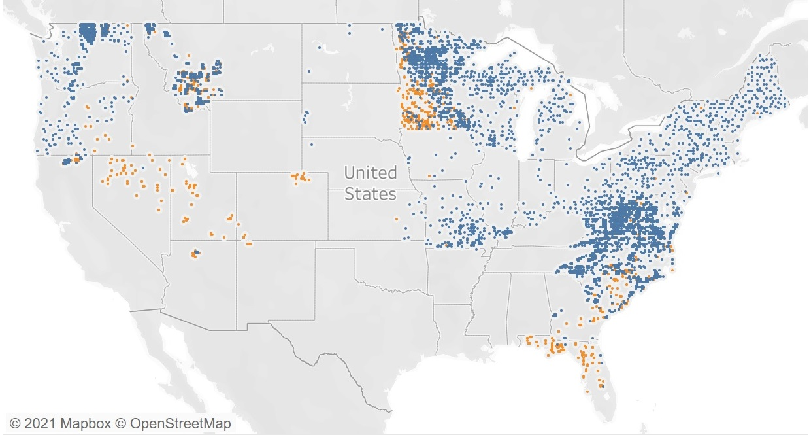

<style type="text/css">
h1.title {
  font-size: 20px;
  color: DarkRed;
  text-align: center;
}
h4.author { /* Header 4 - and the author and data headers use this too  */
    font-size: 18px;
  font-family: "Times New Roman", Times, serif;
  color: DarkRed;
  text-align: center;
}
h4.date { /* Header 4 - and the author and data headers use this too  */
  font-size: 18px;
  font-family: "Times New Roman", Times, serif;
  color: DarkBlue;
  text-align: center;
}
h1 { /* Header 3 - and the author and data headers use this too  */
    font-size: 22px;
    font-family: "Times New Roman", Times, serif;
    color: darkred;
    text-align: center;
}
h2 { /* Header 3 - and the author and data headers use this too  */
    font-size: 18px;
    font-family: "Times New Roman", Times, serif;
    color: navy;
    text-align: left;
}

h3 { /* Header 3 - and the author and data headers use this too  */
    font-size: 15px;
    font-family: "Times New Roman", Times, serif;
    color: navy;
    text-align: left;
}

h4 { /* Header 4 - and the author and data headers use this too  */
    font-size: 18px;
    font-family: "Times New Roman", Times, serif;
    color: darkred;
    text-align: left;
}
</style>

```{r setup, include=FALSE}
# install.packages("remotes") through github since it not
# available from CRAN. 
# 
# remotes::install_github("rlesur/klippy")
##
# install.packages("webshot")
# webshot::install_phantomjs()

# code chunk specifies whether the R code, warnings, and output 
# will be included in the output files.
library(knitr)
library(klippy)
library(webshot)
knitr::opts_chunk$set(echo = TRUE,      # include code chunk in the output file
                      warnings = FALSE, # sometimes, you code may produce warning messages,
                                        # you can choose to include the warning messages in
                                        # the output file. 
                      results = TRUE    # you can also decide whether to include the output
                                        # in the output file.
                      )  
```

```{r klippy, echo=FALSE, include=TRUE}
klippy::klippy(position = c('top', 'right'),color = 'darkred',tooltip_message = 'Click to copy', tooltip_success = 'Done')
```

# Introduction

In this section, we study the random behavior of quantities obtained from random samples using the probability distributions introduced in the previous weeks. 

Some technical terms:

* **Population** - set of all subjects of interest. For example, if we want the average height of WCU students, then the set of all WCU students is the **population**.

* **Sample** - a subset of subjects of the population. For example, all students in the department of Biology form a subset of all WCU students. In other words, the set of all students in Biology is a **sample**. **However**, this **sample** does not represent the **population** since WCU has many other majors.

* **Random Sample** - a subset of subjects that represent the population. For example, we can use one of the methods introduced in week #2 to collect a subset from the WCU student population - to obtain a random sample.

* **Parameter** - numerical characteristic of the population. For example, the average height of the WCU student population, denoted by $\mu$. Apparently, $\mu$ is unknown but fixed.

* **Statistic** - numerical characteristic of population calculated from the random sample. For example, we select a random sample of 150 students from WCU and find the average height, denoted by $\bar{X}$. Apparently, $\bar{X}$ is random since its value is dependent on the random sample.

Since $\bar{X}$ is a random variable, we use probability to characterize the random behavior of $\bar{X}$.


# Concepts of the sampling distribution

We see from the examples in the previous section that the sample mean is a random variable. In fact, all population parameters evaluated at a random sample taken from the population are random variables. To characterize the behavior, we need to use probability distributions.

* **A sampling distribution** is the distribution of a **sample statistic** such as sample mean, sample variance, sampling coefficient of variation, sample correlation coefficient, etc.

A population has many different numerical characteristics that require different probability distributions to characterize them. In this course, we focus on the mean and proportion and some coefficients of regression that affect the mean and proportion. In the next few modules, we introduce procedures for constructing confidence intervals and testing hypotheses inferences for population means and proportions. 

In the next sections, we introduce sampling distributions of sample means and proportions under different assumptions.


# Sampling Distribution of Sampling Means

Inferential statistics is all about making the inference about population parameters by using the information of individual subjects. The estimated population parameters could be used to make a prediction at the individual level.

The information in the estimate is dependent on the amount of information in the sample and the population as well. In the next few sections, we introduce the sampling distribution of sample means under different assumptions.


## Working Data Set: Plant Diversity

This data set includes the geographic location (lat/lon) for 15,136 plots, as well as the herbaceous species richness, climate, soil pH, and other variables related to the plots.

This data set is associated with the following publication: Simkin, S., C. Clark , W. Bowman, E. Allen, J. Belnap, and L. Pardo. The conditional vulnerability of plant diversity to atmospheric nitrogen deposition across the United States. PNAS (PROCEEDINGS OF THE NATIONAL ACADEMY OF SCIENCES). National Academy of Sciences, WASHINGTON, DC, USA, 113(15): 4086-4091, (2016).


```{r fig.align='center', fig.width=7, fig.height= 5}

```


We choose a special subset that contains data associated with **Perennial graminoid vegetation**. That has 1152 records. The distributions of 6 numerical variables are given in the following histograms.

```{r}
plant.diversity = read.csv("https://stat501.s3.amazonaws.com/w05-plant-diversity.csv", header = TRUE)
```


```{r echo=FALSE, fig.align='center'}
plant.diversity = read.csv("https://stat501.s3.amazonaws.com/w05-plant-diversity.csv", header = TRUE)
##
plant.diversity.id = which(plant.diversity$NVC_2_name == "Perennial graminoid vegetation") 
plant.diversity.01 =plant.diversity[plant.diversity.id, ] 
##
CL_kghayr9.924 = plant.diversity.01$CL_kghayr
cl.id = which(CL_kghayr9.924 < 9.4 & CL_kghayr9.924 >9.2 )
drop.id = sample(cl.id, round(0.55*length(cl.id)), replace = FALSE)
plant.diversity.02 = plant.diversity.01[-drop.id,]
##
CL_kghayr8.68 = plant.diversity.02$CL_kghayr
cl.id0 = which(CL_kghayr8.68 < 8.8 & CL_kghayr8.68 >8.6 )
drop.id0 = sample(cl.id0, round(0.25*length(cl.id0)), replace = FALSE)
plant.diversity.03 = plant.diversity.02[-drop.id0,]
##
CL_kghayr8.02 = plant.diversity.03$CL_kghayr
cl.id1 = which(CL_kghayr8.68 < 8.2 & CL_kghayr8.68 >8.0 )
plant.diversity.03 = rbind(plant.diversity.03, plant.diversity.03[cl.id1,]) 
##
par(mfrow = c(2,3))
##
N_dep_kghayr = plant.diversity.03$N_dep_kghayr
N_dep_kghayr = N_dep_kghayr[!is.na(N_dep_kghayr)]
hist(N_dep_kghayr, probability = TRUE, breaks = 10, 
     xlab="Total nitrogen deposition",
     main = "", col = "azure1",border="lightseagreen")
lines(density(N_dep_kghayr, adjust=2), col="blue", )
#
temp_C_ave = plant.diversity.03$temp_C_ave
temp_C_ave = temp_C_ave[!is.na(temp_C_ave)]
hist(temp_C_ave, probability = TRUE,  breaks = 10, 
     xlab="Annual average temperature",
     main = "",col = "azure1",border="lightseagreen")
lines(density(temp_C_ave, adjust=2), col="blue")
#
precip_mm = plant.diversity.03$precip_mm
precip_mm = precip_mm[!is.na(precip_mm)]
hist(precip_mm, probability = TRUE,  breaks = 10, 
     xlab="Annual precipitation",
     main = "",col = "azure1",border="lightseagreen")
lines(density(precip_mm, adjust=2), col="blue")
#
spp_richness = plant.diversity.03$spp_richness
spp_richness = spp_richness[!is.na(spp_richness)]
hist(spp_richness, probability = TRUE, breaks = 10,  
     xlab="Observed species richness",
     main = "",col = "azure1",border="lightseagreen")
lines(density(spp_richness, adjust=2), col="blue")
#
CL_kghayr = plant.diversity.03$CL_kghayr
CL_kghayr = CL_kghayr[!is.na(CL_kghayr)]
hist(CL_kghayr, probability = TRUE,  breaks = 10,
     xlab="Critical Load of nitrogen deposition",
     main = "",col = "azure1",border="lightseagreen")
lines(density(CL_kghayr, adjust=2), col="blue")
#
EX_kghayr = plant.diversity.03$EX_kghayr
EX_kghayr = EX_kghayr[!is.na(EX_kghayr)]
hist(EX_kghayr, probability = TRUE, breaks = 10,  
     xlab="Exceedance of Critical Load",
     main = "",col = "azure1",border="lightseagreen")
lines(density(EX_kghayr, adjust=2), col="blue")

```


We can see from the above histograms that the **Critical Load of nitrogen deposition** is close to the normal distribution. Other variables are **not** normally distributed. In the rest of this note, I will assume the above data sets to be "populations" and take random samples from appropriate populations listed above in different examples. Some of the following examples will be based on the above populations. You may want to use the distributional information (the shapes of histograms) to choose appropriate sampling distributions of sample statistics based on the sample taken from one of the above populations.


## Normal Population with given mean ($\mu$) and Variance ($\sigma^2$)

**Result #1:** Assume that $X$ is a normal random variable with an unknown mean $\mu$ and the known variance $\sigma^2$. That is,

$$
X \to N(\mu, \sigma^2)
$$

Let random sample $\{x_1, x_2, \cdots, x_n  \} \to N(\mu, \sigma_0^2)$, where population mean $\mu$ is unknown and variance $\sigma_0^2$. Then the sample mean

$$
\bar{X} = \frac{\sum_{i=1}^n}{n}
$$
is normally distributed with mean $\mu$ and variance $\sigma^2/n$. In other words,

$$
\bar{X} \to N(\mu, \sigma_0^2/n)
$$

**Remarks**:  The simple comparison of $X$ and $\bar{X}$.

* The means of the distributions of $X$ and $\bar{X}$ are equal.
     
* The variances of the distributions of $X$ and $\bar{X}$ are **not** equal. In fact, the variance of $\bar{X}$ is less than the variance of $X$.

* As the sample size increases, the variance of $\bar{X}$ decreases since the denominator of the variance of $\bar{X}$ contains the sample size $n$.

* Since the R functions **pnorm()** and **qnorm()** require the standard deviation as an argument. 


The following figure shows the variance of the sample means with different sample sizes.

```{r  echo=FALSE,fig.align='center', fig.width= 5, fig.height=4}
# population N(10, 5^2)
dx=seq(-10, 30, length = 500)
dy = dnorm(dx, 10, 5)
plot(dx, dy, type = "l", col = "red",
     axes = FALSE,
     ylim=c(0, max(dnorm(dx,10, 5/sqrt(22)))),
     lwd = 2,
     xlab = "",
     ylab = "",
     main = "Sampling distributions of sample means:\n  normal population",
     cex.main =0.8
)
axis(1, pos = 0)
lines(dx, dnorm(dx,10, 5/sqrt(2)), col = "blue", lwd = 2)
lines(dx, dnorm(dx,10, 5/sqrt(5)), col = "brown", lwd = 2)
lines(dx, dnorm(dx,10, 5/sqrt(10)), col = "skyblue", lwd = 2)
lines(dx, dnorm(dx,10, 5/sqrt(20)), col = "purple", lwd = 2)
legend("topright", c("n=1", "n=2", "n=5", "n=10", "n=20"), lwd=rep(2,5), 
       col=c("red", "blue", "brown", "skyblue", "purple"), 
       cex = 0.7, bty="n")
```

The above figure shows that, as sample size increases, the variance of $\bar{X}$ decreases (the density curve becomes skinnier as sample size increases). 


**Example 1**. We use **Critical Load (CL) of nitrogen deposition** in the **plant diversity** data set. Assume that **Critical Load (CL) of nitrogen deposition** follows a normal distribution with a mean of $\mu=10$ and known variance $\sigma^2 = 0.2$. Use this information to answer the following questions.

1. If a random of 20 Critical Load (CL) of nitrogen deposition sample values are taken from the population,  what is the probability that the mean critical load nitrogen deposition ($\bar{X}$) is great than 10.1 kg N/ha/yr?

2. What is the level of critical load (CL) of nitrogen deposition that is higher than the 95% mean level of critical load (CL) of nitrogen deposition with the same sample size 20?

**Solution**: Since critical load (CL) of nitrogen deposition is a normal population, therefore, the sampling distribution of $\bar{X} \to N(10, .2/20)$. The solutions to problems are based on this sampling distribution.

1. $P(\bar{X} > 10.05)$ is equal to the right tail area of $N(10, (\sqrt{0.2/20})^2$. Note that, by default,  R function **pnorm()** only gives the left-tail area. The desired probability is equal to $1 - left.tail.area$. The R code is given in the following.

```{r}
1-pnorm(10.1, mean = 10, sd = sqrt(0.2/20))
```
Therefore, $P(\bar{X} > 11.5) = 0.1587$. The tail probability is labeled in the following figure.

2. the desired cut-off  if actually the $95\%$ quantile of the distribution of $\bar{X}$ which can be found by **qnorm()**.

```{r}
qnorm(0.95, mean = 10, sd = sqrt(0.2/20))
```

Therefore the $95\%$ quantile is 10.16449.


```{r  echo=FALSE,fig.align='center', fig.width= 5, fig.height=4}
# population N(10, 5^2)
dx=seq(8.5, 11.5, length = 500)
dy = dnorm(dx, 10, sqrt(0.2))
plot(dx, dy, type = "l", col = "red",
     axes = FALSE,
     ylim=c(0, max(dnorm(dx,10, sqrt(0.2/20)))),
     lwd = 2,
     xlab = "",
     ylab = "",
     main = "Sampling distributions of sample means:\n  normal population - Example 1.",
     cex.main =0.8
)
axis(1, pos = 0)
lines(dx, dnorm(dx,10, sqrt(0.2/20)), col = "blue", lwd = 2)
polygon(c(10.1, seq(10.1, 11, length=300), 10.1), c(0, dnorm(seq(10.1, 11, length=300), 10, sqrt(0.2/20)), 0), col="skyblue")
d.y = dnorm(10.1, 10, sqrt(0.2/10))
arrows(10.75, 0.7*d.y, 10.15, 0.2*d.y, angle=20, length =0.1, col = "navy")
text(10.8, 0.8*d.y, expression(paste("P(",bar(X)," > 10.1) = 0.1587")), cex = 0.8, col = "navy")
#
arrows(9, 0.5*d.y, 9.25, dnorm(9.25,10, sqrt(0.2)), angle=20, length=0.1, col="red")
text(9, 0.6*d.y, expression(paste(X %->%  N(10, 0.2))), cex = 0.8, col = "red")
#
arrows(9, 1.1*d.y, 9.85, dnorm(9.85,10, sqrt(0.2/20)), angle=20, length=0.1, col="blue")
text(9, 1.2*d.y, expression(paste(bar(X) %->%  N(10, sqrt(0.2/20)))), cex = 0.8, col = "blue")
#
legend("topright", c("n=1",  "n=20"), lwd=rep(2,5), 
       col=c("red", "blue"), 
       cex = 0.7, bty="n")
```


## Normal Population with a given mean ($\mu$) and an **Unknown** Variance ($\sigma^2$)

If the population variance is unknown, then we have to use sample variance to characterize the distribution $\bar{X}$. Unlike in the case of the normal population with known variance in which we can specify the sampling distribution $\bar{X}$ directly, we cannot but have the following result based on the standardized statistic.


**Result #2:**  Let random sample $\{X_1, X_2, \cdots, X_n \} \to N(\mu, \sigma^2)$ and $\bar{X}$ and $s^2$ be the sample mean and sample variance, respectively. then we have 

$$
\frac{\bar{X}-\mu}{s/\sqrt{n}} \to t_{n-1}
$$
Where $t_{n-1}$ is a t-distribution with $n-1$ degrees of freedom. The two basic types of questions associated with $t-$distribution were discussed in the previous module. 

**Example 2**. Assume that the sample of 11 levels of level of critical load (CL) of nitrogen deposition $\{ 8.67, 9.38, 9.27, 8.56, 8.72, 8.83, 9.72, 8.36, 8.76, 8.91, 9.49 \}$ is randomly selected from all sites in the study. Its **sample standard deviation** is $0.430$. What is the percent of the sample means based on the same sample size 11 will be bigger than 10.2? Note that the population mean is $\mu = 10$.


```{r echo = FALSE}
# example.2.dat = sample(CL_kghayr,       # the population
#                       size = 11,
#                       replace = FALSE  # without replacement since sampled size about 1% of the population.
#                       )
# sd(example.2.dat)
# cbind(pop.var = var(CL_kghayr), sample.var = var(example.2.dat))
```


**Solution** The question to answer is about the sample mean $\bar{X}$ with size $n = 11$. Since the population variance is unknown, $\bar{X}$ is not a normal distribution.

$$
T = \frac{\bar{X} - \mu}{s/\sqrt{n}} \to t_{n-1}
$$
Therefore, 

$$
P(\bar{X} > 10.2) = P\left( \frac{\bar{X}-\mu}{s/\sqrt{n}}  > \frac{10.2-10}{0.43/\sqrt{11}} \right) = P(T>1.543)
$$

As we know, $P(T > 1.543)$ is the right-tail area of $t_{11-1} = t_{10}$. The desired probability is $1-$ left-tailed area. The following R code finds the above probability.

```{r}
1- pt(1.543, df = 11-1)
```

Therefore, $P(T > 1.543) = 0.0769$.


```{r  echo=FALSE, fig.align='center', fig.width= 5, fig.height=4}
# population N(10, 5^2)
dx.t=seq(-4, 4, length = 500)
dy.t = dnorm(dx.t, 0,1)
plot(dx.t, dy.t, type = "l", col = "red",
     axes = FALSE,
     ylim=c(0, max(dnorm(dx.t, 0, 1))),
     lwd = 2,
     xlab = "",
     ylab = "",
     main = "Standard Normal vs t-distribution: Example 2.",
     cex.main =0.8
)
axis(1, pos = 0)
lines(dx.t, dt(dx.t, df=10), col = "blue", lwd = 2)
polygon(c(1.543, seq(1.543, 4, length=300), 1.543), c(0, dt(seq(1.543, 4, length=300), df=10), 0), col="skyblue")

d.y = dt(1.543, df=10)
arrows(0, 0.7*d.y, 1.543, 0, angle=20, length =0.1, col = "navy")
text(0,  0.9*d.y, "T = 1.543", cex = 0.8, col="blue")
#
arrows(3, 1.5*d.y, 2, 0.25*d.y, angle=20, length =0.1, col = "navy")
text(3,  1.8*d.y, expression(paste("P( T > 1.543) = 0.0769")), cex = 0.7, col = "navy")
#
legend("topright", c("standard normal",  "t-distribution(df = 10)"), lwd=rep(2,5), 
       col=c("red", "blue"), 
       cex = 0.7, bty="n")
```


## Unspecified Population with a given mean ($\mu$)and an unspecifed variance ($\sigma^2$)

In previous two cases, we assume the population to be normal. Quite frequently we need to deal with a population without a specified distribution real-world applications. The means the population distribution is unknown. As usual, we assume the population mean is known. The population variance is either given or unknown. If we still want to use the sampling distribution of sample means to make inferences about the population mean, what result(s) we can use to characterize the sampling distribution of the sample mean?

In this section, we discuss this types sampling distribution of sample means under certain conditions. Before we present the result, we perform a simulations to show the patterns of the sampling distributions of sample means using various sample sizes. We simulate a non-normal distribution with two peaks and take samples from that population with different sample sizes, and use these sample means to estimate the corresponding density curves.

```{r  echo=FALSE, fig.align='center', fig.width=7, fig.height=5, warnings = FALSE, results=FALSE}
# simulation with two-component Gaussian mixture model
x = seq(-15, 18, length=500)
y=0.4*dnorm(x, -3, 3) + 0.6*dnorm(x,5,3)
sample.2 =0.4*rnorm(50000, -3, 3) + 0.6*rnorm(50000,5,3)
sample.mtrx = matrix(sample.2, ncol = 50)  # 50-100 matrix, each row is considered as a sample
avg.2 = apply(sample.mtrx[,1:2], 1, mean)
avg.4 = apply(sample.mtrx[,1:4], 1, mean)
avg.8 = apply(sample.mtrx[,1:8], 1, mean)
avg.12 = apply(sample.mtrx[,1:12], 1, mean)
avg.32 = apply(sample.mtrx[,1:32], 1, mean)
ylimit = max(density(avg.2)$y,density(avg.4)$y,density(avg.8)$y,
             density(avg.12)$y, density(avg.32)$y)
#
plot(x, y, type = "l", lwd = 2, col = "red", axes = FALSE, 
     xlab ="", ylab ="", ylim=c(0,ylimit),
     main = "Sampling distribution of sample means \n  with various sample sizes",
     cex.main =0.9, 
     col.main = "navy")
axis(1, pos = 0)
##
lines(density(avg.2 , adjust=2), col="cyan4", lwd =2)
lines(density(avg.4 , adjust=2), col="blue4", lwd =2)
lines(density(avg.8 , adjust=2), col="brown", lwd =2)
lines(density(avg.12 , adjust=2), col="darkorchid", lwd =2)
lines(density(avg.32 , adjust=2), col="mediumblue", lwd =2)
legend("topright", c("n=1: original population", "n=2", "n=4", "n=8", "n=12", "n=32"), 
       col=c("red", "cyan4", "blue4", "brown", "darkorchid", "mediumblue"), 
       bty="n", lwd=rep(2,6), cex = 0.8)
```


The figure shows that, as the sample size increases, the sampling distribution of the sampling mean approaches a normal distribution regardless of the distribution of the original population. The following theorem explicitly specifies the sampling distribution.

**Results #3**: **Central Limit Theorem:** Let $X \to (\mu, \sigma^2)$ (**caution**: the population is not necessarily to be a normal population.). Let $\bar{X}$ be the sample mean with size $n$. If $n$ is large, the sampling $\bar{X}$ is **approximately** normally distributed with a mean $\mu_{\bar{X}} = \mu$ and variance $\sigma_{\bar{X}}^2 = \sigma^2/n$. That is,

$$
\bar{X} \to N\left( \mu, \frac{\sigma^2}{n} \right).
$$

**Comments**: The following are comments related to the normal approximations.

* the baseline population is not specified in the theorem. The distribution could be discrete or continuous.

* when the sample size is large, the sample mean is approximately normally distributed. The question is how large is called "large"? As a convention, we call the sample size is large if $n > 30$.


**Example 3.** The blood cholesterol levels of a population of workers have mean 202 and standard deviation 14. If a sample of 36 workers is selected, approximate the probability that the sample mean of their blood cholesterol levels will lie between 198 and 206.


**Solution** Let $X$ be the blood cholesterol levels of a population of workers. Then $X \to (\mu = 202, \sigma = 14)$. Since $n=36 > 30$, using the C.L.T, we have $\bar{X} \to N(202, 14/\sqrt{36})$. Therefore, 

$$
P(198 < \bar{X} < 206) = P(\bar{X} < 206) - P(\bar{X} < 198) =0.9135237 
$$

```{r}
 pnorm(206, mean = 202, sd = 14/sqrt(36)) - pnorm(198, mean = 202, sd = 14/sqrt(36))
```

The above probability is the area of the shaded area in the following figure.

```{r echo = FALSE, fig.align='center'}
x <- seq(160, 244, length = 300)
y <- dnorm(x, mean =202, sd = 14)
y1 <- dnorm(x, mean =202, sd = 14/sqrt(36))
plot(x, y, type = "l", lwd = 2, col = "navy",
     xlab = "Cholesterol Level",
     ylab = " ",
     ylim = c(0, max(y1)),
     main = "Density curve of cholesterol level \n  shaded area: 0.914",
     cex.main = 0.8,
     col.main = "navy",
     axes = FALSE)
axis(1, pos = 0)
##
lines(x, y1, lwd = 2, col = "darkred")
##
x3 <- seq(198, 206, length=300)
y3 <- dnorm(x3, mean = 202, sd = 14/sqrt(36))
polygon(c(198, x3,206), c(0,y3, 0), col = "skyblue")
lines(x, y1, lwd = 2, col = "darkred")
legend("topright", c("Population distribution", "sampling distribution"), 
       col = c("navy", "darkred"), lwd = rep(2,2), cex = 0.8, bty = "n")
```


# Sampling distribution of sample proportions

For a population of binary data that only takes on exactly two possible values such as "success" vs "failure", "diseased" vs "disease-free", etc., its distribution is uniquely determined by the proportion of one of the categories.

Let $X=\{x_1, x_2, \cdots, x_n\}$ be a random sample taken from a population of binary data taking on only two possible values "success" or "failure". That is, $x_i$ = "success" or "failure", for $i=1, 2, \cdots, n.$ If we are interested in the proportion of "success" of the population, we can do the following numerical coding on the sample:
1 = "success" and 0 = "failure". With this numerical coding, we calculate the sample mean

$$
\hat{p} = \frac{\sum_{i=1}^n x_i}{n} = \frac{\# 1s}{n} = \frac{\# succeses}{n} = proportion.of.successes.
$$

Therefore, the sample proportion is actually a **sample mean**. Therefore, according to the central limit theorem, $\hat{p}$ is approximately normally distributed under certain conditions. This idea is formalized in the following result.

**Result #4**. Let $p$ be the proportion of one of the categories, say "success" and $\hat{p}$ the sample proportion based on a random sample with size $n$. If $np > 5$ and $n(1-p) > 5$, then 

$$
\hat{p} \to N\left( p, \sqrt{\frac{p(1-p)}{n}}\right).
$$

In some applications, the standard deviation $\sqrt{p(1-p)/n}$ is estimated by $\sqrt{\hat{p}(1-\hat{p})/n}$.

```{r echo = FALSE, fig.align='center'}
p = 0.1
# n =20
cnt.matrix = matrix(rbinom(1000000, 1, p), ncol = 1000)
d.1000 = density(apply(cnt.matrix[,1:1000], 1,mean))$x
d.750 = density(apply(cnt.matrix[,1:750], 1,mean))$x
d.500 = density(apply(cnt.matrix[,1:500], 1,mean))$x
d.300 = density(apply(cnt.matrix[,1:300], 1,mean))$x
d.200 = density(apply(cnt.matrix[,1:200], 1,mean))$x
d.100 = density(apply(cnt.matrix[,1:100], 1,mean))$x
#
dy.1000 = density(apply(cnt.matrix[,1:1000], 1,mean))$y
dy.750 = density(apply(cnt.matrix[,1:750], 1,mean))$y
dy.500 = density(apply(cnt.matrix[,1:500], 1,mean))$y
dy.300 = density(apply(cnt.matrix[,1:300], 1,mean))$y
dy.200 = density(apply(cnt.matrix[,1:200], 1,mean))$y
dy.100 = density(apply(cnt.matrix[,1:100], 1,mean))$y
#
rge = range(d.1000, d.750,d.500, d.300, d.200, d.100)
rge.y = range(dy.1000, dy.750,dy.500, dy.300, dy.200, dy.100)
x0 = seq(rge[1], rge[2], length=1000)
#
plot(density(apply(cnt.matrix[,1:1000], 1,mean)), col="red", axes = FALSE,
     xlab = "", ylab = "", lwd = 2, 
     xlim=c(rge[1], 0.8*rge[2]),
     ylim=c(rge.y[1], 1.1*rge.y[2]),
     main ="Simulating Sampling Distribution: p = 0.1",
     cex.main = 0.8, col.main = "navy")
lines(density(apply(cnt.matrix[,1:750], 1,mean)), col="purple", lwd = 2)
lines(density(apply(cnt.matrix[,1:500], 1,mean)), col="skyblue", lwd = 2)
lines(density(apply(cnt.matrix[,1:300], 1,mean)), col="blue", lwd = 2)
lines(density(apply(cnt.matrix[,1:200], 1,mean)), col="brown", lwd = 2)
lines(density(apply(cnt.matrix[,1:100], 1,mean)), col="navy", lwd = 2)
lines(x0, dnorm(x0, p, sqrt(p*(1-p)/1000)), lwd = 2, col="turquoise4", lty =1)
legend("topright", c("Normal","n=1000", "n=750", "n=500", "n=300", "n=200", "n=100"),
       col=c("turquoise4", "red","purple","skyblue", "blue", "brown", "navy"), lwd=rep(2,7),
       cex = 0.8, lty=c(1, rep(1,7)), bty="n")
```

The above simulated sampling distributions with samples taken from a binary population with true $p = 10\%$ use different sample sizes. We see that as the sample size increases, the sampling distribution approaches the normal distribution.


**Example 4** The frequency of color blindness (dyschromatopsia) in the Caucasian American male population is estimated to be about 8%. We take a random sample of size 125 from this population. What is the probability that more than 9% of the 125 subjects have color blindness?

**Solution** Since $np = 125\times 0.08 = 10 > 5$, $n(1-0.08) = 115> 5$, the C.L.T can be used to approximate the sampling distribution of the sample proportion to the normal distribution as outlined in the **result #3**. That is,

$$
\hat{p} \to N\left(0.08, \sqrt{\frac{0.08(1-0.08)}{125}} \right) =N\left(0.08, 0.0243 \right).
$$

The probability we want to find is $P(\hat{p} > 0.09) = 1 -P(\hat{p} < 0.09) = 0.34$

```{r}
1 - pnorm(0.09, mean = 0.08, sd = 0.0243)
```


**Example 5** Suppose 60% of seniors who get flu shots remain healthy, independent from one person to the next. If we selected a random sample from the complex of 100, what is the probability that the sample proportion will be greater than 50%?

**Solution**: We are given that $p=0.6$. Since $np=200\times 0.6 = 120 > 5$ and $n(1-p) = 200 \times 0.4 = 80 > 5$. Using **result #3**, we have 

$$
\hat{p} \to N\left(0.6, \sqrt{\frac{0.6(1-0.6)}{200}} \right) = N(0.6, 0.0346).
$$

Therefore, $P(\hat{p} > 0.5) = 1 - P(\hat{p} < 0.5) = 0.2859$

```{r}
1-pnorm(0.6, 0.0346)
```


# Summary

In this module, we introduced the sampling distribution of sample means and proportions under various assumptions. Let random sample $\{x_1, x_2, \cdots, x_n \}$ be taken from a population with sample mean 

$$
\bar{X} = \frac{\sum_{i=1}^n x_i}{n}.
$$

Th sampling distribution of $\bar{X} (\hat{p})$ under various conditions is summarized in the following .


* **Sampling distribution of sampling means $\bar{X}$**

  + Population is normal with known variance ($\sigma_0^2$).
  
  $$
  \bar{X} \to N\left( \mu, \frac{\sigma_0^2}{n} \right) \Rightarrow \frac{\bar{X}-\mu}{\sigma_0/\sqrt{n}} \to N(0,1).
  $$
  
  
  + Population is normal with unknown variance ($\sigma^2$).
  
  $$
   \bar{X} \to N\left( \mu, \frac{\sigma^2}{n} \right) \Rightarrow \frac{\bar{X}-\mu}{\sigma/\sqrt{n}} \to N(0,1).
  $$
  However, if the sample variance $s^2$ is used,
  
  $$
  \frac{\bar{X}-\mu}{s/\sqrt{n}} \to t_{n-1}.
  $$
  
  + Population is unspecified: **if the sample size is large**,
  
  $$
   \bar{X} \to N\left( \mu, \frac{\sigma^2}{n} \right) \Rightarrow \frac{\bar{X}-\mu}{\sigma/\sqrt{n}} \to N(0,1) \hspace{3mm} \mbox{and} \hspace{3mm} \frac{\bar{X}-\mu}{s/\sqrt{n}} \to N(0,1).
  $$
  
 where $s$ is the sample standard deviation. 
  
* **Sampling distribution of proportions ($\hat{p}$)**: if $np > 5$ and $n(1-p) > 5$, then

$$
\hat{p} \to N\left( p, \frac{p(1-p)}{n} \right) \Rightarrow \frac{\hat{p}-p}{\sqrt{p(1-p)/n}} \to N(0, 1).
$$

Note also that

$$
\frac{\hat{p}-p}{\sqrt{\hat{p}(1-\hat{p})/n}} \to N(0, 1).
$$


