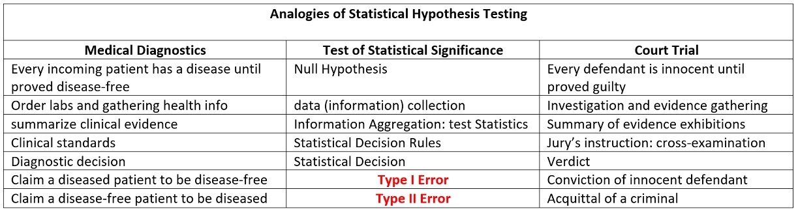
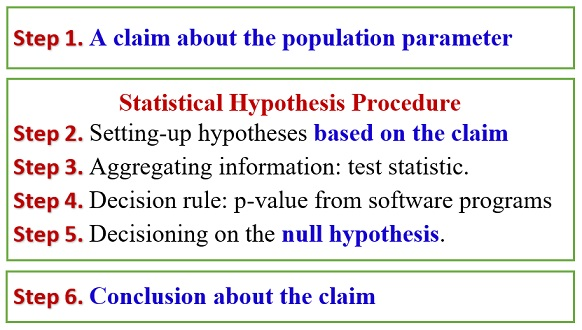
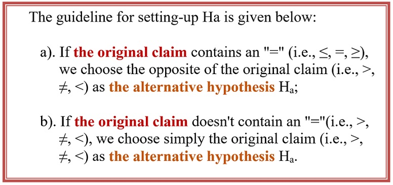
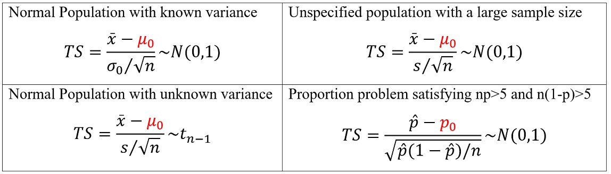
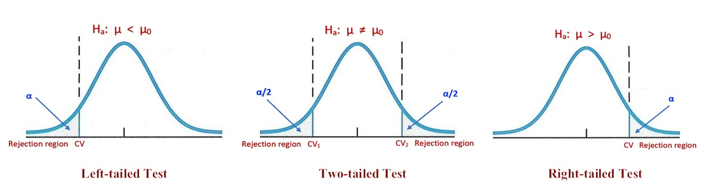
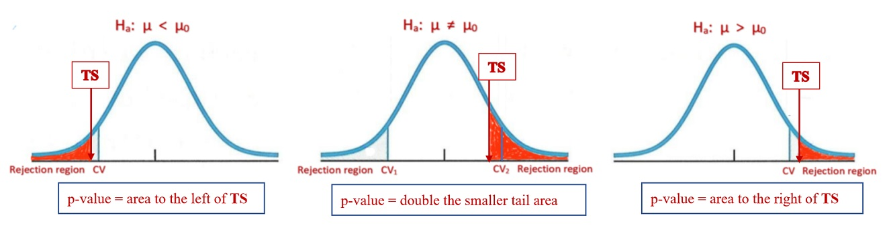

<style type="text/css">
h1.title {
  font-size: 20px;
  color: DarkRed;
  text-align: center;
}
h4.author { /* Header 4 - and the author and data headers use this too  */
    font-size: 18px;
  font-family: "Times New Roman", Times, serif;
  color: DarkRed;
  text-align: center;
}
h4.date { /* Header 4 - and the author and data headers use this too  */
  font-size: 18px;
  font-family: "Times New Roman", Times, serif;
  color: DarkBlue;
  text-align: center;
}
h1 { /* Header 3 - and the author and data headers use this too  */
    font-size: 25px;
    font-family: "Times New Roman", Times, serif;
    color: darkred;
    text-align: center;
}
h2 { /* Header 3 - and the author and data headers use this too  */
    font-size: 20px;
    font-family: "Times New Roman", Times, serif;
    color: navy;
    text-align: left;
}

h3 { /* Header 3 - and the author and data headers use this too  */
    font-size: 18px;
    font-family: "Times New Roman", Times, serif;
    color: navy;
    text-align: left;
}

h4 { /* Header 4 - and the author and data headers use this too  */
    font-size: 18px;
    font-family: "Times New Roman", Times, serif;
    color: darkred;
    text-align: left;
}
</style>

```{r setup, include=FALSE}
# install.packages("remotes") through github since it not
# available from CRAN. 
# 
# remotes::install_github("rlesur/klippy")
##
# install.packages("webshot")
# webshot::install_phantomjs()

# code chunk specifies whether the R code, warnings, and output 
# will be included in the output files.
library(knitr)
library(klippy)
library(webshot)
knitr::opts_chunk$set(echo = TRUE,      # include code chunk in the output file
                      warnings = FALSE, # sometimes, you code may produce warning messages,
                                        # you can choose to include the warning messages in
                                        # the output file. 
                      results = TRUE    # you can also decide whether to include the output
                                        # in the output file.
                      )  
#```
#
#```{r klippy, echo=FALSE, include=TRUE}
#klippy::klippy(position = c('top', 'right'),color = 'darkred',tooltip_message = 'Click to copy', tooltip_success = #'Done')
```

# Introduction

There are two basic statistical inferences: confidence interval and testing hypothesis. In confidence interval inference, we estimate the population parameter(s) by constructing an interval that reals the information about the precision and accuracy of the estimate and the level of confidence of the estimate to be correct.

The other type of inference is to justify a statement about a population parameter. For example, if someone **claims** that the average height of students at a university is higher than 70 inches, how to justify the claim? To reach the binary decision of either supporting the claim or rejecting the claim, we need to gather information from the population and then use the sample evidence to make the statistical decision.

The logic of statistical hypothesis testing is similar to the medical diagnostic decision process and jury trial - both are evidence-based decision processes. Analogies between the statistical testing hypothesis and the aforementioned two processes are summarized in the following table. 

```{r echo=FALSE, fig.align ="center", fig.cap="Analogies of statistical hypothesis testing to jury trial and medical diagnostics", fig.height=2,fig.width=4, dev="jpeg"}

```

Note that no matter whichever statistical decision is made, there will be two possible errors: Type I and type II errors. We can see from the above analogies that **the type I error is  <span style="color:red">more serious than</span> the type II error**. Because of this relationship between the two types of errors, in practice, we control the type I error and then minimize the type II error - this is the basis of Neymann-Pearson's Lemma for statistical hypothesis testing.

With the above conceptual understanding of the testing hypothesis, we next formally formulate the statistical testing hypothesis so that we can implement it in real-world applications.


# Formulation of Statistical Hypothesis Testing

The formal statistical testing hypothesis is summarized in the following steps.


```{r echo=FALSE, fig.align ="center", fig.cap="Formulation of statistical hypothesis testing", fig.height=3,fig.width=2, dev="jpeg"}

```

Unlike the formulation used in the textbook, we separate the **statistical hypothesis testing procedure** from the general testing problem. Steps 2-5 are actual statistical procedures. The general workflow of conducting a testing hypothesis is summarized in the following few sections.


## Null and Alternative  Hypotheses

We start from a practical question that involves data and a statement claiming population parameters. 

**Example** The yield of alfalfa from a random sample of six test plots is 1.4, 1.6, 0.9, 1.9, 2.2 and 1.2 tons per acre. Assume that the random sample comes from a normal population. Test at the 0.05 level of significance whether this supports the contention that the average yield for this kind of alfalfa is 1.5 tons per acre.

* **Data Set**: `{1.4, 1.6, 0.9, 1.9, 2.2, 1.2}`
* **Claim**: `the average yield for this kind of alfalfa is 1.5 tons per acre`.

If we use the Greek letter $\mu$ to denote the population mean, then the claim is $\mu \ne 1.5$ of this particular example. In general, there are six possible claims

$$\mu = 1.5, \mu \ne 1.5, \mu > 1.5, \mu \le 1.5, \mu < 1.5, \mu > 1.5 $$

Three of the six potential claims **have an equal sign** and the other three potential claims **do not have an equal sign**.

## Relationship between the claim and the statistical hypotheses

The statistical **null hypothesis** must contain an **equal sign** since we assume that **the null hypothesis is true**. The **alternative hypothesis** is the opposite of the **null hypothesis**!

In other words, if the claim has an **equal sign**, the corresponding **null hypothesis** is the same as the claim. Otherwise, the **opposite of the claim will be the null hypothesis**.

The above relationship is summarized in the following table.

```{r echo=FALSE, fig.align ="center", fig.cap="Formulation of statistical hypothesis testing", fig.height=3,fig.width=2, dev="jpeg"}

```

**Example 1 (Revisited)** Based on the above description, the **claim** is $\mu = 1.5$. It contains an **equal sign**. Therefore,  the **null hypothesis (Ho)** and the **alternative hypothesis (Ha)** are given by
<center>
Ho: $\mu = 1.5$  v.s.  Ha: $\mu \ne 1.5$.
</center>


## Test Statistics - Statistical Evidence

In construction confidence intervals of population mean and proportion, we used the distribution of **pivotal quantity** since it contains all information needed for constructing a confidence interval. **<span style="color:red">The same amount of information is needed for testing the hypothesis</span>**. We introduced four major types of **pivotal quantities** in the previous module for constructing the confidence intervals of the single population mean $\mu$ and proportion $p$.

In testing hypotheses, we assume the **null hypothesis** is true. Therefore, we replace the unknown population parameter with the claimed value of the parameter in the **null hypothesis**. Therefore, the four test statistics under various assumptions.

```{r echo=FALSE, fig.align ="center", fig.cap="Test statistics under different assumptions", fig.height=3,fig.width=2, dev="jpeg"}

```

The above four statistics are either standard normal or t distribution. **<span style="color:blue">If the claimed value in the null hypothesis is close to the true population parameter, we would expect the value of the test statistic to be around zero<span>**. However, if the value of the test statistic is **far away from zero**, we intend to reject the **null hypothesis** and accept the **alternative hypothesis**. 

A similar question that was asked when we constructed confidence intervals needs to be answered in the testing hypothesis. The **null hypothesis** is rejected if the test statistic is far ways from zero.  **<span style="color:blue">How Far Is Far?</span>** 


## Types of Test and Rejection Region

The rejection of a test is dependent on its specific type (right-, left-, and two-tailed) and the type I error (also called significance level $\alpha$, the same $\alpha$ used in the confidence level $1-\alpha$). Next, we assume the significance to be $\alpha$. The reject region of each of the three types tests in summarized the following.

```{r echo=FALSE, fig.align ="center", fig.cap="Three different types of hypothesis tests", fig.height=3,fig.width=2, dev="jpeg"}

```

From the above figure, we can see the location of the rejection region from the form of the alternative test. The rejection region of the left-tailed test is on the left tail of **the distribution of the test statistic**. The area of the rejection regions is equal to the **significance level $\alpha$**. For a two-tailed test, there two rejection region located on both sides of the tails of the sampling distribution of the test statistic. The tail regions on both tails are equal to $\alpha/2$. We can also interpret the right-tailed test in a similar way.


## Statistical Decision Rule: p-value

In this subsection, we define the **p-value** based on the statistic and the significance level to determine whether the test statistic is in the rejection region. 

```{r echo=FALSE, fig.align ="center", fig.cap="Definitions of p-values for different types of tests", fig.height=3,fig.width=2, dev="jpeg"}

```

The definition of the p-value for different types of tests are given in the above figures. The statistical decision rule is summarized in the following.

* If the p-value is less than the significance level $\alpha$, the **null hypothesis is rejected** and the alternative is accepted.

* if the p-value is greater than the significance level $\alpha$, the **null hypothesis is accepted** and the alternative is rejected.


## Summary of the Test Hypothesis Procedure

The above subsection described the steps for performing a formal statistical hypothesis. When we implement the testing procedure, we need to follow the above-mentioned steps. Particularly, write the original clearly and then based on the description in section 2.1.1 to set up the **null hypothesis (Ho)** and the **alternative hypothesis (Ha)** correctly.

In the next section, we will present numerical examples with different claims and assumptions about the populations. For the two-sample comparison problems, we only focus on testing the difference between two population means.

Some of the examples will be based on the raw data set(s). The analysis related to your research will be based on raw data you generated from lab experiments or fieldwork.

# Case Studies

One important piece of advice is to draw a density curve of the distribution of the underlying distribution of the test statistics and label all information about the population, samples, and the null hypothesis (rejection regions) on the density curve so you can choose a correct R function from **pnorm()** or **pt()** to find the p-value. As a convention, if you are given the significance level $\alpha$, you are expected to use the default significance level $\alpha = 0.05$ meaning that your resulting statistical decision only allows less than $5\%$ of chance to be wrong.


## Case I: normal population with a known variance.

This situation is not common in real-life applications unless you have some prior information about the population variance and you believe that variance remains unchanged.

**Example 2**: Researchers are interested in the mean age of a certain population. The data available to the researchers are the ages of a simple random **sample of 10 individuals** drawn from the population of interest with mean $\bar{x} = 27$. It is assumed that the sample comes from a population whose ages are approximately normally distributed. Let us also assume that the population has a known variance of $\sigma_0^2 = 20$. The question that researchers want to ask is: Can we conclude that the mean age of this population is different from 30 years? Assuming that the mean age of the population is equal to 30.

**Solution**: First of all, the **claim** is the mean age of the research population remains unchanged meaning that $\mu_0=20$. Since the original claim has an equal sign in it, the null hypothesis is identical to the claim. Therefore, the null and alternative hypotheses are given by

$$
H_o: \mu = 30  \leftrightarrow  H_a: \mu \ne 30.
$$

Since the study population is normal with known variance $\sigma_0^2=20$. Therefore, the test statistic
$$
TS = \frac{\bar{x} - \mu_0}{\sigma_0/\sqrt{n}} \to N(0,1)
$$
The calculation of the p-value is given in the following code.

```{r}
# given conditions
xbar = 27
sig.sq.0 = 20
mu0 = 30
n = 10
alpha = 0.05   # not given, use the default
# two-tailed normal test
TS = (xbar - mu0)/(sqrt(sig.sq.0/n))    # test statistics
right.tail.area = 1 - pnorm(TS)      # TS is standard normal
left.tail.area = pnorm(TS)           
p.value = 2*min(right.tail.area, left.tail.area)   # double the smaller tail area
p.value
```

p-value = 0.03389 is less than the default significance level of 0.05. We reject the NULL HYPOTHESIS. We conclude the current mean age of the study population is significantly different from 30 years ago.

**Remarks**

  1. The statistical decision is always made on the **Null Hypothesis**! 
  2. If we are given a raw data set, we need to find the sample mean and sample size and then use the above code to find the p-value.
  

**Example 3**: Refer to **Example 2**. Suppose, instead of asking if they could conclude that $\mu_0= 30$, the
researchers had asked: Can we conclude that $\mu < 30$? 

**Solution**: To this question, the claim is $\mu < 30$ that does NOT have an equal sign in it, we need to the opposite the claim as the null hypothesis.  The alternative hypothesis will be identical to the claim. That is, we have the following null and alternative hypotheses.

$$
H_o: \mu \ge 30  \leftrightarrow  H_a: \mu < 30.
$$

This is a left-tailed test. The rejection region is on the left tail of the density curve of the test statistic. The p-value is calculated by

```{r}
# given conditions
xbar = 27
sig.sq.0 = 20
mu0 = 30
n = 10
alpha = 0.05   # not given, use the default
# two-tailed normal test
TS = (xbar - mu0)/(sqrt(sig.sq.0/n))    # test statistics
right.tail.area = pnorm(TS)         # TS is standard normal
p.value = right.tail.area
p.value
```

Since the p-value is less than 0.05. We reject the null hypothesis that $\mu \ge 30$, we conclude the actual mean age of the population less than 30.


## Case II: Normal population with an unknown variance

From theory, if the sample was taken from a normal population with unknown variance, the test statistic is always a random variable that follows t-distribution with degrees of freedom $df = n-1$.

$$
TS = \frac{\bar{x}-\mu_0}{s/\sqrt{n}} \to t_{n-1}
$$

If the sample is large, the t-distribution is close to the standard normal distribution. In this case, you can use either normal or t-distribution to find the p-value. **However**, if the sample size small (n < 30), we **MUST** use the t -distribution to find the p-value.


**Example 4**: Nakamura et al. studied subjects with medial collateral ligament (MCL) and anterior cruciate ligament (ACL) tears. Between February 1995 and December 1997, 17 consecutive patients with combined acute ACL and grade III MCL injuries were treated by the same physician at the research center. One of the variables of interest was the length of time in days between the occurrence of the injury and the first magnetic resonance imaging (MRI). The data are shown in the following. 

  14, 0, 28, 14, 9, 10, 24, 9, 18, 4, 24, 26, 8, 2, 12, 21, 3

We wish to know if we can conclude that the mean number of days between injury and initial MRI **is not 15 days** in a population presumed to be represented by these sample data. The original problem did not mention in the normal distribution of the population, but we assume the normality of the population in order to perform a t-test about the population mean.

**Solution**: The claim about the population mean is $\mu \ne 15$. This is a two-tailed test. 

$$
H_o: \mu = 15  \leftrightarrow  H_a: \mu \ne 15.
$$

Since we have a small sample (n = 17) from an implicitly assumed population with an unknown variance. The test statistic 

$$
TS = \frac{\bar{x} - \mu_0}{s/\sqrt{n}} \to t_{n-1}
$$

Since this is a t-test with a given set of raw data values, we can use a convenient R function **t.test()** was built based on the above formulas and the definition of p-values. You type `?t.test` in the R console to find the help document of this function and accompanying examples as well. 

```{r}
days = c(14, 0, 28, 14, 9, 10, 24, 9, 18, 4, 24, 26, 8, 2, 12, 21, 3) # define the R data set
t.test(days,                         # data set
       mu = 15,                      # claimed value in the null hypothesis
       conf.level = 0.95,            # confidence level 0.95 => significant level 1-0.95.
       alternative ="two.sided")     # alternative hypothesis
```

The p-value is 0.4403 which is greater than 0.05. We **fail to reject** the null hypothesis. Therefore, the sample DOES NOT have evidence to support the claim that $\mu \ne 15$.

**Remark** We use the formula to find the p-value using **pt()** to find the p-values as shown in the following.

```{r}
days = c(14, 0, 28, 14, 9, 10, 24, 9, 18, 4, 24, 26, 8, 2, 12, 21, 3)
xbar = mean(days)
s = sd(days)
mu0 = 15
n = length(days)
alpha = 0.05    # not given, use the default
# two-tailed normal test
TS = (xbar - mu0)/(s/sqrt(n))    # test statistics
right.tail.area = 1 - pt(TS, df = n-1)         # TS is standard normal
leftt.tail.area = pt(TS, df = n-1) 
p.value = 2*min(right.tail.area,leftt.tail.area)
p.value
```
We can see the p-values generated from the two methods are identical.


## Unspecified population with an unknown variance - CLT

This is a direct application of the CLT. The key is that the sample size MUST be large!

**Example 5**: The goal of a study by Klingler et al. was to determine how symptom recognition and perception influence clinical presentation as a function of race. They characterized symptoms and care-seeking behavior in African-American patients with chest pain seen in the emergency department. One of the presenting vital signs was systolic blood
pressure. Among 157 African-American men, the mean systolic blood pressure was 146mm Hg with a standard deviation of 27. We wish to know if, on the basis of these data, we may conclude that the mean systolic blood pressure for a population of African-American men **is greater than** 140.

**Solution**: The claim is that the mean systolic blood pressure for a population of African-American men **is greater than** 140. That is $\mu > 140$.  Since the claim does not have an equal sign in it, its opposite will be the null hypothesis.

$$
H_o: \mu \le 140  \leftrightarrow  H_a: \mu > 140.
$$

We are also given the sample size $n = 157 > 30$, by the CLT, the test statistic

$$
TS = \frac{\bar{x} - \mu_0}{s/\sqrt{n}} \to N(0,1)
$$

The following code calculates the p-value

```{r}
# sample information
n = 157
xbar = 146
s = 27
mu0 = 140
###
TS = (xbar - mu0)/(s/sqrt(157))
# This is a right-tailed test. we need the right tail area using 1- pnorm(TS)
p.value = 1-pnorm(TS)
p.value
```


## Testing Population Proportion

The most important step is to check whether conditions $np > 5$ and $n(1-p) > 5$ before claiming that 
$$
TS = \frac{\hat{p}-p_0}{\sqrt{\hat{p}(1-\hat{p})/n}} \to N(0,1)
$$
R has a function **prop.test()** for testing proportion and equality of two proportions. Of cause, we can also translate the above formula and appropriate distribution of the test statistics to calculate the p-value.


**Example 6**: Wagenknecht et al. collected data on a sample of 301 Hispanic women living in San Antonio, Texas. One variable of interest was the percentage of subjects with impaired fasting glucose (IFG). IFG refers to a metabolic stage intermediate between normal glucose homeostasis and diabetes. In the study, 24 women were classified in the IFG stage. The article cites population estimates for IFG among Hispanic women in Texas as 6.3 percent. Is there sufficient evidence to indicate that the population of Hispanic women in San Antonio has a prevalence of IFG higher than 6.3 percent?

**Solution**: Note that the claim is that the population of Hispanic women in San Antonio has a prevalence of IFG higher than 6.3 percent. That is, $p > 0.063$. The null and alternative hypotheses are given by

$$
H_o: p \le 0.063  \leftrightarrow  H_a: p > 0.063.
$$

Since $\hat{p} = 24/301$ $n\hat{p} = 301\times\hat{p} = 24 > 5$, $n(1-\hat{p}) = 301\times(1-24/301) > 5$. We can claim that the test statistic is approximately normally distributed.

$$
TS_0 = \frac{\hat{p}-p_0}{\sqrt{\hat{p}(1-\hat{p})/n}} \to N(0,1)
$$

R also has a built-in function **prop.test()** that can be used for testing a single proportion or the equality of two proportions. Here we use the **prop.test()** to conduct the above right-tailed test. The test used in the R function has the following form

$$
TS_1 = \frac{\hat{p}-p_0}{\sqrt{p_0(1-p_0)/n}} \to N(0,1)
$$

The p-value reported from **prop.test()** is slightly different from the formula in which the denominator uses $\hat{p}$.


```{r}
prop.test(x=24,                       # number of successes
          n = 301,                    # sample size
          p = 0.063,                  # claimed probability in the null hypothesis
          alternative = "greater",    # right-tailed test
          conf.level = 0.95)          # significance level = 1 - confidence level
```

The p-value is 0.1409 that is greater than 0.05. We fail to reject the null hypothesis that $p \le 0.063$. Therefore, the sample does not support the claim that $p > 0.063$.

**Remark** Both $TS_0$ and $TS_1$ are valid statistics. They are derived using different methods. The following code shows that the two statistics result in similar p-values. 


```{r}
TS1 = (24/301-0.063)/(sqrt((24/301)*(1-24/301)/301))
TS2 = (24/301-0.063)/(sqrt((0.063)*(1-0.063)/301))
p.value1 = 1 - pnorm(TS1)
p.value2 = 1 - pnorm(TS2)
cbind(p.value1, p.value2)
```

## Testing the difference between two population means

Comparing two population means is common in practice. In this subsection, we introduce two special procedures for testing two population means under different conditions.

### Both populations are unspecified and sample sizes are large.

Assume that $\{ x_1, x_2, \cdots, x_{n_1}\}$ and $\{ y_1, y_2, \cdots, y_{n_2}\}$ are taken from two independent populations with means $\mu_1$ and $\mu_2$, respectively. Assume $n_1 > 30$ and $n_2 > 30$. By CLT, we have 

$$
\bar{x}-\bar{y} \to N\left(\mu_1-\mu_2, \sqrt{\frac{s_1^2}{n_1}+\frac{s_2^2}{n_2}}\right).
$$

Then the test statistic for testing $\mu_1-\mu_2$ is defined to be

$$
TS = \frac{(\bar{x}-\bar{y}) -(\mu_1-\mu_2)}{\sqrt{\frac{s_1^2}{n_1}+\frac{s_2^2}{n_2}}} \to N(0, 1)
$$

**Example 7**: To identify the role of various disease states and additional risk factors in the development of thrombosis. One focus of the study was to determine if there were differing levels of the anticardiolipin antibody IgG in subjects with and without thrombosis. The following table summarizes the researchers’ findings in a study

```{}
Sample statistics:

                     mean   size   stdev
Thrombosis (x)      59.01    53    44.89
No thrombosis (y)   46.61    54    34.85
```

We wish to know if we may conclude, on the basis of these results, that, in general, persons with thrombosis have, on the average, higher IgG levels than persons without thrombosis.

**Solution**: The **claim** is that persons with thrombosis have, on average, higher IgG levels than persons without thrombosis, that is, $\mu_1 - \mu_2 > 0$. The opposite of the claim will be the null hypothesis.

$$
H_o: \mu_1 - \mu_2 \le 0 \leftrightarrow  H_a: \mu_1 - \mu_2 > 0 .
$$

This is a right-tailed test. The test statistic is

$$
TS = \frac{(\bar{x}-\bar{y}) -(\mu_1-\mu_2)}{\sqrt{\frac{s_1^2}{n_1}+\frac{s_2^2}{n_2}}} =
 \frac{(59.01-46.61) -(0)}{\sqrt{\frac{44.89^2}{53}+\frac{34.85^2}{54}}}
$$

we use the following code to find the p-value.

```{r}
#                      mean   size   stdev
# Thrombosis (x)      59.01    53    44.89
# No thrombosis (y)   46.61    54    34.85
xbar = 59.01
ybar = 46.61
s1 = 44.89
s2 = 34.85
n1 = 53
n2 = 54
##
TS = ((xbar - ybar) - 0)/sqrt(s1^2/n1 + s2^2/n2)
## right-tailed test
p.value = 1 - pnorm(TS)
p.value
```

Since p-value = 0.0555 > 0.05, we fail to reject the **null hypothesis** at level 0.05. We conclude that the $\mu_1 - \mu_2 > 0$ meaning that persons with thrombosis have, on average, higher IgG levels than persons without thrombosis.

**Remark**: If we are given two raw data sets, we use **mean()** and **var()** and **length()** to calculate the means, variances and sample sizes.


### Both populations are normal with unknown but equal variances 

Assume that $\{ x_1, x_2, \cdots, x_{n_1}\}$ and $\{ y_1, y_2, \cdots, y_{n_2}\}$ are taken from two independent **normal** populations with means $\mu_1$ and $\mu_2$, respectively. Let $s_1^2$ and $s_2^2$ be the corresponding sample variances. Since we assume that the two population variances are equal.

$$
s_{pool} = \sqrt{\frac{(n_1-1)s_1^2 + (n_2-1)s_2^2}{n_1 + n_2 -2}}
$$

Then the test statistic for testing $\mu_1 - \mu_2$ is defined to be

$$
TS = \frac{(\bar{x}-\bar{y}) -(\mu_1-\mu_2)}{\sqrt{\frac{(n_1-1)s_1^2 + (n_2-1)s_2^2}{n_1 + n_2 -2}}} \to N(0, 1)
$$

We can use the above formulas to find the p-value based on the type of test. In R, **t.test()** can also be used to generate the result directly if we are given the raw data.


**Example 8**:  To investigate wheelchair maneuvering in individuals with lower-level spinal cord injury (SCI) and healthy controls (C). Subjects used a modified wheelchair to incorporate a rigid seat surface to facilitate the specified experimental measurements. Interface pressure measurement was recorded by using a high-resolution pressure-sensitive mat with a spatial resolution of four sensors per square centimeter taped on the rigid seat support. During static sitting conditions, average pressures were recorded under the ischial tuberosities (the bottom part of the pelvic bones). The data for measurements of the left ischial tuberosity (in mm Hg) for the SCI and control groups are shown in the following

```{}
Control: 131 115 124 131 122 117 88 114 150 169
SCI:     60 150 130 180 163 130 121 119 130 148
```

We wish to know if we may conclude, on the basis of these data, that, in general, healthy subjects exhibit lower pressure than SCI subjects.

**Solution**: The **claim** is healthy subjects exhibit lower pressure than SCI subjects, $\mu_c < \mu_s$. Since the claim $\mu_c - \mu_s < 0$ has no equal sign in it, 

$$
H_o: \mu_c - \mu_s \ge 0 \leftrightarrow  H_a: \mu_1 - \mu_2 < 0 .
$$

This is a left-tailed test. We use the following code to test the above hypothesis.


```{r}
## R is case-sensitive, we encourage to use all lower case letters to name variables
control = c(131, 115, 124, 131, 122, 117, 88, 114, 150, 169)
sci= c(60, 150, 130, 180, 163, 130, 121, 119, 130, 148)
##
t.test(control, sci, 
       conf.level = 0.95, 
       alternative = "less", 
       var.equal = TRUE)
```

we can also use the above formulas to find the p-value.

```{r}
control = c(131, 115, 124, 131, 122, 117, 88, 114, 150, 169)
sci= c(60, 150, 130, 180, 163, 130, 121, 119, 130, 148)
xbar.c = mean(control)
s.sq.c = var(control)
ybar.s = mean(sci)
s.sq.s = var(sci)
n.c = length(control)
n.s = length(sci)
##
s.pool = sqrt(((n.c-1)*s.sq.c+(n.s-1)*s.sq.s)/(n.c+n.s-2))
## 
TS = (xbar.c - ybar.s)/(s.pool*sqrt(1/n.c + 1/n.s))
## left-tailed test
p.value = pt(TS, df = n.c+n.s-2)
p.value
```

With p-value = 0.288 > 0.05, we fail to reject the **null hypothesis** and reject the alternative hypothesis. We don't have the sample evidence to support the claim that healthy subjects exhibit lower pressure than SCI subjects.

**Remark**: **t.test()** can conduct two-sample test with unequal variances. 


### Paired t-test

The paired t-test is widely used in clinical studies. For example, an investigator wants to assess the effect of an intervention in reducing systolic blood pressure (SBP) in a pre- and post-design. Here, for each patient, there would be two observations of SBP, that is, before and after. Here instead of individual observations, the difference between pairs of observations would be of interest and the problem reduces to the one-sample situation where the null hypothesis would be to test the mean difference in SBP equal to zero against the alternate hypothesis of mean SBP being not equal to zero. The underlying assumption for using paired t-test is that under the null hypothesis **the population of difference is normally distributed** and this can be judged using the sample values.

**t.test()** can do the paired test. We can also convert the two-sample problem to a single sample problem. Let $\{x_1, x_2, \cdots, x_n \}$ be the before sample and $\{y_1, y_2, \cdots, y_n \}$ be the after sample. We can take the difference of the corresponding before-after sample values to create a single sample $\{y_1-x_1, y_2-x_2, \cdots, y_n-x_n \}$. We can use the one-sample procedure to test the difference between before and after means.


**Example 9**: To study the effects of reminiscence therapy for older women with depression. She studied 15 women 60 years or older residing for 3 months or longer in an assisted living long-term care facility. For this study, depression was measured by the Geriatric Depression Scale (GDS). Higher scores indicate more severe depression symptoms. The participants received reminiscence therapy for long-term care, which uses family photographs, scrapbooks, and personal memorabilia to stimulate memory and conversation among group members. Pre-treatment and post-treatment
depression scores are given in the following table. Can we conclude, based on these data, that subjects who participate in reminiscence therapy experience, on average, a decline in GDS  depression scores? Let $\alpha = 01$.

```{}
Pre–GDS:  12 10 16 2 12 18 11 16 16 10 14 21 9 19 20
Post–GDS: 11 10 11 3  9 13  8 14 16 10 12 22 9 16 18
```


**Solution**: The **claim** is that subjects who participate in reminiscence therapy experience, on average, a decline in GDS  depression scores. $\mu_{after} - \mu_{before} < 0$. This is a left-tailed test.

$$
H_o: \mu_{after} - \mu_{before} \ge 0 \leftrightarrow  H_a: \mu_{after} - \mu_{before} < 0 .
$$

```{r}
pre.GDS = c(12, 10, 16, 2, 12, 18, 11, 16, 16, 10, 14, 21, 9, 19, 20)
post.GDS = c(11, 10, 11, 3,  9, 13,  8, 14, 16, 10, 12, 22, 9, 16, 18)
##
t.test(post.GDS, pre.GDS,  
       conf.level = 0.95, 
       alternative = "less", 
       paired = TRUE)
```

```{r}
pre.GDS = c(12, 10, 16, 2, 12, 18, 11, 16, 16, 10, 14, 21, 9, 19, 20)
post.GDS = c(11, 10, 11, 3,  9, 13,  8, 14, 16, 10, 12, 22, 9, 16, 18)
dif.GDS = post.GDS - pre.GDS
t.test(dif.GDS,
       mu = 0,
       conf.level = 0.95,
       alternative = "less")
```

### Concluding Remarks

The R built-in function **t.test(x,y)** is a black-box method that is convenient to perform the t-tests. For a two-sample test, the difference in the hypothesis testing is defined to be $\mu_x - \mu_y$. **Reversing the order will result in a wrong answer**.

**prop.test()** can also be used to test the equality of two proportions. We also need to pay attention to the order of the two proportions.

Using built-in functions **t.test()** and **prop.test()** is convenient, but we have to know how these functions were set up to avoid unnecessary mistakes. Using formulas to perform test hypotheses can help enhance the understanding of the concept of these testing procedures.


