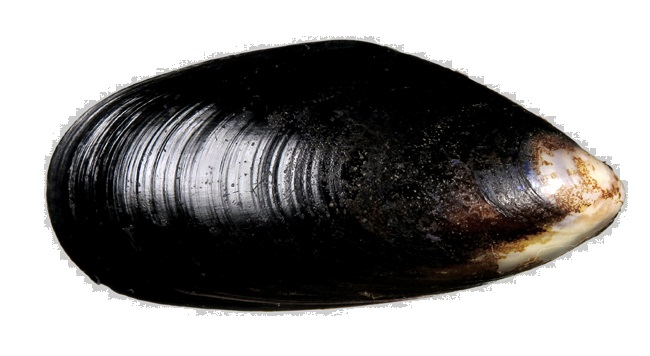

<style type="text/css">
h1.title {
  font-size: 20px;
  color: DarkRed;
  text-align: center;
}
h4.author { /* Header 4 - and the author and data headers use this too  */
    font-size: 18px;
  font-family: "Times New Roman", Times, serif;
  color: DarkRed;
  text-align: center;
}
h4.date { /* Header 4 - and the author and data headers use this too  */
  font-size: 18px;
  font-family: "Times New Roman", Times, serif;
  color: DarkBlue;
  text-align: center;
}
h1 { /* Header 3 - and the author and data headers use this too  */
    font-size: 22px;
    font-family: "Times New Roman", Times, serif;
    color: darkred;
    text-align: center;
}
h2 { /* Header 3 - and the author and data headers use this too  */
    font-size: 18px;
    font-family: "Times New Roman", Times, serif;
    color: navy;
    text-align: left;
}

h3 { /* Header 3 - and the author and data headers use this too  */
    font-size: 15px;
    font-family: "Times New Roman", Times, serif;
    color: navy;
    text-align: left;
}

h4 { /* Header 4 - and the author and data headers use this too  */
    font-size: 18px;
    font-family: "Times New Roman", Times, serif;
    color: darkred;
    text-align: left;
}
</style>

```{r setup, include=FALSE}
# code chunk specifies whether the R code, warnings, and output 
# will be included in the output files.
library(knitr)
library(klippy)
library(webshot)
library(MASS)
knitr::opts_chunk$set(echo = TRUE,       # include code chunk in the output file
                      warnings = FALSE,  # sometimes, you code may produce warning messages,
                                         # you can choose to include the warning messages in
                                         # the output file. 
                      results = TRUE,    # you can also decide whether to include the output
                                         # in the output file.
                      message = FALSE,
                      fig.align='center', 
                      fig.pos = 'h'
                     
                      )  
```

```{r klippy, echo=FALSE, include=TRUE}
#klippy::klippy(position = c('top', 'right'),color = 'darkred',tooltip_message = 'Click to copy', tooltip_success = 'Done')
```

# Introduction and The Question

In the previous module, we introduced the test on equality of two population variance. A natural question is how to compare three, four, more population means? 

## The Question of One-way ANOVA

```{r echo=FALSE, fig.align ="center", fig.cap=" Mussule Mytilus trossulus", fig.height=3,fig.width=4.5, dev="jpeg"}

```


Consider here are some data on a shell measurement in the mussel Mytilus trossulus from five locations: Tillamook, Oregon; Newport, Oregon; Petersburg, Alaska; Magadan, Russia; and Tvarminne, Finland, taken from a much larger data set.


|Tillamook | Newport | Petersburg	| Magadan	| Tvarminne|
|----------|---------|------------|---------|----------|
|($\mu_1$) |($\mu_2$)|  ($\mu_3$) |($\mu_4$)| ($\mu_5$)|
|0.0571    |0.0873   |	0.0974    |	0.1033  |	0.0703   |
|0.0813  	 |0.0662   |	0.1352    |	0.0915  |	0.1026   |
|0.0831  	 |0.0672   |	0.0817    |	0.0781  |	0.0956   |
|0.0976  	 |0.0819   |	0.1016    |	0.0685  |	0.0973   |
|0.0817  	 |0.0749   |	0.0968    |	0.0677  |	0.1039   |
|0.0859  	 |0.0649   |	0.1064    |	0.0697  |	0.1045   |
|0.0735  	 |0.0835   |	0.105     |	0.0764	|          |
|0.0659  	 |0.0725	 | 	          | 0.0689	|          |
|0.0923	 	 |	 	     |            |         |          |
|0.0836	 	 |         |            |         |          |


The statistical **null hypothesis** is that the mean lengths of mussel shell *are the same across the five locations*. That is, the null hypothesis has the following form.

$H_0:$  $\mu_1 = \mu_2 = \mu_3 = \mu_4 = \mu5.$

The **alternative hypothesis** is that the mean lengths of the mussel shells of the five locations are *not all equal*. 

$H_a:$ at least one of the means is different from the other.


## What is ANOVA

ANOVA is a statistical technique that assesses potential differences in a continuous dependent variable by a categorical variable having 2 or more categories. For example, an ANOVA can examine potential differences in the starting salaries of undergraduate students majoring in Biology, Mathematics, and Psychology. We have learned the two-sample t-test to compare the difference of two population mean. To compare three or more population means, we need a new procedure - analysis of variance (ANOVA).

The use of ANOVA depends on the research designs (see the class note of week #2). One-way and k-way ANOVAs are commonly used in practice.


* **One-way ANOVA** involves a single factor variable that has several categories. The one-way ANOVA addresses whether the means across categories are equal. If the means are not equal, the ANOVA does not tell which specific difference. Separate procedures are needed to perform pair-wise comparisons to detect the specific difference.

* **Two-way ANOVA** involves two-factor variables. Each factor variable has several categories. The null hypotheses could be different from situation to situation. This is not the main to cover in this module. We will use multiple linear regression approaches to this problem.


## Assumptions of ANOVA

There two basic assumptions for the **classical ANOVA**.

* The response variable has a normal distribution with potentially different means at different factor levels.

* The variance of the response variable has constant variance (the variances of different categories are equal).

The ANOVA procedures are sensitive to the normality assumption of the response variable.  In practice, we need to perform diagnostic analysis and make sure the assumptions are satisfied. If the assumptions are violated, the resulting p-values might not be correct.

If the constant variance assumption is not satisfied, the distribution of the variance ratio in the ANOVA table is NOT the specified F distribution. One way to handle multiple comparisons with this unequal variance data is the well-known Welch ANOVA. We will use it in the data analysis of the case study.


# Steps of ANOVA

In this section, we outline the steps for the analysis of variance.

## ANOVA Tables

All computer programs that perform ANOVA generate the following ANOVA table.

Source | SS     | DF     | MS     | F    |
-------|--------|--------|--------|------|
Between| $SS_B$ | $K-1$ | $MS_B = SS_B/(K-1)$ | $F=MS_B/MSE_W$|
Within | $SS_W$ | $N-K$ | $MS_W = SS_W/(N-K)$ | 
Total  | $SS_T$ | $N-1$ |         |      |

I will use the mussel length data as an example to calculate the quantities in the above table.


|Tillamook | Newport | Petersburg	| Magadan	| Tvarminne|
|----------|---------|------------|---------|----------|
|($\mu_1$) |($\mu_2$)|  ($\mu_3$) |($\mu_4$)| ($\mu_5$)|
|0.0571    |0.0873   |	0.0974    |	0.1033  |	0.0703   |
|0.0813  	 |0.0662   |	0.1352    |	0.0915  |	0.1026   |
|0.0831  	 |0.0672   |	0.0817    |	0.0781  |	0.0956   |
|0.0976  	 |0.0819   |	0.1016    |	0.0685  |	0.0973   |
|0.0817  	 |0.0749   |	0.0968    |	0.0677  |	0.1039   |
|0.0859  	 |0.0649   |	0.1064    |	0.0697  |	0.1045   |
|0.0735  	 |0.0835   |	0.105     |	0.0764	|          |
|0.0659  	 |0.0725	 | 	          | 0.0689	|          |
|0.0923	 	 |	 	     |            |         |          |
|0.0836	 	 |         |            |         |          |
|$n_1, \bar{x}_1, s_1$ |$n_2, \bar{x}_2, s_2$|  $n_3, \bar{x}_3, s_3$ |$n_4, \bar{x}_4, s_4$| $n_5, \bar{x}_5, s_5$|

In the last row of the table, we calculated the sample mean ($\displaystyle\bar{x}_i$), sample standard deviation ($\displaystyle s_i$), and sample size ($\displaystyle n_i$) of each of the $K=5$ locations. Let $\displaystyle \bar{x}$ is the mean of the combined sample mean and $N=n_1 + n_2 + n_3 + n_4 + n_5.$ 

* The sum of squared deviations between groups.
$$\displaystyle SS_{B} = \sum n_i(\bar{x}_i-\bar{x})^2.$$

* The sum of squared of deviation within groups
$$\displaystyle SS_{W} = \sum (n_i-1)s_i^2.$$

* The sum of total error
$$\displaystyle SS_T = SS_B + SS_W.$$

**Important Result**: If the ANOVA assumptions are satisfied, $F \approx F_{K-1, N-K}$.

If the p-value of the **F test** is less than the given significance level, we reject the null hypothesis.

$H_0:$  $\mu_1 = \mu_2 = \mu_3 = \mu_4 = \mu5.$

This implies that at least one of the means is different from the other.


## Post hoc Pairwise Comparison

If the null hypothesis of the ANOVA is rejected, we need to perform a pairwise comparison the identify the significant difference between the means. There are different types of comparisons: pairwise comparison and various simultaneous comparison procedures are available in R.

## How to Summarize ANOVA Results

* **Describe the test type you used and the purpose of the test** - an ANOVA is appropriate for multiple test subjects. In the above example, the measurements of the same shell were taken from 5 locations. 

* **Write whether or not a significant difference existed between the means of each test group**. Write "There was" or "There was not a significant effect of the factor."

* **Write the results of the F test**. Write F test, followed by a parenthesis, then the two sets of degrees of freedom values separated by a comma, followed by an equal sign and the F value. The statement is something like: "F (two sets of degrees of freedom) = F value, p = p-value."

* **Write "Post hoc test comparison" if a significant result is present**. Write the post hoc test you used. 

* **Recap the results in an easy-to-understand sentence or two**. We could write "A significant difference existed between locations. 


# Welch's ANOVA

The classical ANOVA assumes that the population is normal and variance is constant (i.e., group variances are equal). This is the base to define the F test. If the assumptions are violated, the variance ratio (F test statistic) does not follow an F distribution.

One method commonly used in practice is the Welch ANOVA in which the degrees of freedom are modified to approximate the F distribution. The "Games-Howell" test is commonly used for the post-hoc multiple comparisons for the Welch ANOVA. The Games-Howell post-hoc test is another nonparametric approach to compare combinations of groups or treatments.

In R, `oneway.test()` in **stats** performs Welch ANOVA. It is routine to use both classical ANOVA and Welch's ANOVA. If there are no violations of the model, both ANOVAs yield similar results. If the two results are different, Welch ANOVA is more appropriate. The classical ANOVA is easy to interpret and understandable. If there are no violations, we always report the classical ANOVA.


# Case Study: Mussel Length Example - Solution

We will use R to conduct ANOVA and post hoc comparison on the mussel length example. 

## Creating An ANOVA Table

Next, we create an R data set (data frame) based on the given data table using the following R code to perform the ANOVA procedure.

```{r}
x1 = c(0.0571,0.0813, 0.0831, 0.0976, 0.0817, 0.0859, 0.0735, 0.0659, 0.0923, 0.0836) 
x2 = c(0.0873,0.0662, 0.0672, 0.0819, 0.0749, 0.0649, 0.0835, 0.0725)
x3 = c(0.0974,0.1352, 0.0817, 0.1016, 0.0968, 0.1064, 0.1050)
x4 = c(0.1033,0.0915, 0.0781, 0.0685, 0.0677, 0.0697, 0.0764, 0.0689)
x5 = c(0.0703,0.1026, 0.0956, 0.0973, 0.1039, 0.1045)
mussel.len = c(x1, x2, x3, x4, x5)      # pool all sub-samples of lengths
location = c(rep("Tillamook", length(x1)), 
             rep("Newport", length(x2)),
             rep("Petersburg", length(x3)),
             rep("Magadan", length(x4)),
             rep("Tvarminne", length(x5)))     # location vector matches the lengths
data.matrix = cbind(len = mussel.len, location = location)   # data a data table
musseldata = as.data.frame(data.matrix)        # data frame
model01 = lm(len ~ location, data = musseldata)  # define a model for generating the ANOVA
anova.model = anova(model01)   # creating the ANOVA table
kable(anova.model, caption = "Analysis of variance table")
```

The ANOVA test indicates that not all means are equal ($F(4,34) = 7.12, p = 0.00028$). The follow-up pair-wise comparisons of the group means are given in the next subsection.


## Diagnostic Analysis

Since the ANOVA is sensitive to the normality assumption of the population and the constant variance. We need to check whether there are violations of the assumption. The following diagnostic plots are used to check the appropriateness of the ANOVA test.

```{r fig.align='center', fig.width = 5, fig.height=4, fig.pos='h'}
aov.model = aov(len~location, data=musseldata)
par(mfrow=c(2,2), mar=c(2,1,2,1))
plot(aov.model)
```
**Constant variance**: If all points on the top-left graph are evenly spread around the horizontal axis (the red curve is overlapped with the horizontal axis), then the constant variance assumption is satisfied.

**Normal population**: If all points on the top right graph are all close to the off-diagonal line, then the normality assumption is satisfied.

The above plot showed that there are no significant violations to the assumptions of the ANOVA test. Next, we perform pair-wise comparisons.


```{r}
welch = oneway.test(mussel.len ~ location)
F.stats = as.vector(welch$statistic)
num.df = as.vector(welch$parameter[1])
denom.df = as.vector(welch$parameter[2])
p.value = as.vector(welch$p.value)
cap.text = welch$method
kable(cbind(F.stats = F.stats, num.df = num.df,
            denom.df=denom.df, p.value = p.value), caption = cap.text)
```


## Welch ANOVA

Although no significant violations were observed in the above residual plots, we still perform the Welch ANOVA for illustrative purposes.

```{r}
source("https://stat501.s3.amazonaws.com/anova-posthoc-test.txt")
# posthoc.tgh <- function(y, x, method=c("games-howell", "tukey"), digits=2)
posthoc = posthoc.tgh(mussel.len, location, method="tukey",digits=2 )
descriptives.stats = posthoc$intermediate$descriptives
kable(descriptives.stats, caption = "Descriptive statistics of sub-populations")
```

We can see that both classical and Welch ANOVA yield the same result (both p-values are < 0.01). Therefore, we report the results of classical ANOVA and Tukey's HSD procedure.


## Post-hoc Multiple Comparisons 


Since the null hypothesis was rejected, it is necessary to quantify the differences between groups in order to determine which groups significantly differ from each other.

There are several multiple comparison tests with implementations in various R libraries. We will use Tukey’s Honest Significant Differences (HSD). The Tukey HSD procedure will run a pairwise comparison of all possible combinations of groups and test these pairs for significant differences between their means, all while adjusting the p-value. If the assumption of constant variance is violated, the Welch ANOVA will be carried out. The Games-Howell test will be used if the null hypothesis in the Welch ANOVA is rejected.

The following R code performs the pair-wise comparisons between the group means.


```{r}
aov.model = aov(len~location, data=musseldata)
kable(TukeyHSD(aov.model)$location, caption = "Tukey multiple comparisons of means")
```

The multiple comparisons show that four differences are significant at level 0.05. These differences will be reported in the summary.

**For illustrative purposes**, we carry the Games-Howell test for multiple comparisons in the following. 

```{r}
Games.howell = posthoc$output$games.howell
kable(Games.howell, caption="Games-Howell multiple comparisons")
```

The results are slightly different from Tukey’s HSD test. Next, we present a visual presentation before summarize the ANOVA result and post-hoc comparisons.


## Visual Comparison - Boxplots

```{r fig.align='center', fig.width=7, fig.height=4}
# Box-plot of mussel length by locations
boxplot(mussel.len ~ location,         
        main="Mussel Length Data", # plot title
        xlab="Mussel Length",      # label of x-axis
        ylab="Locations",          # label y-axis
        border = "navy",           # border color box-plot
        col="skyblue")             # box color
```

The box-plot also confirms that the group means are not identical.

## ANOVA Reporting 

We conducted a one-way ANOVA test on the equality of the mean lengths of mussel shells in the five locations and found a statistical significance with F(4, 34) = 7.12, p-value = 0.00028. This implies that the means at different locations are not identical. 

After we conducted pairwise comparisons of the means of the lengths of mussel shells across five locations using the HSD test, we found that, among the 10 pairwise comparisons, four of them are significant with a adjusted p-value less than 0.05: Petersburg - Magadan = 0.0254304 (p = 0.0037), Petersburg - Newport = 0.0286429 (p = 0.0009), Tvarminne - Newport = 0.0209 (p = 0.032),   and Tillamook - Petersburg = -0.0232429 (p = 0.0057). The group box-plot also showed the difference between the locations.

\

\

\

\


