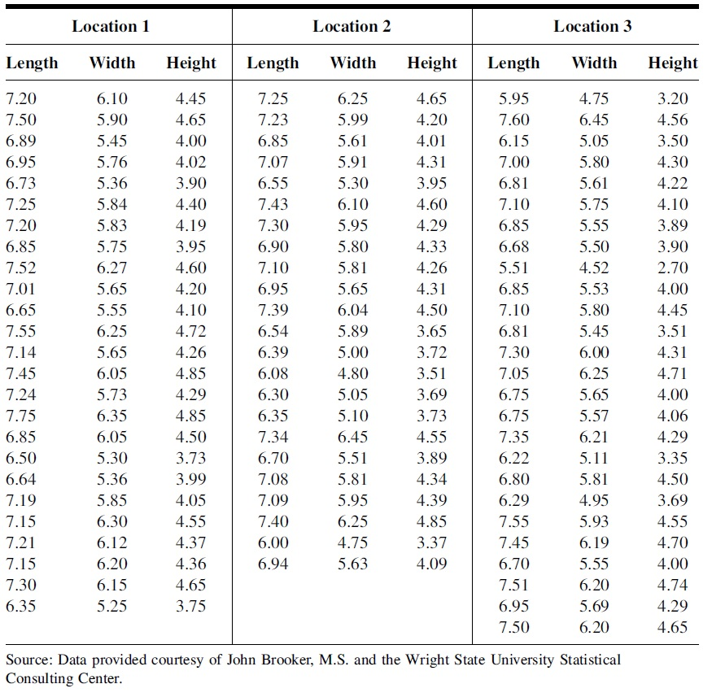

<style type="text/css">
h1.title {
  font-size: 20px;
  color: DarkRed;
  text-align: center;
}
h4.author { /* Header 4 - and the author and data headers use this too  */
    font-size: 18px;
  font-family: "Times New Roman", Times, serif;
  color: DarkRed;
  text-align: center;
}
h4.date { /* Header 4 - and the author and data headers use this too  */
  font-size: 18px;
  font-family: "Times New Roman", Times, serif;
  color: DarkBlue;
  text-align: center;
}
h1 { /* Header 3 - and the author and data headers use this too  */
    font-size: 22px;
    font-family: "Times New Roman", Times, serif;
    color: darkred;
    text-align: center;
}
h2 { /* Header 3 - and the author and data headers use this too  */
    font-size: 18px;
    font-family: "Times New Roman", Times, serif;
    color: navy;
    text-align: left;
}

h3 { /* Header 3 - and the author and data headers use this too  */
    font-size: 15px;
    font-family: "Times New Roman", Times, serif;
    color: navy;
    text-align: left;
}

h4 { /* Header 4 - and the author and data headers use this too  */
    font-size: 18px;
    font-family: "Times New Roman", Times, serif;
    color: darkred;
    text-align: left;
}
</style>

```{r setup, include=FALSE}
# code chunk specifies whether the R code, warnings, and output 
# will be included in the output files.
library(knitr)
library(klippy)
library(webshot)
library(MASS)
knitr::opts_chunk$set(echo = TRUE,       # include code chunk in the output file
                      warnings = FALSE,  # sometimes, you code may produce warning messages,
                                         # you can choose to include the warning messages in
                                         # the output file. 
                      results = TRUE,    # you can also decide whether to include the output
                                         # in the output file.
                      message = FALSE,
                      fig.align='center', 
                      fig.pos = 'h'
                     
                      )  
```

```{r klippy, echo=FALSE, include=TRUE}
klippy::klippy(position = c('top', 'right'),color = 'darkred',tooltip_message = 'Click to copy', tooltip_success = 'Done')
```


The effects of thermal pollution on Asiatic clams at three different geographical
locations were analyzed by researchers. Sample data on clam shell length, width, and
height are displayed in the following table. 


```{r echo=FALSE, fig.align ="center", fig.cap="Clam shell data table", fig.height=4,fig.width=4, dev="jpeg"}

```

The objective is to determine if there is a significant difference in mean length, height, or width (measured in mm) of the clam shell at the three different locations by performing three analyses. 

To save you some time, I created three data sets for length, width, and height respectively in the following code chunk. **You only choose ONE of the three sets** to complete this week's assignment.

```{r}
# length
Len.loc.1 = c(7.20, 7.50, 6.89, 6.95, 6.73, 7.25, 7.20, 6.85, 7.52, 7.01, 6.65, 7.55,
7.14, 7.45, 7.24, 7.75, 6.85, 6.50, 6.64, 7.19, 7.15, 7.21, 7.15, 7.30, 6.35)
Len.loc.2 = c(7.25, 7.23, 6.85, 7.07, 6.55, 7.43, 7.30, 6.90, 7.10, 6.95, 7.39, 6.54,
6.39, 6.08, 6.30, 6.35, 7.34, 6.70, 7.08, 7.09, 7.40, 6.00, 6.94)
Len.loc.3 = c(5.95, 7.60, 6.15, 7.00, 6.81, 7.10, 6.85, 6.68, 5.51, 6.85, 7.10, 6.81,
7.30, 7.05, 6.75, 6.75, 7.35, 6.22, 6.80, 6.29, 7.55, 7.45, 6.70, 7.51, 6.95, 7.50)

# Width
Width.loc.1 = c(6.10, 5.90, 5.45, 5.76, 5.36, 5.84, 5.83, 5.75, 6.27, 5.65, 5.55, 6.25,
          5.65, 6.05, 5.73, 6.35, 6.05, 5.30, 5.36, 5.85, 6.30, 6.12, 6.20, 6.15,5.25)
Width.loc.2 = c(6.25, 5.99, 5.61, 5.91, 5.30, 6.10, 5.95, 5.80, 5.81, 5.65, 6.04, 5.89,
                5.00, 4.80, 5.05, 5.10, 6.45, 5.51, 5.81, 5.95, 6.25, 4.75, 5.63)
Width.loc.3 = c(4.75, 6.45, 5.05, 5.80, 5.61, 5.75, 5.55, 5.50, 4.52, 5.53, 5.80, 5.45,
      6.00, 6.25, 5.65, 5.57, 6.21, 5.11, 5.81, 4.95, 5.93, 6.19, 5.55, 6.20, 5.69, 6.20)

## Height
Height.loc.1 = c(4.45, 4.65, 4.00, 4.02, 3.90, 4.40, 4.19, 3.95, 4.60, 4.20, 4.10, 4.72,
            4.26, 4.85, 4.29, 4.85, 4.50, 3.73, 3.99, 4.05, 4.55, 4.37, 4.36, 4.65, 3.75)
Height.loc.2 = c(4.65, 4.20, 4.01, 4.31, 3.95, 4.60, 4.29, 4.33, 4.26, 4.31, 4.50, 3.65,
           3.72, 3.51, 3.69, 3.73, 4.55, 3.89, 4.34, 4.39, 4.85, 3.37, 4.09)
Height.loc.3 = c(3.20, 4.56, 3.50, 4.30, 4.22, 4.10, 3.89, 3.90, 2.70, 4.00, 4.45, 3.51,
        4.31, 4.71, 4.00, 4.06, 4.29, 3.35, 4.50, 3.69, 4.55, 4.70, 4.00, 4.74, 4.29, 4.65)

```

The following are the steps for the completing the assignment:

1. Pick **ONE** of the three data sets (length, width, and height) from the above code chunk.

2. Modify the code in 4.1 to create an R data set and perform the classical ANOVA analysis. Interpret the ANOVA results as I did in the class note.

3. Perform a diagnostic analysis using the residual plot as shown in Section 4.2. Explain whether you observe any violations of the model assumptions.

4. If the null hypothesis is rejected, carry out multiple comparisons between the three locations using either Tukey's HSD or Games-Howell procedures as I did in sections 4.3 and 4.3.

5. Report the ANOVA analysis results similar to what I did in 4.5.


