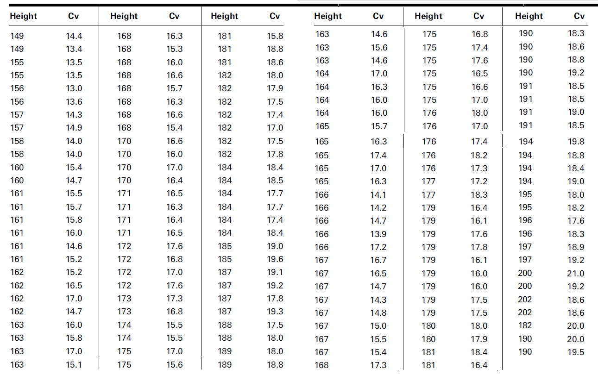

<style type="text/css">
h1.title {
  font-size: 20px;
  color: DarkRed;
  text-align: center;
}
h4.author { /* Header 4 - and the author and data headers use this too  */
    font-size: 18px;
  font-family: "Times New Roman", Times, serif;
  color: DarkRed;
  text-align: center;
}
h4.date { /* Header 4 - and the author and data headers use this too  */
  font-size: 18px;
  font-family: "Times New Roman", Times, serif;
  color: DarkBlue;
  text-align: center;
}
h1 { /* Header 3 - and the author and data headers use this too  */
    font-size: 22px;
    font-family: "Times New Roman", Times, serif;
    color: darkred;
    text-align: center;
}
h2 { /* Header 3 - and the author and data headers use this too  */
    font-size: 18px;
    font-family: "Times New Roman", Times, serif;
    color: navy;
    text-align: left;
}

h3 { /* Header 3 - and the author and data headers use this too  */
    font-size: 15px;
    font-family: "Times New Roman", Times, serif;
    color: navy;
    text-align: left;
}

h4 { /* Header 4 - and the author and data headers use this too  */
    font-size: 18px;
    font-family: "Times New Roman", Times, serif;
    color: darkred;
    text-align: left;
}
</style>

```{r setup, include=FALSE}
# code chunk specifies whether the R code, warnings, and output 
# will be included in the output files.
library(knitr)
library(klippy)
library(webshot)
library(MASS)
knitr::opts_chunk$set(echo = TRUE,       # include code chunk in the output file
                      warnings = FALSE,  # sometimes, you code may produce warning messages,
                                         # you can choose to include the warning messages in
                                         # the output file. 
                      results = TRUE,    # you can also decide whether to include the output
                                         # in the output file.
                      message = FALSE,
                      fig.align='center', 
                      fig.pos = 'h'
                     
                      )  
```

```{r klippy, echo=FALSE, include=TRUE}
#klippy::klippy(position = c('top', 'right'),color = 'darkred',tooltip_message = 'Click to copy', tooltip_success = 'Done')
```


To analyze somatosensory evoked potentials (SEPs) and their interrelations following stimulation of digits I, III, and Vin the hand. The researchers wanted to establish reference criteria in a control population. Thus, healthy volunteers were recruited for the study. In the future, this information could be quite valuable as SEPs may provide a method to demonstrate functional disturbances in patients with suspected cervical root-lesion who have pain and sensory symptoms. In the study, stimulation below-pain-level intensity was applied to the fingers. Recordings of spinal responses were made with electrodes fixed by adhesive electrode cream to the subject’s skin. One of the relationships of interest was the correlation between a subject’s height (cm) and the peak spinal latency (Cv) of the SEP. The data for 155 measurements are shown in the following data table.


```{r echo=FALSE, fig.align ="center", fig.cap="Week 9 assignment data table", fig.height=5, fig.width=7,  dev="jpeg"}

```


To save your time, I create a data file and store it on AWS, you can use the following code directly to load the data to R and then perform and regression analysis.

```{r}
assign.data=read.table("https://stat501.s3.amazonaws.com/w09-assign-data.txt", header = TRUE)
height = assign.data$height
cv = assign.data$cv
```

Use the above and the variables **height** and the cervical (spine) potentials, **cv**,  extracted from the above data table to perform the analyses as I presented in the section of the class note. To be more specific, your assignment should contain the following analyses with the same level of detail.

* make a scatter plot to show the potential association between **height** and **cv**. Please tell the story about the pattern you observed in the scatter plot.

* fit a least square regression to the data. Since we are interested in how the **height** impacts **cv**. The variable **cv** should be the response variable. Once the regression model is built, carry out the residual diagnostic to see whether there is a potential violation of the assumptions.

* If there are violations, consider the generic Box-Cox transformation of **cv** to correct the observable violations. If the numeric value **1** is NOT in the $95\%$ confidence interval of $\lambda$, choose a convenient value of $\lambda$ and re-build the model with the transformed response variable. For example, if the $95\%$ confidence interval of $\lambda$ is [-1.2, 0.91], then we choose $\lambda = 0$ which corresponds to logarithmic transformation. your model formula should take on the form **lm(log(response.var) ~ explanatory.var)**.


* Once the final model is identified, create a summary table that contains the estimated intercept and slope and their significance statistics (p-values).

* Perform an **association analysis** by describing how **height** impacts **cv**. Please interpret the slope parameter as I did in my case study.

* Predict the values of **cv** when **height = 165.6, 173.5** and provide the corresponding $95\%$ predictive intervals.

\

\

\

