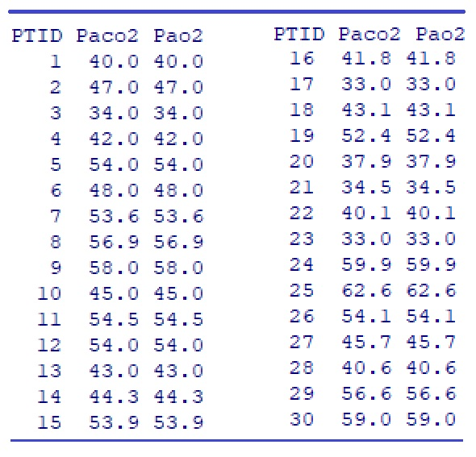

<style type="text/css">
h1.title {
  font-size: 20px;
  color: DarkRed;
  text-align: center;
}
h4.author { /* Header 4 - and the author and data headers use this too  */
    font-size: 18px;
  font-family: "Times New Roman", Times, serif;
  color: DarkRed;
  text-align: center;
}
h4.date { /* Header 4 - and the author and data headers use this too  */
  font-size: 18px;
  font-family: "Times New Roman", Times, serif;
  color: DarkBlue;
  text-align: center;
}
h1 { /* Header 3 - and the author and data headers use this too  */
    font-size: 22px;
    font-family: "Times New Roman", Times, serif;
    color: darkred;
    text-align: center;
}
h2 { /* Header 3 - and the author and data headers use this too  */
    font-size: 18px;
    font-family: "Times New Roman", Times, serif;
    color: navy;
    text-align: left;
}

h3 { /* Header 3 - and the author and data headers use this too  */
    font-size: 15px;
    font-family: "Times New Roman", Times, serif;
    color: navy;
    text-align: left;
}

h4 { /* Header 4 - and the author and data headers use this too  */
    font-size: 18px;
    font-family: "Times New Roman", Times, serif;
    color: darkred;
    text-align: left;
}
</style>

```{r setup, include=FALSE}
# code chunk specifies whether the R code, warnings, and output 
# will be included in the output files.
library(knitr)
library(klippy)
library(webshot)
library(MASS)
knitr::opts_chunk$set(echo = TRUE,       # include code chunk in the output file
                      warnings = FALSE,  # sometimes, you code may produce warning messages,
                                         # you can choose to include the warning messages in
                                         # the output file. 
                      results = TRUE,    # you can also decide whether to include the output
                                         # in the output file.
                      message = FALSE,
                      fig.align='center', 
                      fig.pos = 'h'
                     
                      )  
```

```{r klippy, echo=FALSE, include=TRUE}
klippy::klippy(position = c('top', 'right'),color = 'darkred',tooltip_message = 'Click to copy', tooltip_success = 'Done')
```

# Introduction

In the previous module, we discussed the relationship between a continuous variable (the length of mussel shells) and a categorical variable (location, also called factor variable). If there is no association between the two variables, the means of all populations are equal. If there is an association between the continuous variable and the factor variable, then the means of the populations are not identical.

The continuous variable is assumed to normal distribution. The continuous variable is also called the response variable (dependent variable) and the factor variable is called the predictor variable (or explanatory variable).

A natural question is how to characterize the relationship between two continuous variables.
 


## The question and the data

**Example**: Amyotrophic lateral sclerosis (ALS) is characterized by a progressive decline of motor function. The degenerative process affects the respiratory system. To investigate the longitudinal impact of nocturnal noninvasive positive-pressure ventilation on patients with ALS. Prior to treatment, they measured partial pressure of arterial oxygen (Pao2) and partial pressure of arterial carbon dioxide (Paco2) in patients with the disease. The results were as follows:


```{r echo=FALSE, fig.align ="center", fig.cap=" Length of clamshells", fig.height=5,fig.width=4, dev="jpeg"}

```

Source: M. Butz, K. H.Wollinsky, U.Widemuth-Catrinescu, A. Sperfeld, S. Winter, H. H. Mehrkens, A. C. Ludolph, and H. Schreiber, “Longitudinal Effects of Noninvasive Positive-Pressure Ventilation in Patients with Amyotrophic Lateral Sclerosis,” *American Journal of Medical Rehabilitation*, 82 (2003) 597–604.


The layout of the data table is shown below. Each subject (patient ID) has one **record** with two pieces of information Paco2 and Pao2.


## Visual Inspection for Association 

We define two vectors to store the sample values of partial pressure of arterial oxygen (Pao2) and partial pressure of arterial carbon dioxide (Paco2). Before conducting analysis, we make a scatter plot to visualize the relationship between the two continuous variables.


```{r fig.align='center', fig.height=3.5, fig.width=5}
# define the data sets based on the given data table.
Paco2 =c(40.0, 47.0, 34.0, 42.0, 54.0, 48.0, 53.6, 56.9, 58.0, 45.0, 54.5, 54.0, 43.0,
         44.3, 53.9, 41.8, 33.0, 43.1, 52.4, 37.9, 34.5, 40.1, 33.0, 59.9, 62.6, 54.1,
         45.7, 40.6, 56.6, 59.0)
Pao2 = c(101.0, 69.0, 132.0, 65.0, 72.0, 76.0, 67.2, 70.9, 73.0, 66.0, 80.0, 72.0,
         105.0, 113.0, 69.2, 66.7, 67.0, 77.5, 65.1, 71.0, 86.5, 74.7, 94.0, 60.4,
         52.5, 76.9, 65.3, 80.3, 53.2, 71.9)
## scatter plot
plot(Paco2, Pao2, 
     pch = 20,
     col = "navy",
     main = "Relationship between Paco2 and Pao2",
     xlab = "Paco2",
     ylab = "Pao2"
)
## The following two lines are not required when you make this scatter plot
segments(30, 65, 55, 50, lty = 3, col = "darkred")
segments(33, 140, 70, 60, lty = 3, col = "blue")
abline(lm(Pao2 ~ Paco2), col = "purple")
```

We can see from the above scatter plot that there is a negative association between Paco2 and Pao2 since Pao2 decreases as Paco2 increases. We can also see that **the variance** of Pao2 is also decreasing as Paco2 increases.

How to quantify the above association?


# The strength of linear correlation - coefficient of correlation

## Definition of Pearosn correlation coefficient

One well-known quantity for measuring the **linear association** between two numerical variables is the Pearson-correlation coefficient. The sample Pearson correlation coefficient is defined as

$$
r=\frac{\sum_{i=1}^n(x_i-\bar{x})(y_i-\bar{y})}{\sqrt{\sum_{i=1}^n(x_i-\bar{x})^2}\sqrt{\sum_{i=1}^n(y_i-\bar{y})^2}}
$$

## Interpretation of correlation coefficient

The interpretation of the Pearson correlation coefficient is customarily given in the following

* if $r > 0$, then $x$ and $y$ are positively correlated; if $r < 0$, then $x$ and $y$ are negatively correlated;

* if $r = 0$, there is **no** linear correlation between $x$ and $y$.

* if $|r| < 0.3$, there is a **weak** linear correlation between $x$ and $y$.

* if $0.3< |r| < 0.7$, there is a **moderate** linear correlation between $x$ and $y$.

* if $0.7 < |r| < 1.0$, there is a **strong** linear correlation between $x$ and $y$.

* if $r = 1$, there is a **perfect** linear correlation between $x$ and $y$.

In R, we use command **cor()** to calculate the above Pearson correlation coefficient.

```{r}
Pearson.correlation = cbind(r=cor(Paco2, Pao2))
kable(Pearson.correlation, caption = "Pearson correlation coefficient",
      align="c")
```

Therefore, there is a weak negative linear correlation between the partial pressure of arterial oxygen (Pao2) and partial pressure of arterial carbon dioxide (Paco2).


# Least square regression: structure, diagnostics, and applications

For illustration purposes, we make the following plot based on an artificial data set to introduce several important concepts of the least square regression model.

```{r echo=FALSE, fig.align='center', fig.width=6, fig.height=5.5}
height <- c(176, 154, 138, 132, 176, 181, 150)
bodymass <- c(82, 49, 53, 47, 69, 77, 62)
plot(bodymass, height, pch=21, col = "navy", 
     main="Illustration of Least Square Regression", 
     ylim=c(130,200), xlim=c(45, 85),
     col.main = "navy", cex.main = 1.2)
#text(bodymass, (height+5), as.character(1:length(height)), col="red", cex=0.8)
model00 = lm(height~bodymass)
abline(model00)
yhat = model00$fit
segments(bodymass, height, bodymass, yhat, lty=2, col="red")
#
points(bodymass, height, pch=20, col = "navy")
points(bodymass, yhat, pch=20, col = "navy")
#
half.pt=(height+yhat)/2
resid.dif.hgt = round(height-yhat,2)
text(bodymass+1.2, half.pt, as.character(resid.dif.hgt), col="red", cex=0.7)
#
resid.txt=paste("e",(1:length(height)),"=", sep="")
text(bodymass-1.2, half.pt, resid.txt, col="red", cex=0.7)
##
pred.y = sum(coef(model00)*c(1,73))
arrows( 68, 186, 73, pred.y+0.5, col="blue", angle=25, length=0.10)
text(68, 191, expression(paste(widehat(height)," = 78.537 + 1.27 bodymass", sep="")),col="blue", cex = 0.7)
text(68, 188, "(Fitted Regression Line)", col="red", cex = 0.7)
# observed value
arrows(82, 165, 82, 175, col="darkred", angle=25, length=0.1)
text(82, 163, "(observed point)", col="darkred", cex = 0.7)
arrows(82, 190, 82, yhat[1]+1, col="darkred", angle=25, length=0.1)
text(82, 192, "(fitted point)", col="darkred", cex = 0.7)
## slope and intercept
arrows(c(66,70), rep(196,2), c(66,70), rep(192,2), angle = 25, length=0.1, col = "red")
text(c(66,70), rep(198,2), c("intercept", "slope"), col="red", cex = 0.7)
## predict new value
pred.new = sum(coef(model00)*c(1,66))
points(66, pred.new, pch=16, col="yellow")
points(66, 127.5, pch=16, col="red")
arrows(66, 127.5, 66, pred.new-0.5, col="darkmagenta", angle=25, length=0.1)
text(67, 0.5*(pred.new+127), "(new value of bosymass: 66)", cex=0.7, col="darkmagenta", srt=90)
##
points(66, pred.new, pch=21, col="red")
arrows(65.8, pred.new, 43.5, pred.new, angle = 25, length=0.1, col="darkmagenta")
points(43.4, pred.new, pch=16, col="darkred")
text(55, pred.new+2, "(Prediction: = 78.537+1.27*66 = 162.4)", cex=0.7, col="darkmagenta", srt=0)
##
text(78,145," Application 2:\nPrediction", col ="darkmagenta")
text(50,193,"  Application 1:\nAssociation", col ="blue")
```

## Definitions 

The following concepts are annotated on the above figure.

* The variable associated with the vertical variable is called the **response** variable. The *response** variable is always placed on the left-hand side of the model formula.

* The variable that impacts the value of the response variable is called the explanatory variable (also called predictor, independent variables).

* The points in the figure plotted based on the data set are called observed data points.

* The line in the figure is called the **fitted regression line**.

* The points on the fitted regression line are called **fitted data points**.

* The difference between coordinates observed and fitted points is called ** the residual** of the observed data point. The residual is, in fact, called the fitted error. It reflects the goodness of the fitted regression line. $e_i$ $(i = 1 ,2 ,\cdots, n)$ are the estimated residual errors.

* The **best** regression line is obtained by minimizing the sum of the squared errors, $e_1^2 +e_2^2+\cdots + e_2^2$. This is the reason why we call the **best** regression line the **least square regression line** .

* The intercept and slope completely determine a straight line. The intercept and slope of the **least square** regression line are obtained by minimizing the sum of the squared residual errors.

* The statistical term *linear model* is the equation of the fitted regression line.

* There are two possible applications of a linear regression model.

  + **Association analysis** - basic describes how the change of explanatory variable impacts the value of the response variable.

  + **Prediction analysis** - predict the values of the response variable based on the corresponding **new values** of the explanatory variable.
  
In this module, we only discuss the least square regression with ONE explanatory variable. In the next module, we will generalize this model to multiple explanatory variables.

## Assumptions of Least Square Regression

The assumptions of the least square linear regression are identical to the ones of the ANOVA.

* The response variable is a **normal random variable**. Its mean is dependent on the **non-random** explanatory variable.

* The variance of the response variable is constant (i.e., its variance is NOT dependent on the **non-random** explanatory variable).

* The relationship between the response and explanatory variables is assumed to be correctly specified.


## Model Building and Diagnostics

We will use **lm()** and the artificial data used in the above plot to find the least square estimate of **parameters**: intercept and slope. 


```{r}
height <- c(176, 154, 138, 132, 176, 181, 150)
bodymass <- c(82, 49, 53, 47, 69, 77, 62)
ls.reg <- lm(height ~ bodymass)
parameter.estimates <- ls.reg$coef
kable(parameter.estimates, 
      caption = "Least square estimate of the intercept and slope", 
      align='c')
```

The least square estimated intercept and slope are approximately equal to 78.63 and 1.27. Therefore, the fitted least square regression line is $\widehat{height}_i = 78.63 + 1.27\times bodymass_i$. The residual error $e_i=height_i - \widehat{height}_i$, for $i=1, 2, \cdots, n.$


Since the explanatory variable is implicitly assumed to be a non-random variable, we can see the relationship between the response variable and the residual in the following general representation.

$$
response.variable = \alpha + \beta \times predictor.variable + \epsilon
$$

The assumption that the response variable is normal with a constant variance is equivalent to that $\epsilon$ is a normal random variable with mean 0 and constant variance $\sigma_0^2$. 

The residual $\epsilon$ is estimated by the errors $e_i$.  Therefore, we can look at the distribution of $\{e_1, e_2, \cdots, e_n\}$ to see potential violations of the model assumptions.

## Residual Diagnostics and Remedies

We make four default residual plots from R function **lm()** in R.  

```{r fig.align='center', fig.width=6, fig.height=2.5}
par(mfrow = c(1,2))  # par => graphic parameter
                     # mfrow => splits the graphic page into panels
#
plot(ls.reg$fitted.values, ls.reg$residuals,    
     main="Residuals vs Fitted",       # title of the plot
     xlab = "Fitted Values",           # label of X-axis 
     ylab = "Residuals"                # label of y-axis
     )
abline(h=0, lty=2, col = "darkred")
##
qqnorm(ls.reg$fitted.values, main = "Normal Q-Q")
qqline(ls.reg$fitted.values, lty = 2, col = "darkred")
```

We can see that there seems to have a minor violation of the assumption of constant variance from the residual plot in the top left figure. In statistics, we have a transformation to stabilize the variable. We will introduce the well-known Box-Cox transformation in this module. It is a generic transformation and was designed to identify the optimal power transformation to stabilize the variance and maintain the normality. Sometimes it works really well but not always. It is always worth a try in case we observed the pattern of non-constant variance.


```{r fig.align='center', fig.width=4, fig.height=3.5}
library(MASS)
boxcox(height ~ bodymass, 
       lambda = seq(-5, 12, length = 100), 
       xlab="lambda")
## 
title(main = "Box-Cox Transformation: 95% CI of lambda",
      col.main = "navy", cex.main = 0.9)
```

The above plot shows the 95% confidence interval of the power ($\lambda$) on the potential power transformation of the response variable $height$. 

In practice, we choose the **most convenient** number in the interval as the power to transform the response variable. Since 1 is in the interval, it is necessary to perform a power transformation. We can also choose the logarithmic transformation of height since $\lambda = 0$ is also in the interval.

**Note**: A special power transformation is the logarithmic transformation of the response if we choose $\lambda = 0$.


## Final Model with Applications

Once the final model is identified, we can use it in two different ways: association and prediction.

In the **association analysis**, we interpret the regression coefficient associated with the significant explanatory variable. 

In this toy example, the summarized statistics are extracted and summarized in the following

```{r}
kable(summary(ls.reg)$coef, caption = "Summary of regression model")
```

The p-value of testing the null hypothesis that the slope parameter to be zero is 0.0075. We reject the null hypothesis $H_0: slope = 0$. This implies that **bodymass** impacts **height**. To be more specific, as the value of **bodymass** increases by one unit, the response variable **height** will increase by 1.27 cm.


In the **prediction analysis**, we can predict the **height** with any given new **bodymass** that is not in the data set. For example, assume **bodymass = 75**, we can then use R function **predict()** to predict the **height**.

```{r}
pred.height = predict(ls.reg, newdata = data.frame(bodymass=75), interval = "prediction", level=0.05)
kable(pred.height, caption="The predicted height with body mass: 75")
```

For a given person with a body mass of 75 unit, the predicted height of that person is 173.7cm  with a 95% predictive interval [173.0, 174.5].

**In summary**: It is dependent on the objectives of your data analysis,

* if the objective is association analysis, the summary will focus on the interpretation of the regression coefficient with a p-value < 0.05.

* if the objective is prediction, the summary will focus on the predicted value and its predictive interval.

* if the objectives are both association analysis and prediction, then summary both results as shown above.


# Case Study: Amyotrophic lateral sclerosis analysis revisited

We only perform the least square regression analysis about the relationship between the partial
pressure of arterial oxygen (Pao2) and partial pressure of arterial carbon dioxide (Paco2) in patients with the disease.

The scatter plot of Paco2 versus Pao2 in section 1 indicates a negative association between them. Next, we assume that the linear relationship between Paco2 and Pao2 and build the least square regression in the following steps.

## Objectives

The objective of this analysis is to build a linear regression model and then use this model to

* assess how Pao2 impacts Paco2.

* predict the value of Paco2 for given Pao2


## Model Fitting

We fit a least square regression to the data first. Based on the objective of the analysis, Paco2 will be the response variable and Pao2 will be the explanatory variable. We first fit the following model

$$
Paco2 = \alpha + \beta \times Pao2 + \epsilon
$$
$\alpha$, $\beta$, and $\epsilon$ are called intercept, slope, and residuals, respectively. Then carry out the diagnostics of the above model and find the potential remedy.


```{r fig.align='center', fig.width=5, fig.height=5}
Paco2 =c(40.0, 47.0, 34.0, 42.0, 54.0, 48.0, 53.6, 56.9, 58.0, 45.0, 54.5, 54.0, 43.0,
         44.3, 53.9, 41.8, 33.0, 43.1, 52.4, 37.9, 34.5, 40.1, 33.0, 59.9, 62.6, 54.1,
         45.7, 40.6, 56.6, 59.0)
Pao2 = c(101.0, 69.0, 132.0, 65.0, 72.0, 76.0, 67.2, 70.9, 73.0, 66.0, 80.0, 72.0,
         105.0, 113.0, 69.2, 66.7, 67.0, 77.5, 65.1, 71.0, 86.5, 74.7, 94.0, 60.4,
         52.5, 76.9, 65.3, 80.3, 53.2, 71.9)
##
ls.reg0 <- lm(Paco2 ~ Pao2)   # fitting a least square regression
par(mfrow = c(2,2))   # split the graphic page into 4 panels
plot(ls.reg0)
```

The residual diagnostic plots show that there are violations of the model assumptions. the Q-Q plot does not support the normality assumption of the residuals. The top-left residual plot does not support the constant variance assumption since the variance of the residual increases as the fitted value increases.

Next, we perform the Box-Cox transformation.

## Box-Cox Transformation

In the Box-cox transformation, the range of potential $\lambda$ is selected by trial-and-error so that the figure should contain the 95% confidence interval. We will use a function in the library **{MASS}**. If you don't have the library on your computer, you need to install it and then load it to the work-space.

```{r}
library(MASS)
boxcox(Paco2 ~ Pao2, lambda = seq(-3, 4, length = 10), 
       xlab=expression(paste(lambda)))
title(main = "Box-Cox Transformation: 95% CI of lambda",
      col.main = "navy", cex.main = 0.9)
```

The above Box-Cox procedure indicates that the power-transformation will not improve the residual plots. I will not try other transformations in this course and simply use the above model as the final working model for prediction and perform association analysis.


## Model Applications

Recall that we will use the final working model to assess the association between the Paco2 and Pao2 and predict the value of Paco2 with new Pao2 as well.

We first present summary statistics of the least square regression model in the following table.

```{r}
ls.reg.final <-lm(Paco2 ~ Pao2)
kable(summary(ls.reg.final)$coef, 
      caption ="Summary of the final least square regression model")
```

We can see that Pao2 significantly impacts Paco2 with a p-value = 0.0025. To be more specific, as Pao2 increases by a unit, the Paco2 **decreases** by about 0.27. The negative sign of the estimated slope indicates the negative linear association between Paco2 and Pao2.

Now, let assume that there two new patients who Pao2 levels 63 and 75, respectively. Note that these two Pao2 are **within the range of Pao2**.

```{r}
## put the new observations in the form of the data frame.
new.pao2 = data.frame(Pao2 = c(63,75))
##
pred.new = predict(ls.reg.final, newdata = new.pao2, 
                   interval = "prediction",
                   level = 0.05)
pred.new.cbind = cbind(Pao2.new=c(63,75), pred.new)
kable(pred.new.cbind, caption = "95% predictive intervals of Paco2")
```

The above predictive table indicates that the predicted value of Paco2 with Pao2 = 63 is about 51.04 with a 95% predictive interval [50.55, 51.23]. The predicted of Paco2 is 47.81 with a 95% predictive interval [47.23, 48.30] for Pao2 = 73.

\

\

\


