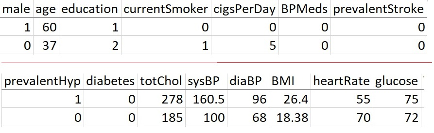

<style type="text/css">
h1.title {
  font-size: 20px;
  color: DarkRed;
  text-align: center;
}
h4.author { /* Header 4 - and the author and data headers use this too  */
    font-size: 18px;
  font-family: "Times New Roman", Times, serif;
  color: DarkRed;
  text-align: center;
}
h4.date { /* Header 4 - and the author and data headers use this too  */
  font-size: 18px;
  font-family: "Times New Roman", Times, serif;
  color: DarkBlue;
  text-align: center;
}
h1 { /* Header 3 - and the author and data headers use this too  */
    font-size: 22px;
    font-family: "Times New Roman", Times, serif;
    color: darkred;
    text-align: center;
}
h2 { /* Header 3 - and the author and data headers use this too  */
    font-size: 18px;
    font-family: "Times New Roman", Times, serif;
    color: navy;
    text-align: left;
}

h3 { /* Header 3 - and the author and data headers use this too  */
    font-size: 15px;
    font-family: "Times New Roman", Times, serif;
    color: navy;
    text-align: left;
}

h4 { /* Header 4 - and the author and data headers use this too  */
    font-size: 18px;
    font-family: "Times New Roman", Times, serif;
    color: darkred;
    text-align: left;
}
</style>

```{r setup, include=FALSE}
# code chunk specifies whether the R code, warnings, and output 
# will be included in the output files.
if (!require("ISwR")) {
   install.packages("ISwR")
   library(ISwR)
}
if (!require("MASS")) {
   install.packages("MASS")
   library(MASS)
}
if (!require("knitr")) {
   install.packages("knitr")
   library(knitr)
}
if (!require("forecast")) {
   install.packages("forecast")
   library(forecast)
}
library(klippy)
library(webshot)

knitr::opts_chunk$set(echo = TRUE,       
                      warnings = FALSE,   
                      results = TRUE,   
                      message = FALSE,
                      fig.align='center', 
                      fig.pos = 'ht')
```

```{r klippy, echo=FALSE, include=TRUE}
#klippy::klippy(position = c('top', 'right'),color = 'darkred',tooltip_message = 'Click to copy', tooltip_success = 'Done')
```


Framingham Heart Study (FHS), a long-term research project developed to identify risk factors of cardiovascular disease, the findings of which had far-reaching impacts on medicine. Indeed, much common knowledge about heart disease—including the effects of smoking, diet, and exercise—can be traced to the Framingham study. The study’s findings further emphasized the need for preventing, detecting, and treating risk factors of cardiovascular disease in their earliest stages

The dataset is a rather small subset of possible FHS datasets, having 4240 observations and 16 variables. The variables are as follows:

* sex : the gender of the observations. The variable is a binary named “male” in the dataset.
* age : Age at the time of medical examination in years.
* education : A categorical variable of the participants' education, with the levels: Some high school (1), high school/GED (2), some college/vocational school (3), college (4) - caution: This is a numerically coded categorical variable, we need to use the form of factor(education) in the model formulas.
* currentSmoker: Current cigarette smoking at the time of examinations
* cigsPerDay: Number of cigarettes smoked each day
* BPmeds: Use of Anti-hypertensive medication at exam
* prevalentStroke: Prevalent Stroke (0 = free of disease)
* prevalentHyp: Prevalent Hypertensive. The subject was defined as hypertensive if treated
* diabetes: Diabetic according to criteria of the first exam treated
* totChol: Total cholesterol (mg/dL)
* sysBP: Systolic Blood Pressure (mmHg)
* diaBP: Diastolic blood pressure (mmHg)
* BMI: Body Mass Index, weight (kg)/height (m)^2
* heartRate: Heart rate (beats/minute)
* glucose: Blood glucose level (mg/dL)

And finally the response variable:

* TenYearCHD: The 10-year risk of coronary heart disease(CHD).

3658 of these 4240 records are complete cases, and the rest have some missing values. The following code chunk will clean the data and only keep the complete records in the final data set.


```{r}
FHS.data = na.omit(read.csv("https://stat501.s3.amazonaws.com/w11-FraminghamCHD.csv"))
```
The above **FHS.data** has 3658 complete records and 16 variables listed above. The goals of this assignment are both **association analysis** and **predictive analysis**. To be more specific, you are expexted to follow the analysis in Section 4.2 in the class note.  

* Use the above FHS.data to fit an initial model that includes all predictor variables.
* BMI and glucose are two clinically important variables. Both variables will be included in the final model. That is, you can define the smallest model using the two important clinical variables.
* Using an automatic variable selection procedure to identify the final model working model.
* Interpret the regression model coefficients. You don’t have to interpret all coefficients. Pick two coefficients associated with categorical and numerical predictor variables, respectively, to interpret.
* Assume there two incoming patients with the following demographics and clinical characteristics:


```{r echo=FALSE, fig.align='center', fig.width=8, fig.height=1}

```
  
\

\

\

\


