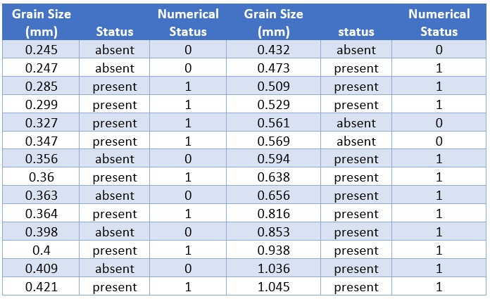
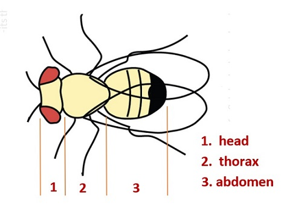

<style type="text/css">
h1.title {
  font-size: 20px;
  color: DarkRed;
  text-align: center;
}
h4.author { /* Header 4 - and the author and data headers use this too  */
    font-size: 18px;
  font-family: "Times New Roman", Times, serif;
  color: DarkRed;
  text-align: center;
}
h4.date { /* Header 4 - and the author and data headers use this too  */
  font-size: 18px;
  font-family: "Times New Roman", Times, serif;
  color: DarkBlue;
  text-align: center;
}
h1 { /* Header 3 - and the author and data headers use this too  */
    font-size: 22px;
    font-family: "Times New Roman", Times, serif;
    color: darkred;
    text-align: center;
}
h2 { /* Header 3 - and the author and data headers use this too  */
    font-size: 18px;
    font-family: "Times New Roman", Times, serif;
    color: navy;
    text-align: left;
}

h3 { /* Header 3 - and the author and data headers use this too  */
    font-size: 15px;
    font-family: "Times New Roman", Times, serif;
    color: navy;
    text-align: left;
}

h4 { /* Header 4 - and the author and data headers use this too  */
    font-size: 18px;
    font-family: "Times New Roman", Times, serif;
    color: darkred;
    text-align: left;
}
</style>

```{r setup, include=FALSE}
# code chunk specifies whether the R code, warnings, and output 
# will be included in the output files.
if (!require("ISwR")) {
   install.packages("ISwR")
   library(ISwR)
}
if (!require("MASS")) {
   install.packages("MASS")
   library(MASS)
}
if (!require("knitr")) {
   install.packages("knitr")
   library(knitr)
}
if (!require("forecast")) {
   install.packages("forecast")
   library(forecast)
}
library(klippy)
library(webshot)

knitr::opts_chunk$set(echo = TRUE,       
                      warnings = FALSE,   
                      results = TRUE,   
                      message = FALSE,
                      fig.align='center', 
                      fig.pos = 'ht')
```

```{r klippy, echo=FALSE, include=TRUE}
#klippy::klippy(position = c('top', 'right'),color = 'darkred',tooltip_message = 'Click to copy', tooltip_success = 'Done')
```


# Introduction

Linear regression models are used to assess the association between the continuous response variable and other predictor variables. If the response variable is a binary categorical variable, the linear regression model is not appropriate. We need to a new model, logistic regression models, to assess the association the the binary rrsponse variable and other predictor variables.

This module focuses on the regression model with a binary response.


# Motivational Example and Practical Question

**Example 1**. Suzuki et al. (2006) measured sand grain size on 28 beaches in Japan and observed the presence or absence of the burrowing wolf spider Lycosa ishikariana on each beach. Sand grain size is a measurement variable, and spider presence or absence is a nominal variable. Spider presence or absence is the dependent variable; if there is a relationship between the two variables, it would be sand grain size affecting spiders, not the presence of spiders affecting the sand.

```{r echo=FALSE, fig.align='center', fig.width=5, fig.height=4, fig.cap="Spider Data Table"}

```

```{r}
grainsize=c(0.245, 0.247, 0.285, 0.299, 0.327, 0.347, 0.356, 0.360, 0.363, 0.364, 0.398, 
            0.400, 0.409, 0.421, 0.432, 0.473, 0.509, 0.529, 0.561, 0.569, 0.594, 0.638, 
            0.656, 0.816, 0.853, 0.938, 1.036, 1.045)
status=c(0, 0, 1, 1, 1, 1, 0, 1, 0, 1, 0, 1, 0, 1, 0, 1, 1, 1, 0, 0, 1, 1, 1, 1, 1, 1, 
         1, 1)
spider = as.data.frame(cbind(grainsize = grainsize, status = status))
```
As usual, there are two objectives for this study.

* **Association analysis**: to determine whether there was a relationship between sand grain size and the presence or absence of the species.

* **Prediction analysis**: to predict the probability of a wolf spider population surviving on a beach with a particular sand grain size, to help determine which beaches to reintroduce the spider to.


## Scatter Plot

```{r}
plot(grainsize, status, type="p", pch=19, col="gold", cex = 1.2, xlim=c(0.25, 1.05))
points(grainsize, status, type="p", pch=21, col="blue", cex = 1.5)
size=seq(0.25, 1.05, length=200)
px=exp(-1.6476+5.121553*size)/(1+exp(-1.6476+5.121553*size))
lines(size, px, lwd=3, col="firebrick3")
abline(lm(status~grainsize), lwd=3, col="blue")
```


```{r}
spider.model = glm(status~grainsize, family=binomial, data = spider)
summary(spider.model)$coef
```


# Case Study

**Example 2**. : Longevity in male fruit flies is positively associated with adult size. But reproduction has a high physiological cost that could impact longevity. 

```{r echo=FALSE, fig.align='center', fig.width=5, fig.height=4, fig.cap="Fruit Flies Data Table"}

```


A study looks at the association between longevity and adult size in male fruit flies kept under one of two conditions. One group is kept with sexually active females over the male’s life span. The other group is cared for in the same way but kept with females that are not sexually active.


```{r echo=FALSE, fig.align='center', fig.width=5, fig.height=4, fig.cap="Fruit Flies Data Table"}
include_graphics("w11-FruitFlies.jpg")
```

The above table gives the longevity in days and thorax length in millimeters (mm) for the male fruit flies given an opportunity to reproduce (IndReprod = 0) and for those deprived of the opportunity (IndReprod = 1).1 Is there evidence that reproduction impacts male fruit fly longevity?


```{r}
Longevity=c(35, 37, 49, 46, 64, 39, 46, 56, 64, 65, 56, 65, 70, 64, 65, 70, 76, 81, 85, 70, 
            70, 76, 76, 76, 16, 19, 19, 33, 34, 34, 30, 42, 42, 34, 26, 30, 40, 54, 35, 35, 
            46, 46, 42, 46, 54, 54, 56, 61, 44)
ThxLength=c(0.64, 0.68, 0.68, 0.72, 0.72, 0.76, 0.76, 0.76, 0.76, 0.76, 0.80, 0.80, 0.80, 
            0.84, 0.84, 0.84, 0.84, 0.84, 0.84, 0.88, 0.88, 0.92, 0.92, 0.94, 0.64, 0.64, 
            0.68, 0.72, 0.72, 0.74, 0.76, 0.76, 0.76, 0.78, 0.80, 0.80, 0.82, 0.82, 0.84, 
            0.84, 0.84, 0.84, 0.88, 0.88, 0.88, 0.88, 0.88, 0.88, 0.92)
IndReprod=1 - c(0, 0, 0, 0, 0, 0, 0, 0, 0, 0, 0, 0, 0, 0, 0, 0, 0, 0, 0, 0, 0, 0, 0, 0, 1, 1, 1, 
            1, 1, 1, 1, 1, 1, 1, 1, 1, 1, 1, 1, 1, 1, 1, 1, 1, 1, 1, 1, 1, 1)
fruitflies = as.data.frame(cbind(Longevity= Longevity,
                                 ThxLength = ThxLength,
                                 IndReprod = IndReprod))
```

```{r}
plot(Longevity, IndReprod)
##
x=seq(15, 85, length=200)
px=exp(-6.391 + 0.126*x)/(1+exp(-6.391 + 0.126*x))
lines(x, px)
```

```{r}
glm((1-IndReprod) ~ Longevity, family=binomial, data=fruitflies)
```

```{r}
iris=read.table("w11-iris.txt", header=TRUE)[1:100,]
type=rep(0,100)
id=which(iris$species=="versicolor")
type[id] = 1
iris$type=type
plot(iris$petal.length, iris$type)
##
x=seq(1, 5.1, length=200)
px=exp(-0.4630 + 0.3365*x)/(1+exp(-0.4630 + 0.3365*x))
lines(x, px)
```

```{r}
glm(type ~ petal.length, data = iris)
```

