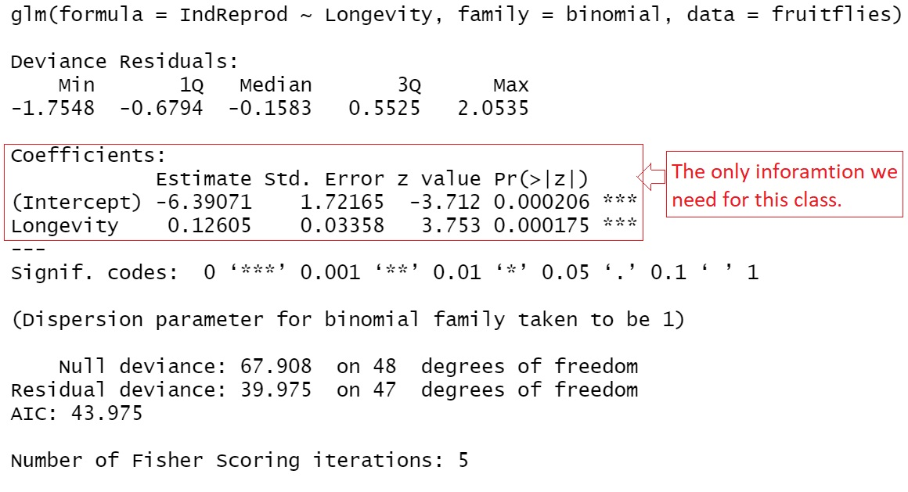

<style type="text/css">
h1.title {
  font-size: 20px;
  color: DarkRed;
  text-align: center;
}
h4.author { /* Header 4 - and the author and data headers use this too  */
    font-size: 18px;
  font-family: "Times New Roman", Times, serif;
  color: DarkRed;
  text-align: center;
}
h4.date { /* Header 4 - and the author and data headers use this too  */
  font-size: 18px;
  font-family: "Times New Roman", Times, serif;
  color: DarkBlue;
  text-align: center;
}
h1 { /* Header 3 - and the author and data headers use this too  */
    font-size: 22px;
    font-family: "Times New Roman", Times, serif;
    color: darkred;
    text-align: center;
}
h2 { /* Header 3 - and the author and data headers use this too  */
    font-size: 18px;
    font-family: "Times New Roman", Times, serif;
    color: navy;
    text-align: left;
}

h3 { /* Header 3 - and the author and data headers use this too  */
    font-size: 15px;
    font-family: "Times New Roman", Times, serif;
    color: navy;
    text-align: left;
}

h4 { /* Header 4 - and the author and data headers use this too  */
    font-size: 18px;
    font-family: "Times New Roman", Times, serif;
    color: darkred;
    text-align: left;
}
</style>

```{r setup, include=FALSE}
# code chunk specifies whether the R code, warnings, and output 
# will be included in the output files.
if (!require("ISwR")) {
   install.packages("ISwR")
   library(ISwR)
}
if (!require("MASS")) {
   install.packages("MASS")
   library(MASS)
}
if (!require("knitr")) {
   install.packages("knitr")
   library(knitr)
}
if (!require("forecast")) {
   install.packages("forecast")
   library(forecast)
}
library(klippy)
library(webshot)

knitr::opts_chunk$set(echo = TRUE,       
                      warnings = FALSE,   
                      results = TRUE,   
                      message = FALSE,
                      fig.align='center', 
                      fig.pos = 'ht')
```

```{r klippy, echo=FALSE, include=TRUE}
klippy::klippy(position = c('top', 'right'),color = 'darkred',tooltip_message = 'Click to copy', tooltip_success = 'Done')
```


# Introduction

Linear regression models are used to assess the association between the continuous response variable and other predictor variables. If the response variable is a binary categorical variable, the linear regression model is not appropriate. We need a new model, logistic regression models, to assess the association between the binary response variable and other predictor variables.

This module focuses on the regression model with a binary response.


# Motivational Example and Practical Question

**Example **: Longevity in male fruit flies is positively associated with the adult size. But reproduction has a high physiological cost that could impact longevity. 

```{r echo=FALSE, fig.align='center', fig.width=4, fig.height=3}
include_graphics("w11-FruitFliesImage.jpg")
```

The original study looks at the association between longevity and adult size in male fruit flies kept under one of two conditions. One group is kept with sexually active females over the male’s life span. The other group is cared for in the same way but kept with females that are not sexually active.


```{r echo=FALSE, fig.align='center', fig.width=5, fig.height=4, fig.cap="Fruit Flies Data Table"}
include_graphics("w11-FruitFlies.jpg")
```

The above table gives the longevity in days for the male fruit flies given an opportunity to reproduce (IndReprod = 0) and for those deprived of the opportunity (IndReprod = 1). 

The data was collected from a case-control study design. The original study association analysis using the multiple linear regression model in which Longevity was a response variable and Thorax and IndReprod were used as predictor variables. In this example, we build a logistic regression to assess the association between longevity and reduction. Due to the case-control study design, the resulting logistic regression cannot be used as a predictive model.

```{r echo=FALSE}
Longevity=c(35, 37, 49, 46, 64, 39, 46, 56, 64, 65, 56, 65, 70, 64, 65, 70, 76, 81, 85, 70, 
            70, 76, 76, 76, 16, 19, 19, 33, 34, 34, 30, 42, 42, 34, 26, 30, 40, 54, 35, 35, 
            46, 46, 42, 46, 54, 54, 56, 61, 44)
IndReprod=1 - c(0, 0, 0, 0, 0, 0, 0, 0, 0, 0, 0, 0, 0, 0, 0, 0, 0, 0, 0, 0, 0, 0, 0, 0, 1, 1, 1, 
            1, 1, 1, 1, 1, 1, 1, 1, 1, 1, 1, 1, 1, 1, 1, 1, 1, 1, 1, 1, 1, 1)
fruitflies = as.data.frame(cbind(Longevity= Longevity,
                                 IndReprod = IndReprod))
```

```{r echo=FALSE, fig.align='center', fig.width=5, fig.height=3.5, fig.cap="The scatter plots of a binary response v.s. a continuous predictor variable"}
par(mar=c(4,4,4,6)+.1)
plot(Longevity, IndReprod, type = "p", 
     # ylab = "Reproduction Status",
     ylab="",
     pch= 19, col = "gold", cex = 2,
     main="Scatter plot and possible fitted curves",
     axes=FALSE,
     col.main = "navy",
     cex.main = 1.3
     )
box(col = 'black')
axis(1)
axis(2, at=c(0,1), labels=c("0", "1"), col.axis="darkred", col="darkred", col.ticks = "darkred", las =1)
mtext("Reproduction Status", side=2, line= 0.5, col="darkred")
axis(4, col = "blue", col.ticks = "blue", col.lab= "blue", las =1, col.axis="blue")
mtext("Reproduction Probability", side=4, line= -1.5, col="blue")

points(Longevity, IndReprod, pch=21, col = "darkred", cex = 2.2)
##
logit=glm(IndReprod ~ Longevity, family=binomial, data=fruitflies)
b0 = logit$coef[1]
b1 = logit$coef[2]
x=seq(15, 85, length=200)
px=exp(b0 + b1*x)/(1+exp(b0 + b1*x))
lines(x, px, lwd = 3, col="blue")
abline(lm(IndReprod ~ Longevity), lwd=4, col="darkred", las = 0.5)
legend(16, 0.9, c("logistic curve", "linear regresion line"),
       col=c("blue", "darkred"), lwd=rep(4,2), bty = "n", cex = 0.8)
```


Since the response variable is binary (i.e., it can only take on two distinct value, 0 and 1 in this example), the linear regression line is a bad choice since (1) response variable is not continuous, (2) the fitted regression line can take on any values between negative infinity and positive infinity. The response variable takes on only either 0 or 1 (see the dark red straight line).

A meaningful approach to assess the association between the binary response variable and the predictor variable by looking at how the predictor variables impact the probability of observing the **bigger** value (i.e., the one that has a higher alphabetical order) of the response variable. The above **S** curve describes the relationship between the values of the predictor variable(s) and the probability of observing the **bigger** value of the response variable.


# Logistic Regression Models and Applications

The logistic regression is a member of the generalized linear regression (GLM) family which includes the linear regression models. The modeling building process is the same as that in linear regression modeling.

## The Structure of Logistic Regression Model

The actual probability function of observing the **bigger** value of response variable for giving predictor variable is given by

$$
P(Y=1) = \frac{\exp(\beta_0 + \beta_1 Longevity)}{1 + \exp(\beta_0 + \beta_1 Longevity)}
$$

If $\beta_1$ (also called slope parameter) is equal to zero, the longevity and the reproduction status are NOT associated. Otherwise, there is an association between the response and the predictor variables. The sign of the slope parameter reflects the positive or negative association.

## Assumptions and Diagnostics

There are assumptions for the binary logistic regression model.

* The response variable must be binary (taking on only two distinct values).

* Predictor variables are assumed to be uncorrelated.

* The functional form of the predictor variables is correctly specified.

The model diagnostics for logistic regression is much more complicated than the in the linear regression models. We will not discuss this topic in this course.


## Coefficient Estimation and Interpretation

The estimation of the logistic regression coefficients is not as intuitive as we saw in the linear regression model (regression lines and regression plane or surface). An advanced mathematical method needs to be used to estimate the regression coefficient.  The R function **glm()** can be used to find the estimate of regression coefficients.

The interpretation of the coefficients of the logistic regression model is also not straightforward. In the motivational example, the value of $\beta_1$ is the change of log odds of observing reproduction status to be 1. As usual, we will not make an inference of the intercept. In case-control data, the intercept is in-estimable. 

The output of **glm()** contains information similar to what has been seen in the output of **lm()** in the linear regression model.

## Use of **glm()** and Annotations

We use the motivational example to illustrate the setup of **glm()** and interpretation of the output.

```{r}
## fit the logistic regression
mymodel =glm(IndReprod ~ Longevity,   # model formula, the response variable is on the left side.
          family=binomial,            # this must be specified since the response is binary!
          data=fruitflies)            # data frame - the variables in the model MUST identical
                                      # to the ones in the data frame!!!
```

```{r echo=FALSE, fig.align='center', fig.width=5, fig.height=6, fig.cap="The complete output of glm()"}

```

The output has four major pieces of information: model formula, five-number-summary of the deviance residuals, significant test results of the predictor variables, and goodness-of-fit measures. In this course, we only focus on the significance tests.


## Applications of Logistic Regression Models

Like other regression models, the logistic regression models have two basic applications: association analysis and prediction analysis. 

The association analysis focuses on the interpretation of the regression coefficients that have the information about whether predictor variables are associated with the response variable through the probability of the **bigger** value of the response variable.

Since the logistic regression builds the relationship between the probability of observing the **bigger** value of the response and the predictor variable, predicting the **value of the response variable** requires a cut-off probability in order to assign a value 1 or 0 to the response variable. The prediction process of a logistic regression model is depicted in the following figure.

```{r echo=FALSE, fig.align='center', fig.width=4, fig.height=4, fig.cap="Prediction process of the logistic regression models"}
include_graphics("w11-LogisticPrediction.jpg")
```


# Case Studies

We present two examples in this section.

## The simple logistic regression model

Suzuki et al. (2006) measured sand grain size on 28 beaches in Japan and observed the presence or absence of the burrowing wolf spider Lycosa ishikariana on each beach. Sand grain size is a measurement variable, and spider presence or absence is a nominal variable. Spider presence or absence is the dependent variable; if there is a relationship between the two variables, it would be sand grain size affecting spiders, not the presence of spiders affecting the sand.

```{r echo=FALSE, fig.align='center', fig.width=5, fig.height=4, fig.cap="Spider Data Table"}
include_graphics("w11-SpiderDataTable.jpg")
```
```{r}
grainsize=c(0.245, 0.247, 0.285, 0.299, 0.327, 0.347, 0.356, 0.360, 0.363, 0.364, 0.398, 
            0.400, 0.409, 0.421, 0.432, 0.473, 0.509, 0.529, 0.561, 0.569, 0.594, 0.638, 
            0.656, 0.816, 0.853, 0.938, 1.036, 1.045)
status=c(0, 0, 1, 1, 1, 1, 0, 1, 0, 1, 0, 1, 0, 1, 0, 1, 1, 1, 0, 0, 1, 1, 1, 1, 1, 1, 
         1, 1)
spider = as.data.frame(cbind(grainsize = grainsize, status = status))
```

**Fitting a Simple Logistic Regression Model**

Since there is only one predictor variable in this study, simply choose the simple linear regression model to this data set.

```{r}
spider.model = glm(status ~ grainsize, 
                   family = binomial,
                   data = spider)
significant.tests = summary(spider.model)$coef
kable(significant.tests, caption = "Summary of the significant tests of 
      the logistic regression model")
```

**Association Analysis**

The above significant tests indicate that the grain size does not achieve the significance (p-value = 0.08844) at level 0.05. Note that the p-value is calculated based on the sample, it is also a random variable. Moreover, the sample size in this study is relatively small. We will claim the association between the two variables. As the grain size increases by one unit, the log odds of observing the wolf spider burrowing increase by 5.121553. In other words, the grain size and the presence of spiders are positively associated.

**Prediction Analysis**

As an example, we choose two new grain sizes 0.33 and 0.57, and want to predict the presence of the wide spiders in the beaches with the given grain sizes. We used the R function **predict()** in linear regression, we use the same function to make the prediction for the logistic regression model.

```{r}
spider.model = glm(status ~ grainsize, 
                   family = binomial,
                   data = spider)
## 
mynewdata = data.frame(grainsize=c(0.275, 0.57))
pred.prob = predict(spider.model, newdata = mynewdata, 
        type = "response")
## threshold probability
cut.off.prob = 0.5
pred.response = ifelse(pred.prob > cut.off.prob, 1, 0)  # This predicts the response
pred.table = cbind(new.grain.size = c(0.275, 0.57), pred.response = pred.response)
kable(pred.table, caption = "Predicted Value of response variable 
      with the given cut-off probability")
```


## Multiple Logistic Regression Model

In this case study, we used a published study on bird introduction in New Zealand. The objective is to predict the success of avian introduction to New Zealand. The detailed information about the study can be found in the following article.  [https://stat501.s3.amazonaws.com/w11-Correlates-of-introduction-success-in-exotic.pdf](https://stat501.s3.amazonaws.com/w11-Correlates-of-introduction-success-in-exotic.pdf). The data is included in the article. A text format data file was created and can be download or read directly from the following URL: [https://stat501.s3.amazonaws.com/w11-birds-data.txt](https://stat501.s3.amazonaws.com/w11-birds-data.txt). 

```{r echo=FALSE, fig.align='center', fig.width=4, fig.height=4}
include_graphics("w11-BirdImage.jpg")
```
The response variable: Status - status of success
Predictor variables:

* length - female body length (mm)
* mass = female body mass (g)
* range = geographic range (% area of Australia)
* migr = migration score: 1= sedentary, 2 =  sedentary and migratory, 3 = migratory
* insect = the number of months in a year with insects in the diet 
* diet = diet score: 1 = herbivorous; 2 = omnivorous, 3 = carnivorous.
* clutch = clutch size
* broods = number of broods per season
* wood = use as woodland scored as frequent(1) or infrequent(2)
* upland = use of the upland as frequent(1) or infrequent(2)
* water = use of water scored as frequent(1) or infrequent(2)
* release  = minimum number of release events
* indiv = minimum of the number of individuals introduced.

We next read the data from the given URL directly to R. Since there are some records with missing values. We drop those records with at least one missing value.

There are several categorical variables with numerical codings. Among them, **migr** and **diet** have three categories and the rest of the categorical variables have two categories. In practice, a **categorical variable with more than two categories must be specified as factor variables** so R can define dummy variables to capture the difference across the difference.

We conducted an exploratory analysis on **nigr** and **diet** and found a flat discrepancy across the effect.We simply treat them as a discrete numerical variable using the numerical coding as the values of the variables.


```{r}
NZbirds=read.table("https://stat501.s3.amazonaws.com/w11-birds-data.txt", header=TRUE)
birds = na.omit(NZbirds)
```

* **Build an Initial Model**

We first build a logistic regression model that contains all predictor variables in the data set. This model is usually called the full model. The Note that the response variable is the success status (1 = success, 0 = failure). Species is a kind of ID, it should not be included in the model. 

```{r}
initial.model = glm(status ~ length + mass + range + migr + insect + diet + clutch + broods + 
                      wood + upland + water + release + indiv, family = binomial, data = birds)
coefficient.table = summary(initial.model)$coef
kable(coefficient.table, caption = "Significance tests of logistic regression model")
```

The p-values in the above significance test table are all bigger than 0.5. We next search for the best model by dropping some of the insignificant predictor variables. Since there are so many different ways to drop variables, next we use an automatic variable procedure to search the final model.

* **Automatic Variable Selection**

R has an automatic variable selection function **step()** for searching the final model. We will start from the initial model and drop insignificant variables using AIC as inclusion/exclusion criterion. 

In practice, sometimes, there may be some practically important predictor variables. Practitioners want to include these practically important variables in the model regardless of their statistical significance. There are we can fit the smallest model that includes only those practically important variables. The final model should be **between** the smallest model, we will call it a  **reduced model**, and the initial model, we will call it a **full model**. For illustration, we assume **insect** and **range** are practically important, we want to include these two variables in the final model regardless of their statistical significance.

In summary, we define two models: the full model and the reduced model. The final best model will be the model between the full and reduced models. The summary table of significant tests is given below.

```{r}
full.model = initial.model  # the *biggest model* that includes all predictor variables
reduced.model = glm(status ~ range + insect , family = binomial, data = birds)
final.model =  step(full.model, 
                    scope=list(lower=formula(reduced.model),upper=formula(full.model)),
                    data = birds, 
                    direction = "backward",
                    trace = 0)   # trace = 0: suppress the detailed selection process
final.model.coef = summary(final.model)$coef
kable(final.model.coef , caption = "Summary table of significant tests")
```


* **Interpretation - Association Analysis**

The summary table contains the two practically important variables **range** and **insect**. **range** does not achieve statistical significance (p-value $\approx$ 1) and **insect** is slightly higher than the significance level 0.005. Both variables are seemingly positively associated with the response variable.

The following interpretation of the individual predictor variable assumes that other life-history variables and introduction effort variable.


**migr** and **upland** are negatively associated with the response variable. The odds of success of introducting migratory birds lower than the sedentary birds. Similarly, birds using upland infrequently have lower odds to be successfully introduced than those using upland frequently. 

**insect** is significant (p-value =0.058). The **odds of success** increases as the number of months of having insect in diet increases.

**mass** and **indiv** are positively associated with the response variable. The odds of success increase and the body mass increases Similarly, the odds of success increases as the number of minimum birds of the species increases.

**wood** does not achieve the statistical significance but seemed to be positively associated with the response variable.

* **Predictive Analysis**

As an illustration, we use the final model to predict the status of success introduction based on the new values of the predictor variables associated with two species. See the numerical feature given in the code chunk.

```{r}
mynewdata = data.frame(mass=c(560, 921),
                       range = c(0.75, 1.2),
                       migr = c(2,1),
                       insect = c(6, 12),
                       wood = c(1,1),
                       upland = c(0,1),
                       indiv = c(123, 571))
pred.cuccess.prob = predict(final.model, newdata = mynewdata, type="response")
##
## threshold probability
cut.off.prob = 0.5
pred.response = ifelse(pred.cuccess.prob > cut.off.prob, 1, 0)  # This predicts the response
## add the new predicted response to Mynewdata
mynewdata$Pred.Response = pred.response
##
kable(mynewdata, caption = "Predicted Value of response variable 
      with the given cut-off probability")
```

The predicted status of the successful introduction of the two species is attached to the two new data records.


\

\

\


