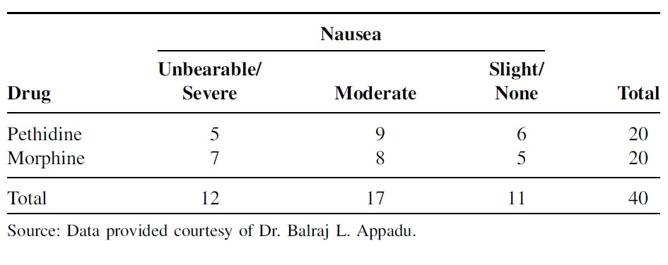
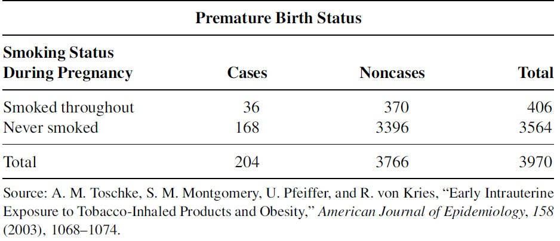

<style type="text/css">
h1.title {
  font-size: 20px;
  color: DarkRed;
  text-align: center;
}
h4.author { /* Header 4 - and the author and data headers use this too  */
    font-size: 18px;
  font-family: "Times New Roman", Times, serif;
  color: DarkRed;
  text-align: center;
}
h4.date { /* Header 4 - and the author and data headers use this too  */
  font-size: 18px;
  font-family: "Times New Roman", Times, serif;
  color: DarkBlue;
  text-align: center;
}
h1 { /* Header 3 - and the author and data headers use this too  */
    font-size: 22px;
    font-family: "Times New Roman", Times, serif;
    color: darkred;
    text-align: center;
}
h2 { /* Header 3 - and the author and data headers use this too  */
    font-size: 18px;
    font-family: "Times New Roman", Times, serif;
    color: navy;
    text-align: left;
}

h3 { /* Header 3 - and the author and data headers use this too  */
    font-size: 15px;
    font-family: "Times New Roman", Times, serif;
    color: navy;
    text-align: left;
}

h4 { /* Header 4 - and the author and data headers use this too  */
    font-size: 18px;
    font-family: "Times New Roman", Times, serif;
    color: darkred;
    text-align: left;
}
</style>

```{r setup, include=FALSE}
# code chunk specifies whether the R code, warnings, and output 
# will be included in the output files.
if (!require("ISwR")) {
   install.packages("ISwR")
   library(ISwR)
}
if (!require("MASS")) {
   install.packages("MASS")
   library(MASS)
}
if (!require("knitr")) {
   install.packages("knitr")
   library(knitr)
}
if (!require("forecast")) {
   install.packages("forecast")
   library(forecast)
}
if (!require("Publish")) {
   install.packages("Publish")
   library(Publish)
}
library(klippy)
library(webshot)

knitr::opts_chunk$set(echo = TRUE,       
                      warnings = FALSE,   
                      results = TRUE,   
                      message = FALSE,
                      fig.align='center', 
                      fig.pos = 'ht')
```

```{r klippy, echo=FALSE, include=TRUE}
#klippy::klippy(position = c('top', 'right'),color = 'darkred',tooltip_message = 'Click to copy', tooltip_success = 'Done')
```


In this assignment, we focus on the Pearson $\chi^2$ test and the measures of association. The level of details should be similar to what you have seen in the case study (Section 5 of the class note). You can also use the two R functions that were used in the class note by running the following one-line code in the code chunk.

```{r}
source("https://stat501.s3.amazonaws.com/w12-table2x2Calculator.txt")
```


**Problem 1**.

In a prospective, randomized, double-blind study, Stanley et al. examined the relative efficacy and side effects of morphine and pethidine, drugs commonly used for patient-controlled analgesia (PCA). Subjects were 40 women, between the ages of 20 and 65 years, undergoing total abdominal hysterectomy. Patients were allocated randomly to receive morphine or pethidine by PCA. At the end of the study, subjects described their appreciation of nausea and vomiting, pain, and satisfaction by means of a three-point verbal scale. We only focus on the association between the severity of nausea and the use of the drug. The observed table is given below.

```{r echo = FALSE, fig.align='center', fig.width=5, fig.height=5}

```

Is there any association between appreciation of nausea and satisfaction? Use Pearson $\chi^2$ test to justify your conclusion and interpret the test results.


**Problem 2**

The following data table was collected to study the obesity status of children ages 5–6 years and the smoking status of the mother during the pregnancy, also reported on another outcome variable: whether the child was born premature (37 weeks or fewer of gestation). The following table summarizes the results of this aspect of the study. The same risk factor (smoking during pregnancy) is considered, but a case is now defined as a mother who gave birth prematurely.


```{r echo = FALSE, fig.align='center', fig.width=5, fig.height=5}

```

Use the chi-square test of independence to determine if one may conclude that there is an association between smoking throughout pregnancy and premature birth. Let $\alpha = 05$. Compute the odds ratio to determine if smoking throughout pregnancy is related to premature birth.


