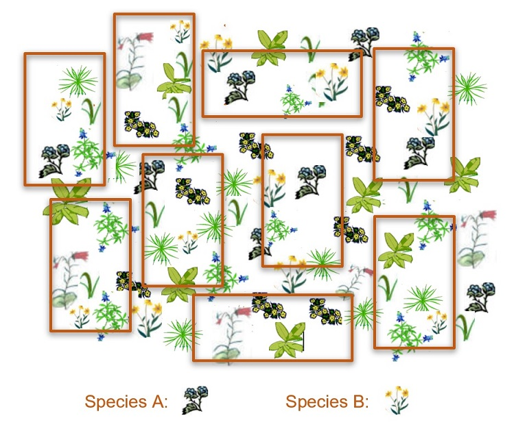
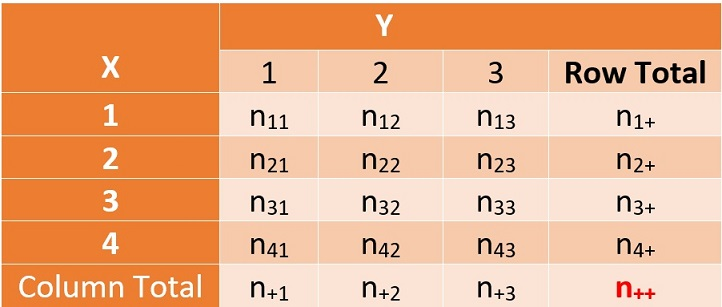
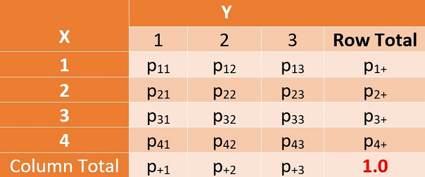
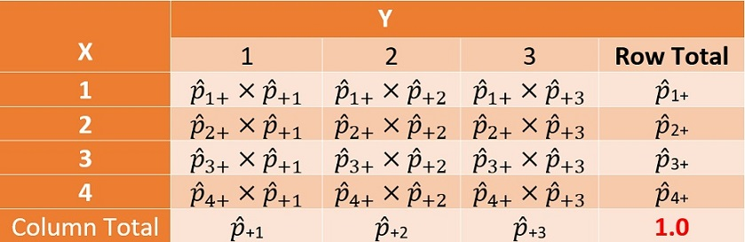
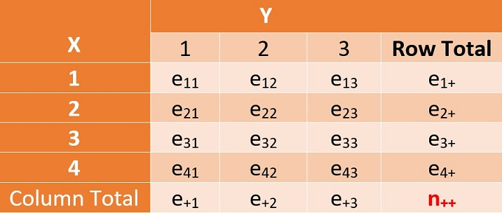
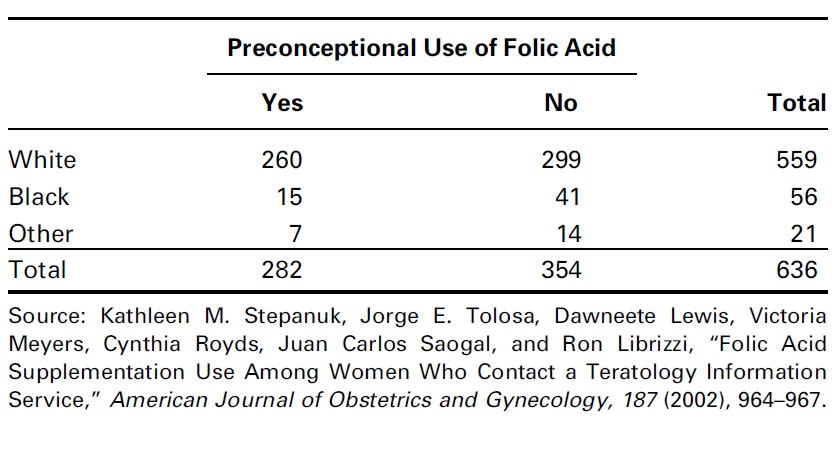
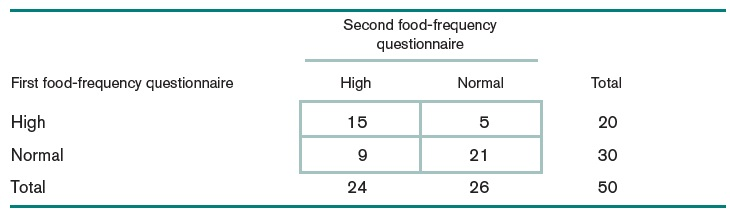

<style type="text/css">
h1.title {
  font-size: 20px;
  color: DarkRed;
  text-align: center;
}
h4.author { /* Header 4 - and the author and data headers use this too  */
    font-size: 18px;
  font-family: "Times New Roman", Times, serif;
  color: DarkRed;
  text-align: center;
}
h4.date { /* Header 4 - and the author and data headers use this too  */
  font-size: 18px;
  font-family: "Times New Roman", Times, serif;
  color: DarkBlue;
  text-align: center;
}
h1 { /* Header 3 - and the author and data headers use this too  */
    font-size: 22px;
    font-family: "Times New Roman", Times, serif;
    color: darkred;
    text-align: center;
}
h2 { /* Header 3 - and the author and data headers use this too  */
    font-size: 18px;
    font-family: "Times New Roman", Times, serif;
    color: navy;
    text-align: left;
}

h3 { /* Header 3 - and the author and data headers use this too  */
    font-size: 15px;
    font-family: "Times New Roman", Times, serif;
    color: navy;
    text-align: left;
}

h4 { /* Header 4 - and the author and data headers use this too  */
    font-size: 18px;
    font-family: "Times New Roman", Times, serif;
    color: darkred;
    text-align: left;
}
</style>

```{r setup, include=FALSE}
# code chunk specifies whether the R code, warnings, and output 
# will be included in the output files.
if (!require("ISwR")) {
   install.packages("ISwR")
   library(ISwR)
}
if (!require("MASS")) {
   install.packages("MASS")
   library(MASS)
}
if (!require("knitr")) {
   install.packages("knitr")
   library(knitr)
}
if (!require("forecast")) {
   install.packages("forecast")
   library(forecast)
}
if (!require("Publish")) {
   install.packages("Publish")
   library(Publish)
}
library(klippy)
library(webshot)

knitr::opts_chunk$set(echo = TRUE,       
                      warnings = FALSE,   
                      results = TRUE,   
                      message = FALSE,
                      fig.align='center', 
                      fig.pos = 'ht')
```

```{r klippy, echo=FALSE, include=TRUE}
klippy::klippy(position = c('top', 'right'),color = 'darkred',tooltip_message = 'Click to copy', tooltip_success = 'Done')
```

# Introduction

We have introduced different modeling to solve the association and prediction analyses. The ANOVA is used when the response is a continuous normal random variable and the predictor variable is categorical. When the response variable is a continuous normal random variable and why is also a continuous (non-random) variable, we use the simple linear regression model to address the associated problems. When predictor variables are hybrid (continuous and categorical), we have a multiple linear regression model (numerically coded categorical variables need to be specified during the modeling process). When the response variable is binary, we use logistic regression to study the association between the response and predictor variables.

The following table summarizes different models for different situations.


|    Response variable |   Predictor variable       |  Type of Models  |
|:--------------------:|:--------------------------:|:----------------:|
| continuous, normal   |  single categorical        |     ANOVA        |
| continuous, normal   |  single continuous         |      SLR         |
| continuous, normal   |  continuous or categorical |      MLR         |
| binary, categorical  |  continuous or categorical |   logistic model |


* **ANOVA**: Analysis of variance model

* **SLR**: Simple linear regression model

* **MLR**: multiple linear regression model, ANOVA is a special MLR. MLR with both categorical and numerical predictor variables is also an Analysis of covariance (ANCOVA).

* **The logistic model** is also called the **logit model**.

We also discussed the relationship between two numerical variables using the Pearson correlation coefficients. When we use correlation coefficients to measure the strength of the linear correlation between two numerical variables, we don't specify the response variable.

In this note, we will discuss the association between two categorical variables. We first assess the association through $\chi^2$ test of independence of the two variables. If they are dependent, we then define measures for the association.


# The Motivational Examples

**Example 1**: A biologist might want to determine if two species of organisms associate (are found together) in a vegetation community. Two hypotheses could be set up in the following:

**Null Hypothesis (Ho)**:	There is no significant association between Species A and Species B; the species are independent of each other. The location of Species A does not affect on the location of Species B.

**Alternative Hypothesis (Ha)**: There is a significant association between Species A and Species B; the species are dependent.  Either Species A significantly associates with Species B or Species A does not significantly associate with Species B.


```{r echo = FALSE, fig.align='center', fig.width=5, fig.height=5}

```

To test the hypotheses, we can use the quadrant random sampling method to collect the raw data.  Assume we collect data in 9 randomly placed quadrants and classify the survey outcomes in the following:

*	The number of quadrants with both species present
*	The number of quadrants with Species A but not Species B
*	The number of quadrants with Species B but not Species A
*	The number of quadrants with neither species 

The above classification is summarized in the following table.

|       ..         |  Presence of A   |      Absence of A       | **Total** |
|:----------------:|:----------------:|:-----------------------:|:---------:|
|**Presence of B** |         5        |               2         |  **7**    |
|**Absence of B**  |         1        |               1         |  **2**    |
| **Total**        |     **6**        |             **3**       |  **9**    |
 
The above table is called the contingency table. Since this table has two rows and two columns, it is also called 2 by 2 contingency table. 

In practice, we have a more general m-by-n contingency table - this is called the two-way table. This week, we focus on analyzing two-way tables.


**Example 2**: Arrington et al. (2002) examined the frequency with which African, Neotropical and North American fishes have empty stomachs and found that the mean percentage of empty stomachs was around 16.2%. As part of the investigation, they were interested in **whether the frequency of empty stomachs was related to dietary items**. The data were separated into four major trophic classifications (detritivores, omnivores, invertivores, and piscivores) and whether the fish species had greater or less than 16.2% of individuals with empty stomachs. The number of fish species in each category combination was calculated and a subset of that (just the diurnal fish) is provided.

**STOMACH**	Categorical listing of the proportion of individuals in the species with empty stomachs (< 16.2% or > 16.2%).

**TROPHIC**	Categorical listing of the trophic classification (DET = detritovore, OMN = omnivore, INV = invertivore, PISC = piscivore).

Then the above information is summarized in the following table.


| Trophic classification  | Stomachs empty (< 16.2%)  | Stomachs empty (>16.2%)  |  Total   |
|:-----------------------:|:-------------------------:|:------------------------:|:--------:|
|           DET	          |             18	          |           4              |  **22**  |
|           OMN	          |             45            |          	8              |  **53**  |
|           INV	          |             58            |         	15             |  **73**  |
|           PISC	        |             16	          |           34             |  **50**  |
|     **Total**           |          **137**          |         **61**           |  **198** |


# Two-way Contingency Tables and Analysis

A k-way contingency table is used to summarize the relationship between k categorical variables. It is a special type of frequency distribution table that k variables are shown simultaneously.

In this note, We will introduce the general structure of two-way contingency tables and statistical tools for analyzing these tables. We will also introduce different study designs that generate two-way contingency tables containing different amounts of information.

## The Structure of Two-way Contingency Table

Let $X$ and $Y$ be two categorical variables. $Y$ is usually random (except in a case-control study) and is also called the response variable; $X$ can be random or fixed, usually acts as a predictor variable. Assume that $X$ has $I$ levels and $Y$ has $J$ levels. For ease of illustration, we consider $4\times3$ contingency table. The general structure of this **observed** two-way contingency table (also called $4\times3$ table) is given by

```{r echo = FALSE, fig.align='center', fig.width=5, fig.height=5, fig.cap = "Observed two-way table based on a random sample"}

```

Where the figures in the bottom and right-most column are called marginal totals. For examples,

* $n_{+ 2} = n_{12} + n_{22} + n_{32} +  n_{42}$ is the column total of the second column.

* $n_{2+} = n_{21} + n_{22} + n_{23}$ is the row total of the second row. 

* $n_{++} =$ total of all frequencies in the table. This is also commonly called the grad total.

If the grand total is a simple random sample from a population, then we can easily turn the above-observed frequency table to an estimated **true joint probability distribution table** of $X$ and $Y$ that is below.

```{r echo = FALSE, fig.align='center', fig.width=5, fig.height=5, fig.cap="The true joint probability distribution of two categorical variables"}

```


For illustration, we look at a few examples in the following.  

* **Joint Probability**: $\hat{P}(X=2, Y=3) = \hat{p}_{23} = n_{23}/n_{++}$ is probability of observing $Y=j$ and $X=2$. We can also estimate the marginal probability from the above model.

* **Marginal Probability**: $\hat{P}(Y=3) = \hat{p}_{+3} = n_{+ 3}/n_{++}$ is the probablity of observing $Y=3$. The probability of observing $X=2$ is estimated by $\hat{P}(X=2) = \hat{p}_{2+} = n_{2+}/n_{++}$ is the probability of observing $X = 2$. 

This means that we can estimate the **true joint distribution of $X$ and $Y$** by using the observed table

## Pearson $\chi^2$ Test of Independence

As mentioned earlier, the null hypothesis of the Pearson $\chi^2$ test of independence is the two categorical variables are independent. Since the general relationship between $X$ and $Y$ is completely determined by the above **joint probability distribution table**. 

**Under the null hypothesis $H_o$**, the **joint probability distribution table of $X$ and $Y$** has the following special structure.

```{r echo = FALSE, fig.align='center', fig.width=5, fig.height=5, fig.cap="The true joint probability distribution of two categorical variables"}

```

This implies that, under the null hypothesis, the **estimated frequency** of any given cell, say ($X=2,Y=3$), is given by $e_{23} = n_{++} \times \hat{p}_{2+}\times\hat{p}_{+3} = n_{2+}n_{+3}/n_{++}$. We can use the same formula to calculate all **estimated frequencies** - we call it the estimated table.


```{r echo = FALSE, fig.align='center', fig.width=5, fig.height=5, fig.cap="The true joint probability distribution of two categorical variables"}

```

In other words, if the **observed** and **estimated** tables are close to each other, we intend to conclude the null hypothesis. 

To answer how close is close, we define a **statistical distance** between the **observed** and **expected** tables as follows

$$
TS = \sum_{i=1}^4\sum_{j=1}^2 \left(\frac{n_{ij}-e_{ij}}{\sqrt{e_{ij}}} \right)^2 \to \chi^2_{(4-1)(2-1)}
$$

where $(4-1)(2-1)$ is the degrees of freedom of $\chi^2_3$ distribution based on the above $4\times2$ contingency table. In general, for an $I\times J$ contingency table, the degrees of freedom are defined to be $(I-1)(J-1)$.

$\chi^2$ is a distribution of a positive random variable such as the **distance** between **observed** and **estimated** tables. Different degrees of freedom define different $\chi^2$ distributions. The following curve is a specific $\chi^2$ distribution

```{r echo = FALSE, fig.align='center', fig.width=5, fig.height=3.5, fig.cap = "Density curve of a chi-sqaure distribution"}
x=seq(0,10, length=200)
y=dchisq(x,3)
plot(x, y, typ="l", lwd=2, col ="blue", axes=FALSE, xlab="", ylab="")
arrows(0,0,10,0, lwd=2, col="navy", angle=15, length=0.15)
arrows(0,0,0, 0.25, lwd = 2, col="navy", angle = 15, length=0.15)
title(main=expression(paste(chi^2, " Distribution Density Curve")), col.main = "navy")
```

Similar to normal and t-distributions, there are also R functions to find quantiles and tail probabilities.

```{}
pchisq(quantile, df)   # left-tail area of the chi-square distribution. df = degrees of freedom.
qchisq(left.tail.area, df) # quantile of the chi-square distribution. df = degrees of freedom.
```
The chi-squared test is essentially always a right-tailed test since the chi-squared test basically measures the discrepancy between two distributions. A large **distance** implies rejecting the null hypothesis. Therefore, the rejection is always on the right tail of the $\chi^2$ density curve. 

**Example 2** (continued):

```{r}
source("https://stat501.s3.amazonaws.com/w12-table2x2Calculator.txt")
## define column vector
less.16.2 = c(18, 45, 58, 16)
bigger.16.2 = c(4,8,15,34)
cont.table = cbind(less.16.2 = less.16.2 , bigger.16.2 = bigger.16.2)
chi.test = Pearson.chisq(cont.table)$inference
kable(chi.test, caption="Pearson chi-square test of independence")
```

The small p-value implies we rejected the null hypothesis. Therefore, the frequency of empty stomachs was related to dietary items.  We can also extract the expected frequency table from the above $\chi^2$ test


```{r}
exp = Pearson.chisq(cont.table)$expected
row.names(exp)=c("DET", "OMN", "INV", "PISC")
kable(exp, caption = "The expected table under the null hypothesis")
```

The original observed table can also be retrieved from the above $\chi^2$ test as follows.

```{r}
obs = Pearson.chisq(cont.table)$observed
row.names(obs) = c("DET", "OMN", "INV", "PISC")
kable(obs, caption = "The original observed frequency table")
```

\newpage 

**Caution of Using Pearson $\chi^2$ Test**: The Pearson $\chi^2$ test assumes that the sample size must be large. The test result is not reliable if one or more of the cells of the contingency table is less than or equal to 5.


# Measures of Association

Depending on the structure of the contingency table, we can define different measures for the association between the two categorical variables. In this section, we restrict our discussion to $2\times2$ tables. The general two-way or three-way tables are more complex and will not be discussed in this note.

A $2\times2$ table can be obtained from different study designs, hence, has a different amount of information.


## $2\times2$-table Under Different Study Designs

We use the following table as a template to discuss the different a amount of information in the $2\times2$ tables based on the different study designs.


```{r echo = FALSE, fig.align='center', fig.width=5, fig.height=5, fig.cap="The true joint probability distribution of two categorical variables"}
include_graphics("w12-Typical2x2table.jpg")
```

We can think about **Characteristic B** to be the status of a disease and **Characteristic A** as the status of exposure to some risk. 

* **Cross-sectional Study Design**

This method assumes a random sample of n subjects from a large population **followed** by the determination for each subject of the presence or absence of characteristic A and the presence or absence of characteristic B. **Only the total sample size n can be specified prior to the collection of the data**.


* **Stratified Sampling Design**

The stratified sampling (also called purposive sampling) assumes that the original population is stratified by either **characteristic A** or **characteristic B**. 

1.  *Stratification with Characteristic B*. This design stratifies the population in exposure and non-exposure sub-populations. Two simple random samples taken independently from the exposure and non-exposure populations respectively. This means that $n_{1+}$ and $n_{2+}$ are pre-determined sample sizes - the typical follow-up study is an example of this design. 
  
2.  *Stratification with Characteristic A*. This design stratifies the population into diseased and disease-free sub-populations. Two simple random samples were taken independently from the diseased and disease-free populations respectively.  This means that $n_{+1}$ and $n_{+2}$ are pre-determined sample sizes - the typical case-control study is an example of this design.


* **Randomized Clinical Trials**

Of a total of $n_{++}$ subjects, $n_{1+}$ are selected at random to be treated with the control treatment (placebo), and the remaining $n_{2+}$ to be treated with test treatment. 


## Measures of Association

We now define several measures of association. The inference of all three measures of association assumes that the sample size is large. **By convention, each cell of the observed frequency table must be bigger than or equal to 5 in order to yield reliable results**. For example, motivational example 1 has several small cells. Pearson $\chi^2$ test and inference on measures of association are reliable. In order to perform the test of independence, we need to increase the sample size until all cell sizes are bigger than or equal to 5.


* **Relative Risk (also Risk Ratio)**: is defined to be the ratio of proportions of disease in exposure and non-exposure populations.

The relative risk (RR) is estimated by

$$
\widehat{RR} = \frac{n_{11}/n_{1+}}{n_{21}/n_{2+}}
$$
Note that the definition of RR requires fixed $n_{1+}$ and $n_{2+}$. If $RR = 1$, there is no association between characteristics A and B. We will use R program to calculate the confidence interval.


* **Risk Difference** is defined to be the difference of proportions of disease of exposure and non-exposure populations.

The risk difference (RD) can be estimated by

$$
RD = n_{11}/n_{1+} - n_{21}/n_{2+}
$$

Note also that the definition of RD requires fixed $n_{1+}$ and $n_{2+}$. If $RD = 0$, there is no association between characteristics A and B.


* The **odds** of disease is the ratio of the probability of being disease divided by the probability of being disease-free. 

For example, we can define odds of disease in exposure population to be $O(D+)_{T+} = [n_{11}/n_{1+}/[n_{12}/n_{1+}] = n_{11}/n_{12}$, and $O(D+)_{T-} = [n_{21}/n_{2+}/[n_{22}/n_{2+}] = n_{21}/n_{22}$ for the non-exposure population. **Note that the odds of an event are not a probability since it can be bigger than 1**. 

From the definition of the odds in the above examples, we don't require fixed marginal totals.


* The **odds Ratio** of a disease is the ratio of the odds of disease in the exposed population and odds of disease in the non-exposed population. 

For example, $OR(disease) = O(D+)_{T+}/O(D+)_{T-} = n_{11}n_{22}/n_{12}n_{21}$. From this definition, we can see that there is no requirement for the marginal totals.


## Validity of Measures of Association 

We have defined several commonly used measures of association for $2\times2$ tables. Since the definition of different measures requires to have different fixed marginal totals.  Therefore, one is valid under one design might not be valid for another study design. The following is the summary of the validity of measures of association.

* Under the **cross-sectional design**, all measures of association (RD, RR, and OR) are valid.

* Under the **case-control study design** (fixed column totals), relative risk (RR) and risk difference (RD) are **invalid** since their definitions require fixed marginal totals pf both exposure and non-exposure populations. The odds ratio (OR) is valid in the case-control study.

* Under the **follow-up study design** (fixed row totals), all three measures (RR, RD, and OR) are valid.

* Under the **randomized clinical trial (RCT)**, all three measures (RR, RD, and OR) are valid since the RCT is the combination of random sampling and (random) stratification for following up.  


|   Study Design           |    Relative Risk  |  Risk Difference   |    Odds Ratio     |
|:------------------------:|:-----------------:|:------------------:|:-----------------:|
|  cross-section           |       Valid       |         valid      |        valid      |
|  Stratified follow-up    |       valid       |         valid      |        valid      |
|  Stratified case-control |     invalid       |       invalid      |        valid      |
|     RCT                  |       valid       |         valid      |        valid      |  
 
We will present examples in the next section of case studies using the two R functions **Pearson.chisq()** and **table2x2()** that can be sourced at [https://stat501.s3.amazonaws.com/w12-table2x2Calculator.txt](https://stat501.s3.amazonaws.com/w12-table2x2Calculator.txt). Whenever you use the function, you simply place the one-line code **source("https://stat501.s3.amazonaws.com/w12-table2x2Calculator.txt")** in the code chunk before calling the above two R functions.


# Case Studies

When conducting the independence test, we need to check the assumption of sample size in order to make the correct decision. For the analyzing $2\times2$ table, we need to know the study designs since some measures may not be valid for all designs.

## Case Study 1

**Example 1**. In 1992, the U.S. Public Health Service and the Centers for Disease Control and Prevention recommended that all women of childbearing age consume 400mg of folic acid daily to reduce the risk of having a pregnancy that is affected by a neural tube defect such as spina bifida or anencephaly. In a study by Stepanuk et al, 693 pregnant women called a teratology information service about their use of folic acid supplementation. The researchers wished to determine if preconceptional use of folic acid and race are independent. The data appear in the following table.


```{r echo = FALSE, fig.align='center', fig.width=5, fig.height=5, fig.cap="Use of folic acid supplementation data table"}

```

We use R function **Pearson.chisq()** to test the independence between the race and the use of folic acid. 

```{r}
source("https://stat501.s3.amazonaws.com/w12-table2x2Calculator.txt")
## 2-by-2 table must be defined as a data frame
case1 <- data.frame(Yes=c(260, 15, 7),No=c(299, 41,14))
rownames(case1) <- c("white","Black", "Other")
Pearson.chi.test = Pearson.chisq(case1)
##
kable(Pearson.chi.test$inference, caption="Summary of Pearson chi-square test of independence")
```

The above Pearson $\chi^2$ test independence indicates that the preconceptional use of folic acid and race are dependent with $\chi_2^2 = 9.0913$ with p-value = 0.0106.  

To compare the observed frequency table and the expected frequency table, we can extract them  from the above **Pearson.chisq()**.

```{r}
kable(Pearson.chi.test$observed, caption = "The observed frequency table")
```
```{r}
kable(Pearson.chi.test$expected, caption = "The expected frequency table")
```

We can see  that the above two tables are different. The second row of the expected table is significantly different from that of the observed table. 


## Case Study 2

**Example 2**: The food-frequency questionnaire is widely used to measure dietary intake. A person specifies the number of servings consumed per day of each of many different food items. The total nutrient composition is then calculated from the specific dietary components of each food item. One way to judge how well a questionnaire measures dietary intake is by its reproducibility. To assess reproducibility the questionnaire is administered at two different times to 50 people and the reported nutrient intakes from the two questionnaires are compared. Suppose dietary cholesterol is quantified on each questionnaire as high if it exceeds 300 mg/day and as normal otherwise. The contingency table in the following table is a natural way to compare the results of the two surveys. Notice that this example has no natural denominator. We simply want to test whether there is some association between the two reported measures of dietary cholesterol for the same person. More specifically, we want to assess how unlikely it is that 15 women will report high dietary cholesterol intake on both questionnaires, given that 20 of 50 women report high intake on the first questionnaire and 24 of 50 women report high intake on the second questionnaire. This test is called a test of independence or a test of association between the two characteristics.

```{r echo = FALSE, fig.align='center', fig.width=5, fig.height=5, fig.cap=" dietary intake data table"}

```

```{r}
source("https://stat501.s3.amazonaws.com/w12-table2x2Calculator.txt")
## 2-by-2 table must be defined as a data frame
case2 <- data.frame(High=c(15, 9),Normal=c(5,21))
rownames(case2) <- c("High","Normal")
Pearson.chi.test02 = Pearson.chisq(case2)
##
kable(Pearson.chi.test02$inference, caption="Summary of Pearson chi-square 
      test of independence")
```

The Pearson $\chi^2$ test indicates that first and second questionnaires are dependent ($\chi^2_1 = 8.0163$, p-value = 0.0046). Next, we use measures of association to assess the strength of the association.

```{r}
source("https://stat501.s3.amazonaws.com/w12-table2x2Calculator.txt")
##
kable(table2x2(case2), caption="Measures of association")
```

Since the above $2\times2$ table was generated based on cross-sectional design (assuming the random sampling). All measures of association are valid. The above results based on measures of association are consistent with that of Pearson $\chi^2$ test. Moreover, we can explicitly interpret the strength of the association between the two survey results.

* **relative risk**: the percentage of those who reported **high-dietary-intake** in the first survey also reported the **same** in the second survey is 2.5 times the percentage of those who reported **low-dietary-intake** in the first survey but reported **high-dietary-intake** in the second survey. The corresponding $95\%$ of the confidence interval is $[1.37, 4.57]$.

* **risk difference**:  the percentage of those who reported **high-dietary-intake** in the first survey also reported the **same** in the second survey is $45\%$ higher than the percentage of those who reported **low-dietary-intake** in the first survey but reported **high-dietary-intake** in the second survey. The corresponding $95\%$ of confidence interval is $[19.9\%, 70.1\%]$.


* **odds ratio**: The odds of reporting **high-dietary-intake** among those who reported **high-dietary-intake** in the first survey is 7 times that among those who reported **low-dietary-intake** in their first survey.


\

\


\


\