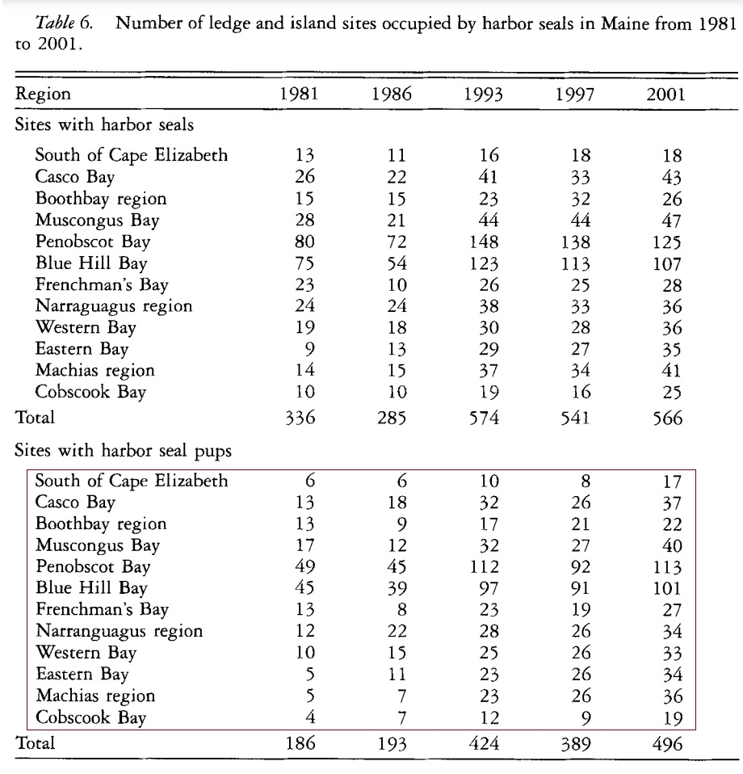

<style type="text/css">
h1.title {
  font-size: 20px;
  color: DarkRed;
  text-align: center;
}
h4.author { /* Header 4 - and the author and data headers use this too  */
    font-size: 18px;
  font-family: "Times New Roman", Times, serif;
  color: DarkRed;
  text-align: center;
}
h4.date { /* Header 4 - and the author and data headers use this too  */
  font-size: 18px;
  font-family: "Times New Roman", Times, serif;
  color: DarkBlue;
  text-align: center;
}
h1 { /* Header 3 - and the author and data headers use this too  */
    font-size: 22px;
    font-family: "Times New Roman", Times, serif;
    color: darkred;
    text-align: center;
}
h2 { /* Header 3 - and the author and data headers use this too  */
    font-size: 18px;
    font-family: "Times New Roman", Times, serif;
    color: navy;
    text-align: left;
}

h3 { /* Header 3 - and the author and data headers use this too  */
    font-size: 15px;
    font-family: "Times New Roman", Times, serif;
    color: navy;
    text-align: left;
}

h4 { /* Header 4 - and the author and data headers use this too  */
    font-size: 18px;
    font-family: "Times New Roman", Times, serif;
    color: darkred;
    text-align: left;
}
</style>

```{r setup, include=FALSE}
# code chunk specifies whether the R code, warnings, and output 
# will be included in the output files.
if (!require("ISwR")) {
   install.packages("ISwR")
   library(ISwR)
}
if (!require("MASS")) {
   install.packages("MASS")
   library(MASS)
}
if (!require("knitr")) {
   install.packages("knitr")
   library(knitr)
}
if (!require("forecast")) {
   install.packages("forecast")
   library(forecast)
}
library(klippy)
library(webshot)

knitr::opts_chunk$set(echo = TRUE,       
                      warnings = FALSE,   
                      results = TRUE,   
                      message = FALSE,
                      fig.align='center', 
                      fig.pos = 'ht')
```

```{r klippy, echo=FALSE, include=TRUE}
# klippy::klippy(position = c('top', 'right'),color = 'darkred',tooltip_message = 'Click to copy', tooltip_success = 'Done')
```

We have assessed the association between the harbor seal count observed in Maine's coastal regions and time (different survey years between 1981 and 2001) using both Poisson and quasi-Poisson regression. In this assignment, you assess the association between the counts of harbor seal pubs and the time. The data table is given below (the frequency counts are in the red box of the following table)


```{r echo = FALSE, fig.align='center', fig.width=5, fig.height=5}

```

To save your time, defined a vector for each survey year in the following code chunk.

```{r}
y.1981=c(6, 13, 13, 17, 49, 45, 13, 12, 10, 5, 5, 4)
y.1986=c(6, 18, 9, 12, 45, 39, 8, 22, 15, 11, 7, 7)
y.1993=c(10, 32, 17, 32, 112, 97, 23, 28, 25, 23, 23, 12)
y.1997=c(8, 26, 21, 27, 92, 91, 19, 26, 26, 26, 26, 9)
y.2001=c(17, 37, 22, 40, 113, 101, 27, 34, 33, 34, 36, 19)
```

Please refer to the case study in the class note to analyze the data and draw conclusions to address the research question. To be more specific, you are expected to answer the following question.

1. Fit both regular and quasi-Poisson regression models.

2. Pick a model as the final model and justify your choice.

3. Comment on the dispersion and interpret the output of the final model.

4. Write a separate paragraph to summarize the results and draw the conclusion.


