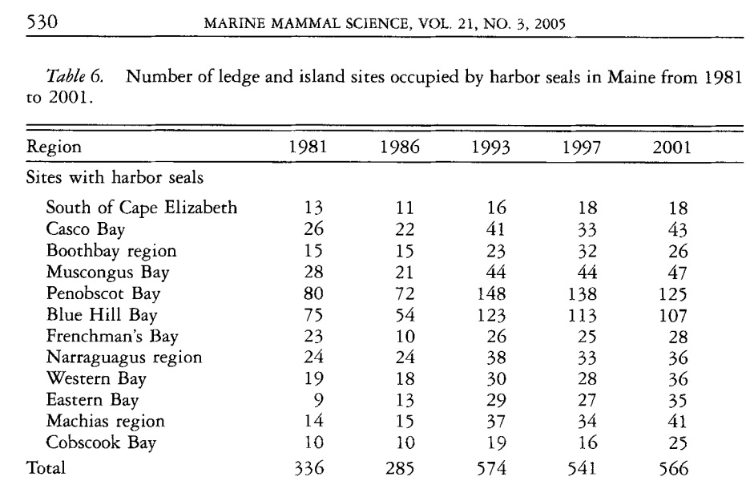
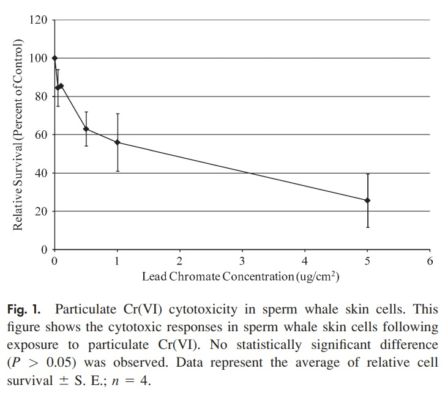
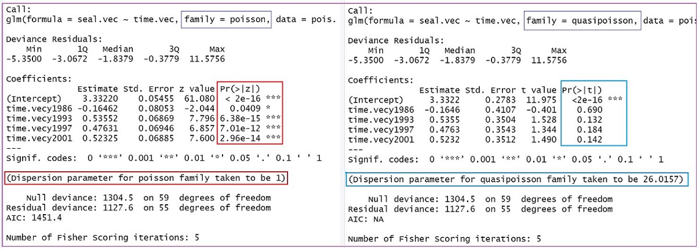

<style type="text/css">
h1.title {
  font-size: 20px;
  color: DarkRed;
  text-align: center;
}
h4.author { /* Header 4 - and the author and data headers use this too  */
    font-size: 18px;
  font-family: "Times New Roman", Times, serif;
  color: DarkRed;
  text-align: center;
}
h4.date { /* Header 4 - and the author and data headers use this too  */
  font-size: 18px;
  font-family: "Times New Roman", Times, serif;
  color: DarkBlue;
  text-align: center;
}
h1 { /* Header 3 - and the author and data headers use this too  */
    font-size: 22px;
    font-family: "Times New Roman", Times, serif;
    color: darkred;
    text-align: center;
}
h2 { /* Header 3 - and the author and data headers use this too  */
    font-size: 18px;
    font-family: "Times New Roman", Times, serif;
    color: navy;
    text-align: left;
}

h3 { /* Header 3 - and the author and data headers use this too  */
    font-size: 15px;
    font-family: "Times New Roman", Times, serif;
    color: navy;
    text-align: left;
}

h4 { /* Header 4 - and the author and data headers use this too  */
    font-size: 18px;
    font-family: "Times New Roman", Times, serif;
    color: darkred;
    text-align: left;
}
</style>

```{r setup, include=FALSE}
# code chunk specifies whether the R code, warnings, and output 
# will be included in the output files.
if (!require("ISwR")) {
   install.packages("ISwR")
   library(ISwR)
}
if (!require("MASS")) {
   install.packages("MASS")
   library(MASS)
}
if (!require("knitr")) {
   install.packages("knitr")
   library(knitr)
}
if (!require("forecast")) {
   install.packages("forecast")
   library(forecast)
}
if (!require("Publish")) {
   install.packages("Publish")
   library(Publish)
}
library(klippy)
library(webshot)

knitr::opts_chunk$set(echo = TRUE,       
                      warnings = FALSE,   
                      results = TRUE,   
                      message = FALSE,
                      fig.align='center', 
                      fig.pos = 'ht')
```

```{r klippy, echo=FALSE, include=TRUE}
# klippy::klippy(position = c('top', 'right'),color = 'darkred',tooltip_message = 'Click to copy', tooltip_success = 'Done')
```

# Introduction

This module considers the relationship between a discrete response variable and other numeric or categorical predictor variables. The analysis of frequency counts and rates is also one of the important statistical tools in life science. The appropriate model we will discuss is a small family of generalized linear models - The Poisson regression model. It has wide applications for both laboratory experimental data and field data which involve count or rate data.


We add this model to the summary table of models in the previous module as follows


|    Response variable |   Predictor variable       |  Type of Models  |
|:--------------------:|:--------------------------:|:----------------:|
| continuous, normal   |  single categorical        |     ANOVA        |
| continuous, normal   |  single continuous         |      SLR         |
| continuous, normal   |  continuous or categorical |  MLR (ANCOVA)    |
| binary, categorical  |  continuous or categorical |   logistic model |
| numeric, discrete    |  continuous or categorical |   Poisson model  |


# Motivational Examples

**Example 1**: Aerial counts of harbor seals (Phora vitulzna concoZw) on ledges along the Maine coast were conducted during the pupping season in 1981, 1986, 1993, 1997, and 2001 to study the changes in abundance of harbor seals. The detailed information of the study can be found from the published work of Gilbert et al (2005) [see the link of the article](https://stat501.s3.amazonaws.com/w13-CHANGES-IN-ABUNDANCE-OF-HARBOR.pdf).


```{r echo = FALSE, fig.align='center'}

```

We are interested in whether the counts of harbor seal counts changed significantly over the years. The data used for to answer this question is taken from the first half of table 6.

```{r echo = FALSE, fig.align='center', fig.width=5, fig.height=5}

```

We construct the R data set in the following based on the above data table that is suitable for modeling.


**Example 2**: This example is based on a study that investigated the cytotoxic and genotoxic effects of soluble and particulate hexavalent chromium in sperm whale skin fibroblasts. The data were extracted from a line plot in the published work of [Wise et al (Fig. 1)](https://stat501.s3.amazonaws.com/w13-TheGenotoxicityofParticulate+andSolubleChromate.pdf). In the first experiment, Particulate Cr(VI) induced a clear concentration-dependent decrease in cell survival over a range of 0.05 to 0.5 lg/cm2. Concentrations of 0.05, 0.1, 0.5, 1, and 5 lg/cm2 lead chromate induced 85%, 86%, 63%, 56%, and 26% relative survival. This information is given in the following figure 1 of the published paper.


```{r echo = FALSE, fig.align='center', fig.width=5, fig.height=5}

```


|   Dose level  |   survived cells  |     total cells    |
|:-------------:|:-----------------:|:------------------:|
|      0        |         100       |          100       |
|      0.05     |          85       |          100       |
|      0.1      |          86       |          100       |
|      0.5      |          63       |          100       |
|      1        |          56       |          100       |
|      5        |          26       |          100       |


The question is whether the survival rates are associated with the dose level?


# Poisson Regression for Counts and Rates

The Poisson regression model assumes the random response variable to be a frequency count or a rate of an uncommon event such as COVID-19 positivity rates, COVID-19 death mortality, etc. As in the linear and logistic regression models, we also assume that predictor variables are non-random. 

## Structure and Interpretations

Let $Y$ be the response variable that takes on frequency counts as values and $X$ be the set of predictor variables such as demographics and social determinants. Further, let $\mu=E[Y]$ be the mean of the response variable. 

**Poisson Regression for Counts**

The Poisson regression model is defined in the following analytic expression.

$$
\log(\mu) = \beta_0 + \beta_1 x_1 + \beta_2 x_2 + \cdots + \beta_p x_p,
$$
where $\beta_0, \beta_1, \cdots, \beta_p$ are coefficients of the Poisson regression model. 


**Poisson Regression for Rates**

The Poisson regression model for rates is defined in the following analytic expression.

$$
\log(\mu/t) = \beta_0 + \beta_1 x_1 + \beta_2 x_2 + \cdots + \beta_p x_p,
$$


where $\beta_0, \beta_1, \cdots, \beta_p$ are coefficients of the Poisson regression model. $t$ is called the **offset** variable. The offset variable serves to normalize the fitted cell means per some space, grouping, or time interval in order to define the meaningful rates.

**Interpretation of Regression Coefficients**

The interpretation of the regression coefficient $\beta_i$ is as following

* $\beta_0$ = the baseline logarithm of the mean of $Y$, $\log(\mu)$, when all predictor variables $x_i = 0$, for $i = 1, 2, \cdots, p$. As usual, we are not interested in the inference of the intercept parameter.

* $\beta_i$ = is the change of the **logarithm of the mean count** due to one unit increases in $x_i$ with all other $x_j$ being fixed, for $j\ne i$. 


**Estimation of Regression Coefficients**

Estimating Poisson regression coefficients requires numerical optimization. We will not go into details about how to estimate the regression coefficients and perform model diagnostics in this module. Instead, we will focus on data analysis, in particular, the interpretation of regression coefficients.


## Assumptions and Goodness-of-fit

Like other statistical models, there are some assumptions for the Poisson regression model: 

* The response variable is a frequency count (or rate variable) that follows the Poisson distribution.

* The mean of the and the variance are equal.

* The relationship between the mean of the response and the predictor variables is correct.

* For a given value of the predictor variable, the mean and variance of the response variable are **equal**. - Unfortunately, this assumption is frequently violated. This type of violation is serious since it produces  wrong estimates of the standard errors, hence, yields wrong p-values.


## Dispersion Issue and Remedies 

The first three assumptions mentioned above are regular for all regression models. The violation of the last assumption is directly associated with the distribution of the response variable. Different causes lead to the violation. For example, the data is not from Poisson distribution or a mixture distribution of Poisson and other distribution. Therefore, there are different ways we can consider to fixed the problem.


Although the detailed discussion of remedies is not the focus of this course, it is useful to know some of the available remedies for dispersion (either over-dispersion and under-dispersion).


* **quasi-Poisson regression** sticks to the simple structure of the Poisson regression and adjusts the dispersed standard error to obtain the valid p-values. We will use this approach in this class.

* **negative binomial regression**, another family regression models for the discrete response variable, relaxes Poisson's assumption on equality of mean and variance. In the **negative binomial regression**, the variance is a function of the mean. It could also have dispersion problems if the variance function is not correct. The **negative binomial regression** is implemented in R.

* **Zero-inflated family of regression models** assumes the data come from the mixture distribution of Poisson and other distributions such as binomial or negative binomial and binomial distributions. R also has libraries to fit several zero-inflated regression models.

* The **Hurdle model** also handles the issue of excess zeros in the data but assumes the sources of zeros in the data are different. Hurdle assumes structural zero and the regular zero-inflated model assume sampling zeros.

We will use **Poisson regression** to detect potential **dispersion** and then decide whether use the regular Poisson regression model to report and implement in practical applications.


## Data Structure of Poisson Regression

The Poisson regression is a subfamily of generalized linear regressions(GLM). The logistic regression is also a member of GLM. Similar to the structure used in the logistic regression, Poisson regression also requires the same data structure usually called the **long table**.

The data table in the first motivational example is not a **long table**. It is actually a **wide table**. The table in example 2 is a **long table**. When using R to build models in GLM, the data should always be in the form of a **long table**. Therefore, the data table in motivational example 1 **cannot** be used to build GLMs. The code for turning the wide table to a long table is given in Section 2. The resulting **long table** (partial table) is shown below.

```{r}
y1981=c(13, 26, 15, 28, 80, 75, 23, 24, 19, 9, 14, 10)
y1986=c(11, 22, 15, 21, 72, 54, 10, 24, 18, 13, 15, 10)
y1993=c(16, 41, 23, 44, 148, 123, 26, 38, 30, 29, 37, 19)
y1997=c(18, 33, 32, 44, 138, 113, 25, 33, 28, 27, 34, 16)
y2001=c(18, 43, 26, 47, 125, 107, 28, 36, 36, 35, 41, 25)
seal.vec = c(y1981, y1986, y1993, y1997, y2001)
time.vec = sort(rep(c("y1981", "y1986", "y1993", "y1997", "y2001"), 12))
pois.data= data.frame(cbind(seal=seal.vec, time=time.vec))
```

```{r}
n=dim(pois.data)[1]
partial.long.table = pois.data[sample(1:n, n, replace = FALSE), ][1:10,]
kable(partial.long.table, caption="Part of the converted long table from the harbor seal data table")
```

# Case Studies

We will use the two motivational examples in this section. As mentioned earlier, the Quasi-Poisson Regression is a generalization of the Poisson regression and is used when modeling an overdispersed count variable.


The Poisson model assumes that the variance is equal to the mean, which is not always a fair assumption. When the variance is greater than the mean, a Quasi-Poisson model, which assumes that the variance is a linear function of the mean, is more appropriate.


For each example, we will fit both Poisson and quasi-Poisson regression models.

## Harbor Seal Data

We will use the **long table** to fit the two models. Which is to choose to report will depend on the dispersion parameter. Next, we use the R function **glm()** to fit Posson and quasi-Poisson model in the following.
 
```{r}
pois.model = glm(seal.vec ~ time.vec, family=poisson, data = pois.data)
summary.table.pois = summary(pois.model)
##
quasi.pois.model = glm(seal.vec ~ time.vec, family=quasipoisson, data = pois.data)
summary.table.quasi.pois = summary(quasi.pois.model)
```
The complete outputs of the two models from R function **glm()** are given in the following figure.

```{r echo = FALSE, fig.align='center', fig.width=7, fig.height=5}

```
We can observe several pieces of information from the above figure.

* The regression coefficients in both Poisson and quasi-Poisson regression models are identical. 

* The standard errors in the Poisson regression model are less than their corresponding standard errors in the quasi-Poisson regression model. 


* The dispersion parameter is forced to be 1 in the Poisson regression model. However, the dispersion parameter is calculated through the quasi-likelihood that yields the value of dispersion parameter 26.0157. This is much bigger than 1 (for the Poisson regression model). Therefore, the p-values in the output of the regular Poisson regression model are not reliable. The inference should be based on the output of the quasi-Poisson model.


The p-values in the quasi-Poisson regression can be extracted in the following table.

```{r}
example.coef.table = summary.table.quasi.pois$coef
kable(example.coef.table, caption="The summary statistics based on 
      the quasi-Poisson regression model")
```

All p-values associated with the survey year are insignificant. The baseline year is 1981 (which is not in the output), this means that counts of harbor seals in any of the survey years were **not significantly** from the baseline year (1981). 


## Toxicity Study

This case study is based on the second motivational example. The analysis in the original article involves error. The statistical problem is a rate regression, the analysis in the original paper used ANOVA that led to a wrong conclusion. Two different methods will be used to assess the association between the concentration and the survival of cells.

### Poisson Regression

We can simply use the summarized table extracted from the original article given in Section 2. This is small data set with only 6 observations and three variables: dose(continuous), survival(discrete - count), total (discrete - count, can only be used as an offset variable in the model).

```{r}
dose =   c(0, 0.05,  0.1, 0.5, 1,   5)
survived=c(100, 85,  86,  63,  56,  26)
total =  c(100, 100, 100, 100, 100, 100)
pois.data = data.frame(cbind(survived=survived, dose=dose, total = total))
```

Next, we fit the quasi-Poisson to the above data and check the dispersion parameter to see whether the regular Possion regression is appropriate.

```{r}
quasi.pois=glm(survived ~ dose + offset(total), family = quasipoisson, data = pois.data)
disp = summary(quasi.pois)$dispersion
kable(cbind(dispersion=disp), caption = "The dispersion paramter of the Poisson regression")
```
The value of the dispersion is slight bigger than 1 (if there no dispersion, the dispersion parameter = 1). We only need to fit the Poisson regression to the data and use fitted Poisson regression model to address the association between the concentration level and the survival rate.

```{r}
pois=glm(survived ~ factor(dose) + offset(total), family = poisson, data = pois.data)
coef=summary(pois)$coef
kable(coef, caption = "Summary statistics of the regression coefficients")
```
Contrary to what was concluded in the original article, the concentration of lead chromate significantly affects the survival of the cells (p-value $\approx$ 0). As the concentration level increases, the survival rate decreases significantly. To be more specific, we can exponentiate the coefficient of the Poisson regression associated with **dose** and obtain $exp(-0.2625) = 0.7691 = 1 - 0.2309$. This means that, as the concentration increases by one unit, the **survival rate** of the skin cells **decreases** by 23.09%.


### Logistic Regression Approach (optional)

Since the logistic regression requires the response to be binary, we need to perform some data management to create a suitable data set for the logistic regression model.

**Data Preparation**

The data reported in the experiment are the percentage of survival of cells with the given total number of cells that died and survived respectively at different levels of concentration. We assume 100 cells were used at each concentration. So we retrieve the data table from the chart in the original paper and summarized in Section 2. Next, we create a **long table** and fit Poisson model to the data. The idea is each column will record the information of each cell. The layout of the long table to be used in the Poisson and quasi-Poisson regression model is depicted in the following:


|   cell ID   |  dose  |  survival  |   total  |
|:-----------:|:------:|:----------:|:--------:|
|     1       |   0    |     1      |     1    |
|     2       |   0    |     1      |     1    |
|    ...      |  ...   |    ...     |    ...   |
|    100      |   0    |     1      |     1    |
|    101      | 0.05   |     1      |     1    |
|    ...      |  ...   |    ...     |    ...   |
|    185      | 0.05   |     1      |     1    |
|    186      | 0.05   |     0      |     1    |
|    187      | 0.05   |     0      |     1    |
|    ...      |  ...   |    ...     |    ...   |
|    ...      |  ...   |    ...     |    ...   |
|    501      |  5     |    1       |    1     |
|    502      |  5     |    1       |    1     |
|    ...      |  ...   |    ...     |    ...   |
|    526      |  5     |    1       |    1     |
|    527      |  5     |    0       |    1     |
|    526      |  5     |    0       |    1     |
|    ...      |  ...   |    ...     |    ...   |
|    599      |  5     |    0       |    1     |
|    600      |  5     |    0       |    1     |


We define the long table in the following code. 

```{r}
cell.id = 1:600                     # cell ID, not a meaningful variable!
total = rep(1,600)                  # the "total" of each cell is simply equal to 1.
dose.0 = rep(1, 100)                # all 100 cells survived with concentration level 0
dose.005 = c(rep(1,85), rep(0,15))  # 85 cells survived and 15 died at concentration level 0.05
dose.0.1 = c(rep(1,86), rep(0,14))  # 86 cells survived and 14 died at concentration level 0.1
dose.0.5 = c(rep(1,63), rep(0,37))  # 63 cells survived and 37 died at concentration level 0.5
dose.1 = c(rep(1, 56), rep(0,44))   # 56 cells survived and 44 died at concentration level 1
dose.5 = c(rep(1,26), rep(0,74))    # 26 cells survived and 74 died at concentration level 5
survival = c(dose.0, dose.005, dose.0.1, dose.0.5, dose.1, dose.5)  
# next line of code defines a indicator telling the concentration level of each cell
dose = c(rep(0, 100), rep(0.05, 100), rep(0.1, 100), rep(0.5, 100), rep(1, 100), rep(5, 100))
## The long table is defined in the following one line of code
toxic.data = data.frame(cbind( cell.id = cell.id, survival = survival, dose=dose, total = total))
```

**Model Building**

This is a typical Poisson rate regression problem. As usual, we will fit both Poisson rate and quasi-Poisson rate models to the data set and then look at the dispersion parameter to decide which model should be used.

Based on the extracted data, the sample size is 600. The following quasi-Poisson regression model indicates the there is no significant dispersion issue for the Poisson regression model.

```{r}
logit.model = glm(survival ~ dose, family = binomial, data = toxic.data)
logit.summary = summary(logit.model)$coef
kable(logit.summary, caption = "Summary statistics on the regression coefficients")
```

The regression coefficient associated with **dose** is negative meaning that as the dose increases the log-odds of survival decreases. To be more specific, we exponentiate the coefficient of *dose* and obtain $exp(-0.5635) = 0.5692 = 1 -43.08 $. This means that, as the dose increase by one unit, the **odds of survival** of the skin cells **decreases** about 43.08%.

**Conclusion**

In summary, the logistic regression yields the same result as that from the Poisson regression. The concentration of lead chromate is negatively associated with the survival of the skin cell of the sperm whale.  


### Pearson $\chi^2$ Test of Independence Approach

We can also answer the original question by testing the hypothesis that the concentration does not affect the survival (independence test). This method only provides whether there is an association between the concentration and survival but not the direction and mangnitude of the association. To prepare for the Pearson $\chi^2$ test, we need to conctruct a $2\times k$ table in the following.

| surv.status | level-0.0 |   level-0.05  | level-0.1 | level-0.5 | level-1 | level-5  |
|:-----------:|:---------:|:-------------:|:---------:|:---------:|:-------:|:--------:|
| survived    |   100     |       85      |     86    |     63    |    56   |     26   |
| died        |    0      |       15      |     14    |     37    |    44   |     74   |

We next construct the observed the observed table in R and then perform the $\chi^2$ test.

```{r}
source("https://stat501.s3.amazonaws.com/w12-table2x2Calculator.txt")
survived=c(100, 85,  86,  63,  56,  26)
died = 100 - survived
obs.table = rbind(survived = survived, died = died)
colnames(obs.table) = as.character(c(0, 0.05, 0.1, 0.5, 1, 5))
chi.test = Pearson.chisq(obs.table)$inference
kable(chi.test, caption="Pearson chi-square test of independence of concentration and survival")
```

The Pearson $\chi^2$ test indicates that the concentration level of lead chromate is **NOT** independent of the survival of the skin cell of the sperm whale. Although the test itself does not give the direction of the association, we can find the information plot plotting the concentrations and survival rates.

# Concluding Remarks

Comparing multiple unrelated proportions (rates) is one of the important methods in analyzing laboratory data. We have summarized several different methods above to address different types of comparison questions that may arise in the actual research hypotheses. It is not as straightforward as the comparison for multiple population means since it requires different and more advanced statistical tools to address the specific comparison questions. 

There are several other recently developed procedures in the literature. Some of these new methods have been implemented in software packages. 

* we can also use the command **prop.test()** to test the equality of multiple proportions. 

* The Marascuilo procedure enables us to simultaneously test the differences of all pairs of proportions when there are several populations under investigation

* One most recently (2017) developed one-way ANOVA-like method uses the idea of likelihood ratio test. 


